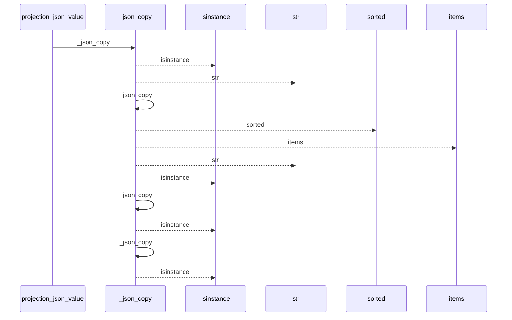
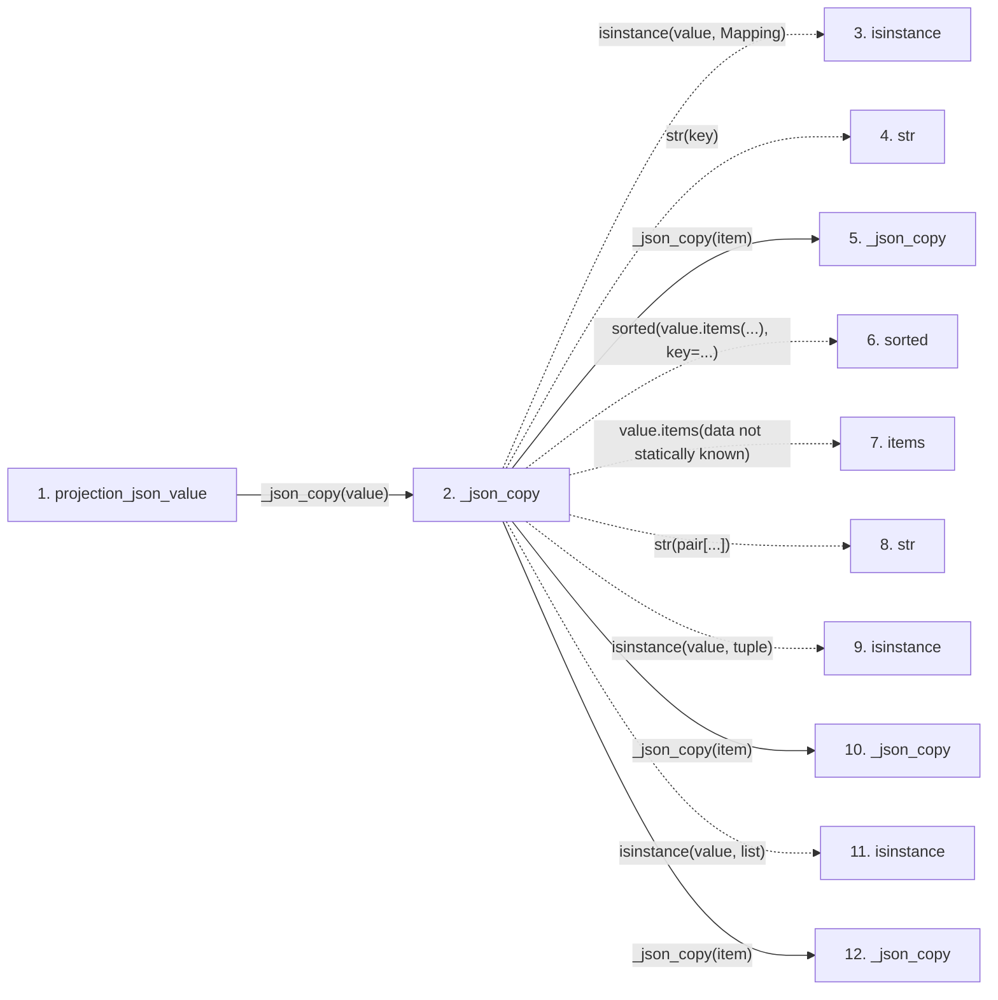

# projection_json_value

**Entry point:** `projection_json_value` (`api`)
**Source:** [knowledge_projection](../modules/knowledge_projection.md)
**Modules touched:** [knowledge_projection](../modules/knowledge_projection.md)

## Call sequence

<!-- Auto-generated from static call edges. Dashed arrows are external or unresolved calls. Reviewed runtime conditions and side effects belong in Behavior. -->

## Data flow

<!-- Auto-generated static analysis. Treat values and boundaries as best-effort hints, not runtime proof. -->

### Step data

| Step | Inputs | Reads | Writes | Returns |
|---|---|---|---|---|
| `projection_json_value` | `value: object` | - | - | `_json_copy(...)` |
| `_json_copy` | `value: object` | `Mapping`, `Enum` | - | `...`, `...`, `...`, `value.value`, `value` |
| `isinstance` | - | - | - | - |
| `str` | - | - | - | - |
| `_json_copy` | `value: object` | `Mapping`, `Enum` | - | `...`, `...`, `...`, `value.value`, `value` |
| `sorted` | - | - | - | - |
| `items` | - | - | - | - |
| `str` | - | - | - | - |
| `isinstance` | - | - | - | - |
| `_json_copy` | `value: object` | `Mapping`, `Enum` | - | `...`, `...`, `...`, `value.value`, `value` |
| `isinstance` | - | - | - | - |
| `_json_copy` | `value: object` | `Mapping`, `Enum` | - | `...`, `...`, `...`, `value.value`, `value` |

### Call data

| From | To | Line | Call |
|---|---|---:|---|
| projection_json_value | _json_copy | 405 | `_json_copy(value)` |
| _json_copy | isinstance | 3568 | `isinstance(value, Mapping)` |
| _json_copy | str | 3570 | `str(key)` |
| _json_copy | _json_copy | 3570 | `_json_copy(item)` |
| _json_copy | sorted | 3571 | `sorted(value.items(...), key=...)` |
| _json_copy | items | 3571 | `value.items(data not statically known)` |
| _json_copy | str | 3571 | `str(pair[...])` |
| _json_copy | isinstance | 3573 | `isinstance(value, tuple)` |
| _json_copy | _json_copy | 3574 | `_json_copy(item)` |
| _json_copy | isinstance | 3575 | `isinstance(value, list)` |
| _json_copy | _json_copy | 3576 | `_json_copy(item)` |

### Boundary effects

*No boundary effects detected.*

### Static analysis gaps

| Kind | Step | Target | Line |
|---|---|---|---:|
| unresolved_call | `_json_copy` | `isinstance` | 3568 |
| unresolved_call | `_json_copy` | `sorted` | 3571 |
| unresolved_call | `_json_copy` | `value.items` | 3571 |
| unresolved_call | `_json_copy` | `isinstance` | 3573 |
| unresolved_call | `_json_copy` | `isinstance` | 3575 |
| step_limit | `projection_json_value` | `first 12 steps` | 0 |

## Behavior

This flow starts at `projection_json_value` and is classified as `api`. The generated call and data-flow sections are bounded static projections; runtime conditions and side effects require source-level confirmation.
