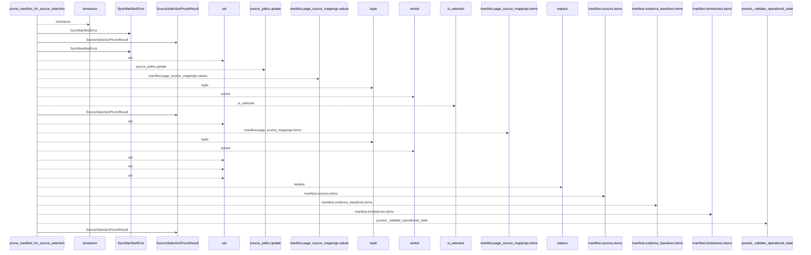
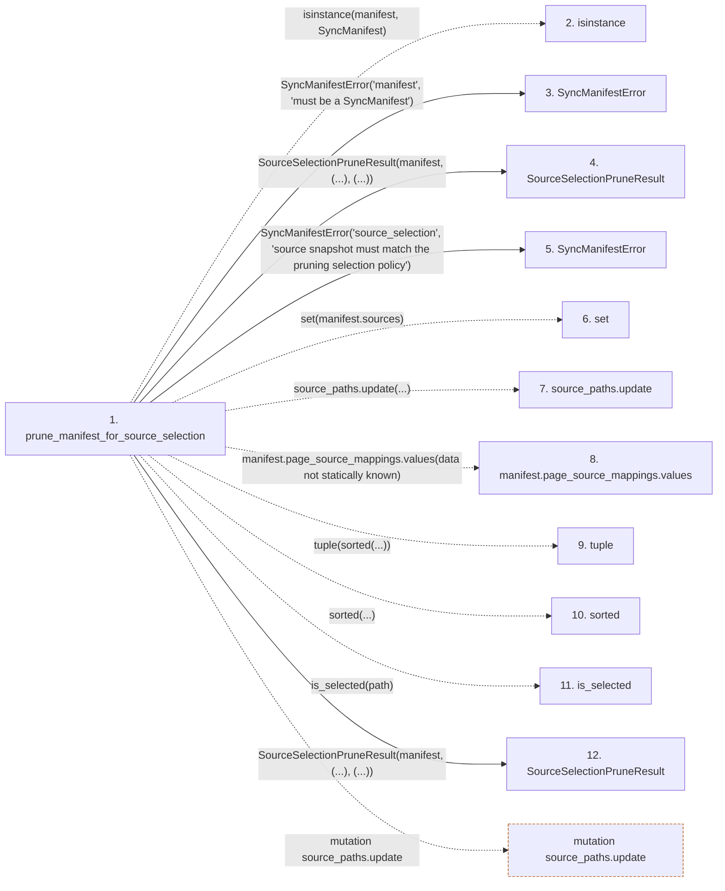

# prune_manifest_for_source_selection

**Entry point:** `prune_manifest_for_source_selection` (`api`)
**Source:** [sync_manifest](../modules/sync_manifest.md)
**Modules touched:** [sync_manifest](../modules/sync_manifest.md)

## Call sequence

<!-- Auto-generated from static call edges. Dashed arrows are external or unresolved calls. Reviewed runtime conditions and side effects belong in Behavior. -->

## Data flow

<!-- Auto-generated static analysis. Treat values and boundaries as best-effort hints, not runtime proof. -->

### Step data

| Step | Inputs | Reads | Writes | Returns |
|---|---|---|---|---|
| `prune_manifest_for_source_selection` | `manifest: SyncManifest`, `policy: SourceSelectionPolicy \| None`, `source_snapshot: SourceSnapshot \| None` | `SyncManifest` | - | `SourceSelectionPruneResult(...)`, `SourceSelectionPruneResult(...)`, `SourceSelectionPruneResult(...)` |
| `isinstance` | - | - | - | - |
| `SyncManifestError` | - | - | - | - |
| `SourceSelectionPruneResult` | - | - | - | - |
| `SyncManifestError` | - | - | - | - |
| `set` | - | - | - | - |
| `source_paths.update` | - | - | - | - |
| `manifest.page_source_mappings.values` | - | - | - | - |
| `tuple` | - | - | - | - |
| `sorted` | - | - | - | - |
| `is_selected` | - | - | - | - |
| `SourceSelectionPruneResult` | - | - | - | - |

### Call data

| From | To | Line | Call |
|---|---|---:|---|
| prune_manifest_for_source_selection | isinstance | 1614 | `isinstance(manifest, SyncManifest)` |
| prune_manifest_for_source_selection | SyncManifestError | 1615 | `SyncManifestError('manifest', 'must be a SyncManifest')` |
| prune_manifest_for_source_selection | SourceSelectionPruneResult | 1617 | `SourceSelectionPruneResult(manifest, (...), (...))` |
| prune_manifest_for_source_selection | SyncManifestError | 1626 | `SyncManifestError('source_selection', 'source snapshot must match the pruning selection policy')` |
| prune_manifest_for_source_selection | set | 1638 | `set(manifest.sources)` |
| prune_manifest_for_source_selection | source_paths.update | 1639 | `source_paths.update(...)` |
| prune_manifest_for_source_selection | manifest.page_source_mappings.values | 1640 | `manifest.page_source_mappings.values(data not statically known)` |
| prune_manifest_for_source_selection | tuple | 1642 | `tuple(sorted(...))` |
| prune_manifest_for_source_selection | sorted | 1643 | `sorted(...)` |
| prune_manifest_for_source_selection | is_selected | 1643 | `is_selected(path)` |
| prune_manifest_for_source_selection | SourceSelectionPruneResult | 1646 | `SourceSelectionPruneResult(manifest, (...), (...))` |

### Boundary effects

| Kind | Target | Step | Line |
|---|---|---|---:|
| mutation | `source_paths.update` | `prune_manifest_for_source_selection` | 1639 |

### Static analysis gaps

| Kind | Step | Target | Line |
|---|---|---|---:|
| external_call | `prune_manifest_for_source_selection` | `isinstance` | 1614 |
| unresolved_call | `prune_manifest_for_source_selection` | `manifest.page_source_mappings.values` | 1640 |
| external_call | `prune_manifest_for_source_selection` | `sorted` | 1643 |
| unresolved_call | `prune_manifest_for_source_selection` | `is_selected` | 1643 |
| step_limit | `prune_manifest_for_source_selection` | `first 12 steps` | 0 |

## Behavior

This flow starts at `prune_manifest_for_source_selection` and is classified as `api`. The generated call and data-flow sections are bounded static projections; runtime conditions and side effects require source-level confirmation.
