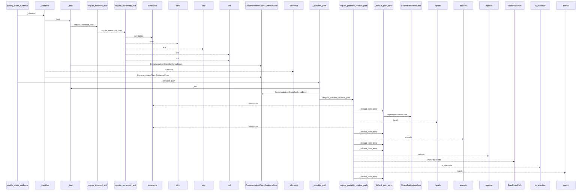
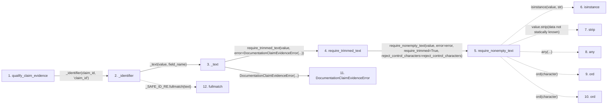

# qualify_claim_evidence

**Entry point:** `qualify_claim_evidence` (`api`)
**Source:** [documentation_claim_evidence](../modules/documentation_claim_evidence.md)
**Modules touched:** [documentation_claim_evidence](../modules/documentation_claim_evidence.md), [knowledge_graph](../modules/knowledge_graph.md), [validation](../modules/validation.md)

## Call sequence

<!-- Auto-generated from static call edges. Dashed arrows are external or unresolved calls. Reviewed runtime conditions and side effects belong in Behavior. -->

> Call sequence diagram shows 30 of 258 interactions; 228 omitted to keep the visualization within the 30-interaction and generated-diagram limits.

> Trace truncated at the depth limit; deeper calls are omitted.

## Data flow

<!-- Auto-generated static analysis. Treat values and boundaries as best-effort hints, not runtime proof. -->

### Step data

| Step | Inputs | Reads | Writes | Returns |
|---|---|---|---|---|
| `qualify_claim_evidence` | `service: DocumentationGraphQueryService`, `claim_id: str`, `canonical_page: str`, `concept_query: str`, `section_locator: str \| None`, `graph_query: Mapping[str, Any] \| None`, `safe_evidence_link: str \| None`, `internal_evidence_ref: str \| None` | `DocumentationQueryError`, `Mapping`, `_UNEVALUATED_FRESHNESS_DISCLOSURE`, `DocumentationQueryError`, `DocumentationQueryError`, `CLAIM_EVIDENCE_SCHEMA_VERSION` | `bounds[...]`, `bounds[...]` | `record` |
| `_identifier` | `value: object`, `field_name: str` | - | - | `text` |
| `_text` | `value: object`, `field_name: str` | - | - | `require_trimmed_text(...)` |
| `require_trimmed_text` | `value: object`, `error: Exception`, `reject_control_characters: bool` | - | - | `require_nonempty_text(...)` |
| `require_nonempty_text` | `value: object`, `error: Exception`, `trim_error: Exception \| None`, `normalize: bool`, `require_trimmed: bool`, `reject_control_characters: bool`, `reject_delete_character: bool` | - | - | `parsed` |
| `isinstance` | - | - | - | - |
| `strip` | - | - | - | - |
| `any` | - | - | - | - |
| `ord` | - | - | - | - |
| `ord` | - | - | - | - |
| `DocumentationClaimEvidenceError` | - | - | - | - |
| `fullmatch` | - | - | - | - |

### Call data

| From | To | Line | Call |
|---|---|---:|---|
| qualify_claim_evidence | _identifier | 238 | `_identifier(claim_id, 'claim_id')` |
| _identifier | _text | 1362 | `_text(value, field_name)` |
| _text | require_trimmed_text | 1390 | `require_trimmed_text(value, error=DocumentationClaimEvidenceError(...))` |
| require_trimmed_text | require_nonempty_text | 658 | `require_nonempty_text(value, error=error, require_trimmed=True, reject_control_characters=reject_control_characters)` |
| require_nonempty_text | isinstance | 574 | `isinstance(value, str)` |
| require_nonempty_text | strip | 576 | `value.strip(data not statically known)` |
| require_nonempty_text | any | 582 | `any(...)` |
| require_nonempty_text | ord | 583 | `ord(character)` |
| require_nonempty_text | ord | 584 | `ord(character)` |
| _text | DocumentationClaimEvidenceError | 1392 | `DocumentationClaimEvidenceError(...)` |
| _identifier | fullmatch | 1363 | `_SAFE_ID_RE.fullmatch(text)` |

### Boundary effects

*No boundary effects detected.*

### Static analysis gaps

| Kind | Step | Target | Line |
|---|---|---|---:|
| unresolved_call | `require_nonempty_text` | `isinstance` | 574 |
| unresolved_call | `require_nonempty_text` | `value.strip` | 576 |
| unresolved_call | `require_nonempty_text` | `any` | 582 |
| unresolved_call | `require_nonempty_text` | `ord` | 583 |
| unresolved_call | `require_nonempty_text` | `ord` | 584 |
| unresolved_call | `_identifier` | `_SAFE_ID_RE.fullmatch` | 1363 |
| step_limit | `qualify_claim_evidence` | `first 12 steps` | 0 |
| truncated_flow | `qualify_claim_evidence` | `depth limit` | 0 |

## Behavior

This flow starts at `qualify_claim_evidence` and is classified as `api`. The generated call and data-flow sections are bounded static projections; runtime conditions and side effects require source-level confirmation.
