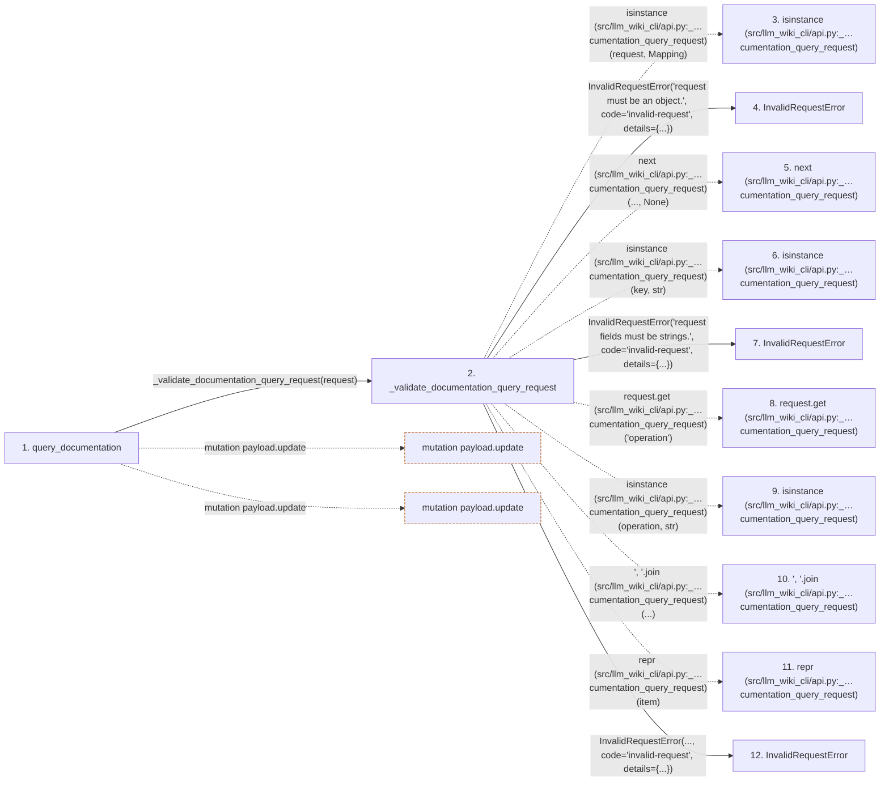

# query_documentation

**Entry point:** `query_documentation` (`api`)
**Source:** [api](../modules/api.md)
**Modules touched:** [api](../modules/api.md), [common](../modules/common.md), [config](../modules/config.md), [documentation_queries](../modules/documentation_queries.md), and 16 more

**Complete modules touched:**

- [api](../modules/api.md)
- [common](../modules/common.md)
- [config](../modules/config.md)
- [documentation_queries](../modules/documentation_queries.md)
- [documentation_query_builder](../modules/documentation_query_builder.md)
- [filesystem_guard](../modules/filesystem_guard.md)
- [io](../modules/io.md)
- [knowledge_artifacts](../modules/knowledge_artifacts.md)
- [knowledge_consumption](../modules/knowledge_consumption.md)
- [knowledge_envelope](../modules/knowledge_envelope.md)
- [knowledge_evidence](../modules/knowledge_evidence.md)
- [knowledge_freshness](../modules/knowledge_freshness.md)
- [knowledge_loader](../modules/knowledge_loader.md)
- [knowledge_verification](../modules/knowledge_verification.md)
- [source_selection](../modules/source_selection.md)
- [source_snapshot](../modules/source_snapshot.md)
- [sync_manifest](../modules/sync_manifest.md)
- [validation](../modules/validation.md)
- [verification_contracts](../modules/verification_contracts.md)
- [wiki_surface](../modules/wiki_surface.md)

## Call sequence

```mermaid
sequenceDiagram
    participant p0 as query_documentation
    participant p1 as _validate_documentation_query_request
    participant p2 as isinstance (src/llm_wiki_cli/api.py:_…cumentation_query_request)
    participant p3 as InvalidRequestError
    participant p4 as next (src/llm_wiki_cli/api.py:_…cumentation_query_request)
    participant p5 as request.get (src/llm_wiki_cli/api.py:_…cumentation_query_request)
    participant p6 as ', '.join (src/llm_wiki_cli/api.py:_…cumentation_query_request)
    participant p7 as repr (src/llm_wiki_cli/api.py:_…cumentation_query_request)
    participant p8 as sorted (src/llm_wiki_cli/api.py:_…cumentation_query_request)
    participant p9 as set (src/llm_wiki_cli/api.py:_…cumentation_query_request)
    participant p10 as _normalize_query_limit
    participant p11 as _normalize_query_input
    participant p12 as callback
    participant p13 as str (src/llm_wiki_cli/api.py:_normalize_query_input)
    participant p14 as normalize_documentation_query_limit
    participant p15 as isinstance (src/llm_wiki_cli/services…documentation_query_limit)
    participant p16 as DocumentationQueryError
    participant p17 as min
    participant p18 as _impact_query
    participant p19 as normalize_supplied_paths
    participant p20 as _portable_supplied_path
    p0->>p1: _validate_documentation_query_request
    p1-->>p2: isinstance (src/llm_wiki_cli/api.py:_…cumentation_query_request)
    p1->>p3: InvalidRequestError
    p1-->>p4: next (src/llm_wiki_cli/api.py:_…cumentation_query_request)
    p1-->>p2: isinstance (src/llm_wiki_cli/api.py:_…cumentation_query_request)
    p1->>p3: InvalidRequestError
    p1-->>p5: request.get (src/llm_wiki_cli/api.py:_…cumentation_query_request)
    p1-->>p2: isinstance (src/llm_wiki_cli/api.py:_…cumentation_query_request)
    p1-->>p6: ', '.join (src/llm_wiki_cli/api.py:_…cumentation_query_request)
    p1-->>p7: repr (src/llm_wiki_cli/api.py:_…cumentation_query_request)
    p1->>p3: InvalidRequestError
    p1-->>p8: sorted (src/llm_wiki_cli/api.py:_…cumentation_query_request)
    p1-->>p9: set (src/llm_wiki_cli/api.py:_…cumentation_query_request)
    p1->>p3: InvalidRequestError
    p1->>p10: _normalize_query_limit
    p10->>p11: _normalize_query_input
    p11-->>p12: callback
    p11->>p3: InvalidRequestError
    p11-->>p13: str (src/llm_wiki_cli/api.py:_normalize_query_input)
    p10->>p14: normalize_documentation_query_limit
    p14-->>p15: isinstance (src/llm_wiki_cli/services…documentation_query_limit)
    p14-->>p15: isinstance (src/llm_wiki_cli/services…documentation_query_limit)
    p14->>p16: DocumentationQueryError
    p14-->>p17: min
    p1-->>p5: request.get (src/llm_wiki_cli/api.py:_…cumentation_query_request)
    p0->>p18: _impact_query
    p18->>p11: _normalize_query_input
    p18->>p19: normalize_supplied_paths
    p19->>p20: _portable_supplied_path
    p20->>p16: DocumentationQueryError
```

<!-- Auto-generated from static call edges. Dashed arrows are external or unresolved calls. Reviewed runtime conditions and side effects belong in Behavior. -->

> Call sequence diagram shows 30 of 1134 interactions; 1104 omitted to keep the visualization within the 30-interaction and generated-diagram limits.

> Trace truncated at the depth limit; deeper calls are omitted.

## Data flow

<!-- Auto-generated static analysis. Treat values and boundaries as best-effort hints, not runtime proof. -->

### Step data

| Step | Inputs | Reads | Writes | Returns |
|---|---|---|---|---|
| `query_documentation` | `request: Mapping[str, Any]`, `src_dir: str`, `wiki_dir: str`, `allow_external_src: bool`, `source_selection: str \| Path \| None` | `wiki_surface`, `_KNOWLEDGE_QUERY_DIRECTIONS`, `_KNOWLEDGE_QUERY_KINDS`, `_TYPED_QUERY_DIRECTIONS`, `CORE_RELATIONSHIP_KINDS`, `GRAPH_ORIGINS`, `GRAPH_RESOLUTIONS` | - | `_impact_query(...)`, `_with_query_envelope(...)` |
| `_validate_documentation_query_request` | `request: Mapping[str, Any]` | `Mapping`, `_DOCUMENTATION_QUERY_FIELDS`, `_DOCUMENTATION_QUERY_FIELDS`, `_DOCUMENTATION_QUERY_FIELDS` | - | `(...)` |
| `isinstance (src/llm_wiki_cli/api.py:_…cumentation_query_request)` | - | - | - | - |
| `InvalidRequestError` | - | - | - | - |
| `next (src/llm_wiki_cli/api.py:_…cumentation_query_request)` | - | - | - | - |
| `isinstance (src/llm_wiki_cli/api.py:_…cumentation_query_request)` | - | - | - | - |
| `InvalidRequestError` | - | - | - | - |
| `request.get (src/llm_wiki_cli/api.py:_…cumentation_query_request)` | - | - | - | - |
| `isinstance (src/llm_wiki_cli/api.py:_…cumentation_query_request)` | - | - | - | - |
| `', '.join (src/llm_wiki_cli/api.py:_…cumentation_query_request)` | - | - | - | - |
| `repr (src/llm_wiki_cli/api.py:_…cumentation_query_request)` | - | - | - | - |
| `InvalidRequestError` | - | - | - | - |

### Call data

| From | To | Line | Call |
|---|---|---:|---|
| query_documentation | _validate_documentation_query_request | 2216 | `_validate_documentation_query_request(request)` |
| _validate_documentation_query_request | isinstance (src/llm_wiki_cli/api.py:_…cumentation_query_request) | 1866 | `isinstance(request, Mapping)` |
| _validate_documentation_query_request | InvalidRequestError | 1867 | `InvalidRequestError('request must be an object.', code='invalid-request', details={...})` |
| _validate_documentation_query_request | next (src/llm_wiki_cli/api.py:_…cumentation_query_request) | 1872 | `next(..., None)` |
| _validate_documentation_query_request | isinstance (src/llm_wiki_cli/api.py:_…cumentation_query_request) | 1872 | `isinstance(key, str)` |
| _validate_documentation_query_request | InvalidRequestError | 1874 | `InvalidRequestError('request fields must be strings.', code='invalid-request', details={...})` |
| _validate_documentation_query_request | request.get (src/llm_wiki_cli/api.py:_…cumentation_query_request) | 1879 | `request.get('operation')` |
| _validate_documentation_query_request | isinstance (src/llm_wiki_cli/api.py:_…cumentation_query_request) | 1880 | `isinstance(operation, str)` |
| _validate_documentation_query_request | ', '.join (src/llm_wiki_cli/api.py:_…cumentation_query_request) | 1881 | `', '.join(...)` |
| _validate_documentation_query_request | repr (src/llm_wiki_cli/api.py:_…cumentation_query_request) | 1881 | `repr(item)` |
| _validate_documentation_query_request | InvalidRequestError | 1882 | `InvalidRequestError(..., code='invalid-request', details={...})` |

### Boundary effects

| Kind | Target | Step | Line |
|---|---|---|---:|
| mutation | `payload.update` | `query_documentation` | 2336 |
| mutation | `payload.update` | `query_documentation` | 2355 |

### Static analysis gaps

| Kind | Step | Target | Line |
|---|---|---|---:|
| external_call | `_validate_documentation_query_request` | `isinstance` | 1866 |
| external_call | `_validate_documentation_query_request` | `next` | 1872 |
| external_call | `_validate_documentation_query_request` | `isinstance` | 1872 |
| unresolved_call | `_validate_documentation_query_request` | `request.get` | 1879 |
| external_call | `_validate_documentation_query_request` | `isinstance` | 1880 |
| unresolved_call | `_validate_documentation_query_request` | `', '.join` | 1881 |
| step_limit | `query_documentation` | `first 12 steps` | 0 |
| truncated_flow | `query_documentation` | `depth limit` | 0 |

## Behavior

This flow starts at `query_documentation` and is classified as `api`. The generated call and data-flow sections are bounded static projections; runtime conditions and side effects require source-level confirmation.
