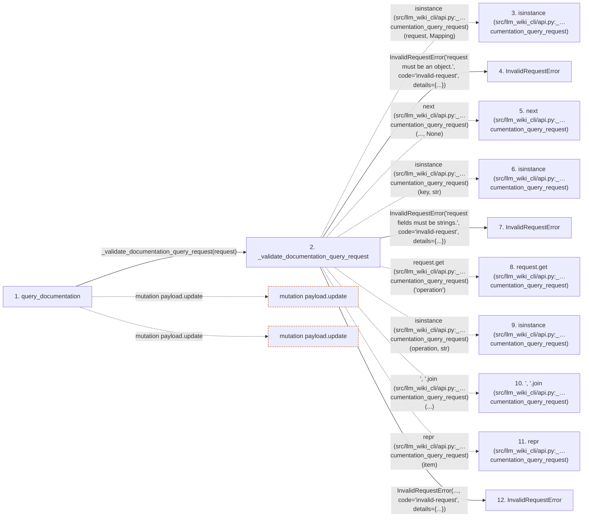

# query_documentation

**Entry point:** `query_documentation` (`api`)
**Source:** [api](../modules/api.md)
**Modules touched:** [analysis_capture](../modules/analysis_capture.md), [api](../modules/api.md), [bootstrap_recovery](../modules/bootstrap_recovery.md), [common](../modules/common.md), and 38 more

**Complete modules touched:**

- [analysis_capture](../modules/analysis_capture.md)
- [api](../modules/api.md)
- [bootstrap_recovery](../modules/bootstrap_recovery.md)
- [common](../modules/common.md)
- [config](../modules/config.md)
- [context_packet](../modules/context_packet.md)
- [documentation_queries](../modules/documentation_queries.md)
- [documentation_query_builder](../modules/documentation_query_builder.md)
- [evidence_explanation](../modules/evidence_explanation.md)
- [extractor_helpers](../modules/extractor_helpers.md)
- [filesystem_guard](../modules/filesystem_guard.md)
- [implementation_evidence](../modules/implementation_evidence.md)
- [io](../modules/io.md)
- [knowledge_artifacts](../modules/knowledge_artifacts.md)
- [knowledge_consumption](../modules/knowledge_consumption.md)
- [knowledge_envelope](../modules/knowledge_envelope.md)
- [knowledge_evidence](../modules/knowledge_evidence.md)
- [knowledge_freshness](../modules/knowledge_freshness.md)
- [knowledge_governance](../modules/knowledge_governance.md)
- [knowledge_loader](../modules/knowledge_loader.md)
- [knowledge_reuse](../modules/knowledge_reuse.md)
- [knowledge_storage](../modules/knowledge_storage.md)
- [knowledge_storage_io](../modules/knowledge_storage_io.md)
- [knowledge_verification](../modules/knowledge_verification.md)
- [maintenance_evidence](../modules/maintenance_evidence.md)
- [maintenance_protocol](../modules/maintenance_protocol.md)
- [maintenance_shapes](../modules/maintenance_shapes.md)
- [maintenance_state](../modules/maintenance_state.md)
- [maintenance_status](../modules/maintenance_status.md)
- [manifest_storage](../modules/manifest_storage.md)
- [markdown_sections](../modules/markdown_sections.md)
- [paths](../modules/paths.md)
- [python_implementation](../modules/python_implementation.md)
- [section_ownership](../modules/section_ownership.md)
- [source_path_diagnostics](../modules/source_path_diagnostics.md)
- [source_selection](../modules/source_selection.md)
- [source_snapshot](../modules/source_snapshot.md)
- [sync_manifest](../modules/sync_manifest.md)
- [typescript_helper_identity](../modules/typescript_helper_identity.md)
- [validation](../modules/validation.md)
- [verification_contracts](../modules/verification_contracts.md)
- [wiki_surface](../modules/wiki_surface.md)

## Call sequence

> Static overview in presentation order, not runtime execution order. Arrows retain captured callers; representative internal continuations and boundary examples precede repeated helper detail.

<!-- Auto-generated from static call edges. Dashed arrows are external or unresolved calls. Reviewed runtime conditions and side effects belong in Behavior. -->

```mermaid
sequenceDiagram
    participant p0 as query_documentation
    participant p1 as _validate_documentation_query_request
    participant p2 as normalize_supplied_paths
    participant p3 as normalize_concept_coordinate
    participant p4 as validate_source_root
    participant p5 as build_documentation_query_service
    participant p6 as _snapshot_query_service
    participant p7 as explanation_provenance
    participant p8 as _with_query_envelope
    participant p9 as _impact_query
    participant p10 as _combined_query_payload
    participant p11 as InvalidRequestError
    participant p12 as _normalize_query_input
    participant p13 as explain_source
    participant p14 as validate_exact_page_coordinate
    participant p15 as normalize_documentation_query_text
    participant p16 as _require_full_inventory_opt_in
    participant p17 as _normalize_query_choice
    participant p18 as _normalize_query_values
    participant p19 as _surface_query
    participant p20 as _portable_supplied_path
    participant p21 as validate_path
    participant p22 as _supplied_path_values
    participant p23 as build_snapshot_documentation_query_service
    participant p24 as fit_documentation_query_result
    participant p25 as supplied_paths_from_unified_diff
    participant p26 as _validate_wiki_dir
    participant p27 as build_live_documentation_query_service
    participant p28 as windows_current_user_sid
    participant p29 as isinstance (src/llm_wiki_cli/api.py:query_documentation)
    participant p30 as request.get (src/llm_wiki_cli/api.py:query_documentation)
    p0->>p1: _validate_documentation_query_request
    p0->>p2: normalize_supplied_paths
    p0->>p3: normalize_concept_coordinate
    p0->>p4: validate_source_root
    p0->>p5: build_documentation_query_service
    p0->>p6: _snapshot_query_service
    p0->>p7: explanation_provenance
    p0->>p8: _with_query_envelope
    p0->>p9: _impact_query
    p0->>p10: _combined_query_payload
    p0->>p11: InvalidRequestError
    p0->>p12: _normalize_query_input
    p0->>p13: explain_source
    p0->>p14: validate_exact_page_coordinate
    p0->>p15: normalize_documentation_query_text
    p0->>p16: _require_full_inventory_opt_in
    p0->>p17: _normalize_query_choice
    p0->>p18: _normalize_query_values
    p0->>p19: _surface_query
    p2->>p20: _portable_supplied_path
    p4->>p21: validate_path
    p2->>p22: _supplied_path_values
    p6->>p23: build_snapshot_documentation_query_service
    p8->>p24: fit_documentation_query_result
    p9->>p25: supplied_paths_from_unified_diff
    p5->>p26: _validate_wiki_dir
    p5->>p27: build_live_documentation_query_service
    p4->>p28: windows_current_user_sid
    p0-->>p29: isinstance (src/llm_wiki_cli/api.py:query_documentation)(helper_cache_dir, (...))
    p0-->>p30: request.get (src/llm_wiki_cli/api.py:query_documentation)('source')
```

> Call sequence diagram shows 30 of 2425 interactions; 2395 omitted to keep the visualization within the 30-interaction and generated-diagram limits, with uncertain identities omitted rather than inferred.

> Captured boundary calls: external 1 of 918 (917 omitted); unresolved 1 of 661 (660 omitted). These counts cover the captured static trace.

Omitted captured detail, grouped by actual caller occurrence and target module:

| Caller | Parent step | Target module | Kind | Omitted interactions |
| --- | --- | --- | --- | --- |
| `src/llm_wiki_cli/api.py:_validate_documentation_query_request` | 2 | - | external | 13 |
| `src/llm_wiki_cli/api.py:_validate_documentation_query_request` | 2 | [src/llm_wiki_cli/api.py](../modules/api.md) | internal | 20 |
| `src/llm_wiki_cli/api.py:_validate_documentation_query_request` | 2 | - | unresolved | 19 |
| `src/llm_wiki_cli/api.py:_normalize_query_limit` | 16 | [src/llm_wiki_cli/api.py](../modules/api.md) | internal | 1 |
| `src/llm_wiki_cli/api.py:_normalize_query_input` | 17 | - | unresolved | 1 |
| `src/llm_wiki_cli/api.py:_normalize_query_input` | 17 | [src/llm_wiki_cli/api.py](../modules/api.md) | internal | 1 |
| `src/llm_wiki_cli/api.py:_normalize_query_input` | 17 | - | external | 1 |
| `src/llm_wiki_cli/api.py:_normalize_query_limit` | 16 | [src/llm_wiki_cli/services/documentation_query_builder.py](../modules/documentation_query_builder.md) | internal | 1 |
> Omission summary shows 8 of 581 groups; 573 further groups are not expanded here. Counts above include all omitted interactions.
> Detailed flow queries retain their own coverage and limits; omitted paths may execute at runtime.

> Trace truncated at the depth limit; deeper calls are omitted.

## Data flow

<!-- Auto-generated static analysis. Treat values and boundaries as best-effort hints, not runtime proof. -->

```mermaid
flowchart LR
    s1["1. query_documentation"]
    s2["2. _validate_documentation_query_request"]
    s3["3. isinstance (src/llm_wiki_cli/api.py:_…cumentation_query_request)"]
    s4["4. InvalidRequestError"]
    s5["5. next (src/llm_wiki_cli/api.py:_…cumentation_query_request)"]
    s6["6. isinstance (src/llm_wiki_cli/api.py:_…cumentation_query_request)"]
    s7["7. InvalidRequestError"]
    s8["8. request.get (src/llm_wiki_cli/api.py:_…cumentation_query_request)"]
    s9["9. isinstance (src/llm_wiki_cli/api.py:_…cumentation_query_request)"]
    s10["10. ', '.join (src/llm_wiki_cli/api.py:_…cumentation_query_request)"]
    s11["11. repr (src/llm_wiki_cli/api.py:_…cumentation_query_request)"]
    s12["12. InvalidRequestError"]
    s1 -->|"_validate_documentation_query_request(request)"| s2
    s2 -. "isinstance (src/llm_wiki_cli/api.py:_…cumentation_query_request)(request, Mapping)" .-> s3
    s2 -->|"InvalidRequestError('request must be an object.', code='invalid-request', details={...})"| s4
    s2 -. "next (src/llm_wiki_cli/api.py:_…cumentation_query_request)(..., None)" .-> s5
    s2 -. "isinstance (src/llm_wiki_cli/api.py:_…cumentation_query_request)(key, str)" .-> s6
    s2 -->|"InvalidRequestError('request fields must be strings.', code='invalid-request', details={...})"| s7
    s2 -. "request.get (src/llm_wiki_cli/api.py:_…cumentation_query_request)('operation')" .-> s8
    s2 -. "isinstance (src/llm_wiki_cli/api.py:_…cumentation_query_request)(operation, str)" .-> s9
    s2 -. "', '.join (src/llm_wiki_cli/api.py:_…cumentation_query_request)(...)" .-> s10
    s2 -. "repr (src/llm_wiki_cli/api.py:_…cumentation_query_request)(item)" .-> s11
    s2 -->|"InvalidRequestError(..., code='invalid-request', details={...})"| s12
    b0["mutation payload.update"]
    s1 -. "mutation payload.update" .-> b0
    b1["mutation payload.update"]
    s1 -. "mutation payload.update" .-> b1
    click s1 "../modules/api.md"
    click s2 "../modules/api.md"
    click s4 "../modules/api.md"
    click s7 "../modules/api.md"
    click s12 "../modules/api.md"
    classDef boundary stroke:#b45309,stroke-dasharray: 4 2
    class b0 boundary
    class b1 boundary
```

### Step data

| Step | Inputs | Reads | Writes | Returns |
|---|---|---|---|---|
| `query_documentation` | `request: Mapping[str, Any]`, `src_dir: str`, `wiki_dir: str`, `allow_external_src: bool`, `source_selection: str \| Path \| None`, `helper_cache_dir: str \| Path \| None`, `comparison_policy: str \| None` | `Path`, `wiki_surface`, `_KNOWLEDGE_QUERY_DIRECTIONS`, `_KNOWLEDGE_QUERY_KINDS`, `_TYPED_QUERY_DIRECTIONS`, `CORE_RELATIONSHIP_KINDS`, `GRAPH_ORIGINS`, `GRAPH_RESOLUTIONS` | `payload[...]`, `payload[...]`, `payload[...]` | `_with_query_envelope(...)`, `_impact_query(...)`, `_with_query_envelope(...)` |
| `_validate_documentation_query_request` | `request: Mapping[str, Any]` | `Mapping`, `_DOCUMENTATION_QUERY_FIELDS`, `_DOCUMENTATION_QUERY_FIELDS`, `_DOCUMENTATION_QUERY_FIELDS`, `_KNOWLEDGE_QUERY_DIRECTIONS`, `_KNOWLEDGE_QUERY_KINDS`, `_TYPED_QUERY_DIRECTIONS`, `CORE_RELATIONSHIP_KINDS` | - | `(...)` |
| `isinstance (src/llm_wiki_cli/api.py:_…cumentation_query_request)` | - | - | - | - |
| `InvalidRequestError` | - | - | - | - |
| `next (src/llm_wiki_cli/api.py:_…cumentation_query_request)` | - | - | - | - |
| `isinstance (src/llm_wiki_cli/api.py:_…cumentation_query_request)` | - | - | - | - |
| `InvalidRequestError` | - | - | - | - |
| `request.get (src/llm_wiki_cli/api.py:_…cumentation_query_request)` | - | - | - | - |
| `isinstance (src/llm_wiki_cli/api.py:_…cumentation_query_request)` | - | - | - | - |
| `', '.join (src/llm_wiki_cli/api.py:_…cumentation_query_request)` | - | - | - | - |
| `repr (src/llm_wiki_cli/api.py:_…cumentation_query_request)` | - | - | - | - |
| `InvalidRequestError` | - | - | - | - |

### Call data

| From | To | Line | Call |
|---|---|---:|---|
| query_documentation | _validate_documentation_query_request | 3106 | `_validate_documentation_query_request(request)` |
| _validate_documentation_query_request | isinstance (src/llm_wiki_cli/api.py:_…cumentation_query_request) | 2710 | `isinstance(request, Mapping)` |
| _validate_documentation_query_request | InvalidRequestError | 2711 | `InvalidRequestError('request must be an object.', code='invalid-request', details={...})` |
| _validate_documentation_query_request | next (src/llm_wiki_cli/api.py:_…cumentation_query_request) | 2716 | `next(..., None)` |
| _validate_documentation_query_request | isinstance (src/llm_wiki_cli/api.py:_…cumentation_query_request) | 2716 | `isinstance(key, str)` |
| _validate_documentation_query_request | InvalidRequestError | 2718 | `InvalidRequestError('request fields must be strings.', code='invalid-request', details={...})` |
| _validate_documentation_query_request | request.get (src/llm_wiki_cli/api.py:_…cumentation_query_request) | 2723 | `request.get('operation')` |
| _validate_documentation_query_request | isinstance (src/llm_wiki_cli/api.py:_…cumentation_query_request) | 2724 | `isinstance(operation, str)` |
| _validate_documentation_query_request | ', '.join (src/llm_wiki_cli/api.py:_…cumentation_query_request) | 2725 | `', '.join(...)` |
| _validate_documentation_query_request | repr (src/llm_wiki_cli/api.py:_…cumentation_query_request) | 2725 | `repr(item)` |
| _validate_documentation_query_request | InvalidRequestError | 2726 | `InvalidRequestError(..., code='invalid-request', details={...})` |

### Boundary effects

| Kind | Target | Step | Line |
|---|---|---|---:|
| mutation | `payload.update` | `query_documentation` | 3257 |
| mutation | `payload.update` | `query_documentation` | 3283 |

### Static analysis gaps

| Kind | Step | Target | Line |
|---|---|---|---:|
| external_call | `_validate_documentation_query_request` | `isinstance` | 2710 |
| external_call | `_validate_documentation_query_request` | `next` | 2716 |
| external_call | `_validate_documentation_query_request` | `isinstance` | 2716 |
| unresolved_call | `_validate_documentation_query_request` | `request.get` | 2723 |
| external_call | `_validate_documentation_query_request` | `isinstance` | 2724 |
| unresolved_call | `_validate_documentation_query_request` | `', '.join` | 2725 |
| step_limit | `query_documentation` | `first 12 steps` | 0 |
| truncated_flow | `query_documentation` | `depth limit` | 0 |

## Behavior

This flow starts at `query_documentation` and is classified as `api`. The generated call and data-flow sections are bounded static projections; runtime conditions and side effects require source-level confirmation.

The explain dispatcher reuses the existing explanation service, adding explicit
snapshot/live selection and optional helper cache binding. The standalone
explain_evidence API and MCP method retain their established payloads. Recorded
and live source/producer bases stay separate, and fresh rejection details remain
fresh-only. A diagnostic reports unavailable archive identity rather than
inferring it from a matching package version.
