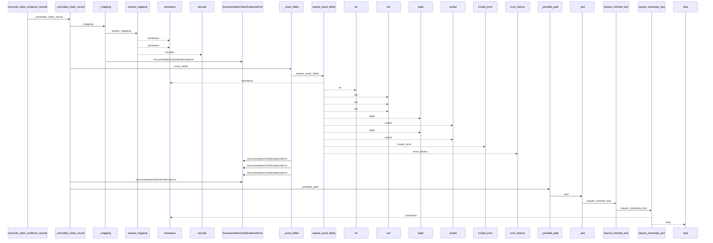
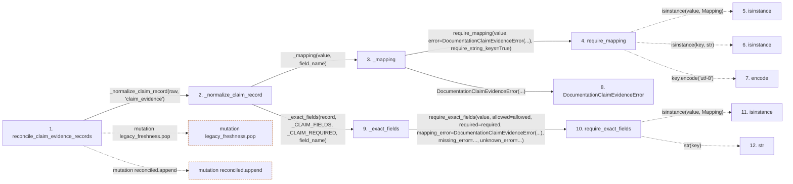

# reconcile_claim_evidence_records

**Entry point:** `reconcile_claim_evidence_records` (`api`)
**Source:** [documentation_claim_evidence](../modules/documentation_claim_evidence.md)
**Modules touched:** [documentation_claim_evidence](../modules/documentation_claim_evidence.md), [knowledge_graph](../modules/knowledge_graph.md), [validation](../modules/validation.md)

## Call sequence

<!-- Auto-generated from static call edges. Dashed arrows are external or unresolved calls. Reviewed runtime conditions and side effects belong in Behavior. -->

> Call sequence diagram shows 30 of 331 interactions; 301 omitted to keep the visualization within the 30-interaction and generated-diagram limits.

> Trace truncated at the depth limit; deeper calls are omitted.

## Data flow

<!-- Auto-generated static analysis. Treat values and boundaries as best-effort hints, not runtime proof. -->

### Step data

| Step | Inputs | Reads | Writes | Returns |
|---|---|---|---|---|
| `reconcile_claim_evidence_records` | `records: Iterable[Mapping[str, Any]]`, `service: DocumentationGraphQueryService` | `Mapping`, `_CLAIM_FIELDS` | - | `tuple(...)` |
| `_normalize_claim_record` | `value: object`, `field_name: str` | `_CLAIM_FIELDS`, `_CLAIM_REQUIRED`, `CLAIM_EVIDENCE_SCHEMA_VERSION`, `_RESOLUTIONS`, `CLAIM_EVIDENCE_SCHEMA_VERSION` | - | `{...}` |
| `_mapping` | `value: object`, `field_name: str` | - | - | `require_mapping(...)` |
| `require_mapping` | `value: object`, `error: Exception`, `require_string_keys: bool`, `key_error: Exception \| None`, `require_utf8_keys: bool`, `utf8_key_error: Exception \| None` | `Mapping` | - | `value` |
| `isinstance` | - | - | - | - |
| `isinstance` | - | - | - | - |
| `encode` | - | - | - | - |
| `DocumentationClaimEvidenceError` | - | - | - | - |
| `_exact_fields` | `value: Mapping[str, Any]`, `allowed: frozenset[str]`, `required: frozenset[str]`, `field_name: str` | - | - | `require_exact_fields(...)` |
| `require_exact_fields` | `value: object`, `allowed: Iterable[str]`, `required: Iterable[str]`, `mapping_error: Exception`, `missing_error: _ErrorFactory`, `unknown_error: _ErrorFactory`, `invalid_error: Callable[[tuple[str, ...], tuple[str, ...]], Exception] \| None`, `stringify_keys: bool` | `Mapping` | - | - |
| `isinstance` | - | - | - | - |
| `str` | - | - | - | - |

### Call data

| From | To | Line | Call |
|---|---|---:|---|
| reconcile_claim_evidence_records | _normalize_claim_record | 400 | `_normalize_claim_record(raw, 'claim_evidence')` |
| _normalize_claim_record | _mapping | 592 | `_mapping(value, field_name)` |
| _mapping | require_mapping | 1423 | `require_mapping(value, error=DocumentationClaimEvidenceError(...), require_string_keys=True)` |
| require_mapping | isinstance | 727 | `isinstance(value, Mapping)` |
| require_mapping | isinstance | 731 | `isinstance(key, str)` |
| require_mapping | encode | 736 | `key.encode('utf-8')` |
| _mapping | DocumentationClaimEvidenceError | 1425 | `DocumentationClaimEvidenceError(...)` |
| _normalize_claim_record | _exact_fields | 593 | `_exact_fields(record, _CLAIM_FIELDS, _CLAIM_REQUIRED, field_name)` |
| _exact_fields | require_exact_fields | 1447 | `require_exact_fields(value, allowed=allowed, required=required, mapping_error=DocumentationClaimEvidenceError(...), missing_error=..., unknown_error=...)` |
| require_exact_fields | isinstance | 1205 | `isinstance(value, Mapping)` |
| require_exact_fields | str | 1207 | `str(key)` |

### Boundary effects

| Kind | Target | Step | Line |
|---|---|---|---:|
| mutation | `legacy_freshness.pop` | `reconcile_claim_evidence_records` | 418 |
| mutation | `reconciled.append` | `reconcile_claim_evidence_records` | 433 |

### Static analysis gaps

| Kind | Step | Target | Line |
|---|---|---|---:|
| unresolved_call | `require_mapping` | `isinstance` | 727 |
| unresolved_call | `require_mapping` | `isinstance` | 731 |
| unresolved_call | `require_mapping` | `key.encode` | 736 |
| unresolved_call | `require_exact_fields` | `isinstance` | 1205 |
| step_limit | `reconcile_claim_evidence_records` | `first 12 steps` | 0 |
| truncated_flow | `reconcile_claim_evidence_records` | `depth limit` | 0 |

## Behavior

This flow starts at `reconcile_claim_evidence_records` and is classified as `api`. The generated call and data-flow sections are bounded static projections; runtime conditions and side effects require source-level confirmation.
