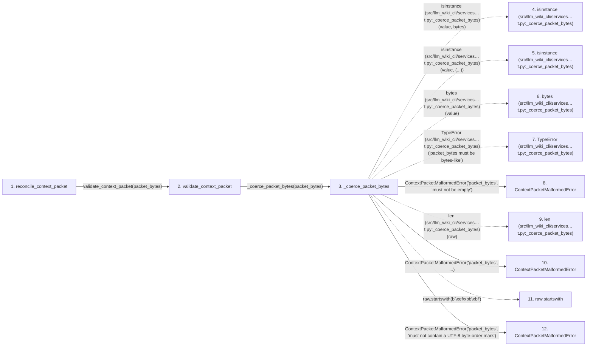

# reconcile_context_packet

**Entry point:** `reconcile_context_packet` (`api`)
**Source:** [context_packet](../modules/context_packet.md)
**Modules touched:** [common](../modules/common.md), [config](../modules/config.md), [context_packet](../modules/context_packet.md), [context_service](../modules/context_service.md), and 34 more

**Complete modules touched:**

- [common](../modules/common.md)
- [config](../modules/config.md)
- [context_packet](../modules/context_packet.md)
- [context_service](../modules/context_service.md)
- [data_flow](../modules/data_flow.md)
- [dependency_versions](../modules/dependency_versions.md)
- [documentation_queries](../modules/documentation_queries.md)
- [documentation_query_builder](../modules/documentation_query_builder.md)
- [entrypoints](../modules/entrypoints.md)
- [extraction_service](../modules/extraction_service.md)
- [filesystem_guard](../modules/filesystem_guard.md)
- [imports](../modules/imports.md)
- [infrastructure_inventory](../modules/infrastructure_inventory.md)
- [infrastructure_sync](../modules/infrastructure_sync.md)
- [io](../modules/io.md)
- [knowledge_artifacts](../modules/knowledge_artifacts.md)
- [knowledge_consumption](../modules/knowledge_consumption.md)
- [knowledge_envelope](../modules/knowledge_envelope.md)
- [knowledge_evidence](../modules/knowledge_evidence.md)
- [knowledge_freshness](../modules/knowledge_freshness.md)
- [knowledge_generation](../modules/knowledge_generation.md)
- [knowledge_loader](../modules/knowledge_loader.md)
- [knowledge_model](../modules/knowledge_model.md)
- [knowledge_orchestration](../modules/knowledge_orchestration.md)
- [knowledge_verification](../modules/knowledge_verification.md)
- [packages](../modules/packages.md)
- [plugins](../modules/plugins.md)
- [python_calls](../modules/python_calls.md)
- [python_imports](../modules/python_imports.md)
- [services_dependencies](../modules/services_dependencies.md)
- [source_selection](../modules/source_selection.md)
- [source_snapshot](../modules/source_snapshot.md)
- [sync_manifest](../modules/sync_manifest.md)
- [validation](../modules/validation.md)
- [verification_contracts](../modules/verification_contracts.md)
- [wiki_media](../modules/wiki_media.md)
- [wiki_surface](../modules/wiki_surface.md)
- [wiki_surface_index](../modules/wiki_surface_index.md)

## Call sequence

```mermaid
sequenceDiagram
    participant p0 as reconcile_context_packet
    participant p1 as validate_context_packet
    participant p2 as _coerce_packet_bytes
    participant p3 as isinstance (src/llm_wiki_cli/services…t.py:_coerce_packet_bytes)
    participant p4 as bytes (src/llm_wiki_cli/services…t.py:_coerce_packet_bytes)
    participant p5 as TypeError (src/llm_wiki_cli/services…t.py:_coerce_packet_bytes)
    participant p6 as ContextPacketMalformedError
    participant p7 as len (src/llm_wiki_cli/services…t.py:_coerce_packet_bytes)
    participant p8 as raw.startswith
    participant p9 as raw.endswith
    participant p10 as _strict_json_payload
    participant p11 as raw.decode
    participant p12 as json.loads (src/llm_wiki_cli/services…t.py:_strict_json_payload)
    participant p13 as isinstance (src/llm_wiki_cli/services…t.py:_strict_json_payload)
    participant p14 as _validate_json_tree
    participant p15 as set (src/llm_wiki_cli/services…et.py:_validate_json_tree)
    participant p16 as visit (src/llm_wiki_cli/services…et.py:_validate_json_tree)
    participant p17 as _packet_contract_for_schema
    participant p18 as isinstance (src/llm_wiki_cli/services…acket_contract_for_schema)
    participant p19 as _PACKET_CONTRACT_BY_SCHEMA.get
    participant p20 as payload.get (src/llm_wiki_cli/services…y:validate_context_packet)
    p0->>p1: validate_context_packet
    p1->>p2: _coerce_packet_bytes
    p2-->>p3: isinstance (src/llm_wiki_cli/services…t.py:_coerce_packet_bytes)
    p2-->>p3: isinstance (src/llm_wiki_cli/services…t.py:_coerce_packet_bytes)
    p2-->>p4: bytes (src/llm_wiki_cli/services…t.py:_coerce_packet_bytes)
    p2-->>p5: TypeError (src/llm_wiki_cli/services…t.py:_coerce_packet_bytes)
    p2->>p6: ContextPacketMalformedError
    p2-->>p7: len (src/llm_wiki_cli/services…t.py:_coerce_packet_bytes)
    p2->>p6: ContextPacketMalformedError
    p2-->>p8: raw.startswith
    p2->>p6: ContextPacketMalformedError
    p2-->>p9: raw.endswith
    p2-->>p9: raw.endswith
    p2->>p6: ContextPacketMalformedError
    p1->>p10: _strict_json_payload
    p10-->>p11: raw.decode
    p10->>p6: ContextPacketMalformedError
    p10-->>p12: json.loads (src/llm_wiki_cli/services…t.py:_strict_json_payload)
    p10->>p6: ContextPacketMalformedError
    p10-->>p13: isinstance (src/llm_wiki_cli/services…t.py:_strict_json_payload)
    p10->>p6: ContextPacketMalformedError
    p10->>p14: _validate_json_tree
    p14-->>p15: set (src/llm_wiki_cli/services…et.py:_validate_json_tree)
    p14-->>p16: visit (src/llm_wiki_cli/services…et.py:_validate_json_tree)
    p1->>p17: _packet_contract_for_schema
    p17-->>p18: isinstance (src/llm_wiki_cli/services…acket_contract_for_schema)
    p17->>p6: ContextPacketMalformedError
    p17-->>p19: _PACKET_CONTRACT_BY_SCHEMA.get
    p17->>p6: ContextPacketMalformedError
    p1-->>p20: payload.get (src/llm_wiki_cli/services…y:validate_context_packet)
```

<!-- Auto-generated from static call edges. Dashed arrows are external or unresolved calls. Reviewed runtime conditions and side effects belong in Behavior. -->

> Call sequence diagram shows 30 of 3393 interactions; 3363 omitted to keep the visualization within the 30-interaction and generated-diagram limits.

> Trace truncated at the depth limit; deeper calls are omitted.

## Data flow

<!-- Auto-generated static analysis. Treat values and boundaries as best-effort hints, not runtime proof. -->

### Step data

| Step | Inputs | Reads | Writes | Returns |
|---|---|---|---|---|
| `reconcile_context_packet` | `packet_bytes: bytes \| bytearray \| memoryview`, `src_dir: str`, `wiki_dir: str`, `allow_external_src: bool`, `read_only: bool`, `job_request: ExtractionJobRequest \| None`, `plan_reporter: Callable[[ExtractionJobPlan], None] \| None`, `source_selection: str \| Path \| None` | `_RECONCILIATION_FACETS`, `CONTEXT_PACKET_RECONCILIATION_POLICY` | - | `ContextPacketReconciliation._from_official_read(...)` |
| `validate_context_packet` | `packet_bytes: bytes \| bytearray \| memoryview` | - | - | `ContextPacketValidation(...)` |
| `_coerce_packet_bytes` | `value: bytes \| bytearray \| memoryview` | `_MAX_PACKET_BYTES`, `_MAX_PACKET_BYTES` | - | `raw` |
| `isinstance (src/llm_wiki_cli/services…t.py:_coerce_packet_bytes)` | - | - | - | - |
| `isinstance (src/llm_wiki_cli/services…t.py:_coerce_packet_bytes)` | - | - | - | - |
| `bytes (src/llm_wiki_cli/services…t.py:_coerce_packet_bytes)` | - | - | - | - |
| `TypeError (src/llm_wiki_cli/services…t.py:_coerce_packet_bytes)` | - | - | - | - |
| `ContextPacketMalformedError` | - | - | - | - |
| `len (src/llm_wiki_cli/services…t.py:_coerce_packet_bytes)` | - | - | - | - |
| `ContextPacketMalformedError` | - | - | - | - |
| `raw.startswith` | - | - | - | - |
| `ContextPacketMalformedError` | - | - | - | - |

### Call data

| From | To | Line | Call |
|---|---|---:|---|
| reconcile_context_packet | validate_context_packet | 1577 | `validate_context_packet(packet_bytes)` |
| validate_context_packet | _coerce_packet_bytes | 1488 | `_coerce_packet_bytes(packet_bytes)` |
| _coerce_packet_bytes | isinstance (src/llm_wiki_cli/services…t.py:_coerce_packet_bytes) | 2251 | `isinstance(value, bytes)` |
| _coerce_packet_bytes | isinstance (src/llm_wiki_cli/services…t.py:_coerce_packet_bytes) | 2253 | `isinstance(value, (...))` |
| _coerce_packet_bytes | bytes (src/llm_wiki_cli/services…t.py:_coerce_packet_bytes) | 2254 | `bytes(value)` |
| _coerce_packet_bytes | TypeError (src/llm_wiki_cli/services…t.py:_coerce_packet_bytes) | 2256 | `TypeError('packet_bytes must be bytes-like')` |
| _coerce_packet_bytes | ContextPacketMalformedError | 2258 | `ContextPacketMalformedError('packet_bytes', 'must not be empty')` |
| _coerce_packet_bytes | len (src/llm_wiki_cli/services…t.py:_coerce_packet_bytes) | 2259 | `len(raw)` |
| _coerce_packet_bytes | ContextPacketMalformedError | 2260 | `ContextPacketMalformedError('packet_bytes', ...)` |
| _coerce_packet_bytes | raw.startswith | 2264 | `raw.startswith(b'\xef\xbb\xbf')` |
| _coerce_packet_bytes | ContextPacketMalformedError | 2265 | `ContextPacketMalformedError('packet_bytes', 'must not contain a UTF-8 byte-order mark')` |

### Boundary effects

*No boundary effects detected.*

### Static analysis gaps

| Kind | Step | Target | Line |
|---|---|---|---:|
| external_call | `_coerce_packet_bytes` | `isinstance` | 2251 |
| external_call | `_coerce_packet_bytes` | `isinstance` | 2253 |
| external_call | `_coerce_packet_bytes` | `bytes` | 2254 |
| external_call | `_coerce_packet_bytes` | `TypeError` | 2256 |
| unresolved_call | `_coerce_packet_bytes` | `raw.startswith` | 2264 |
| step_limit | `reconcile_context_packet` | `first 12 steps` | 0 |
| truncated_flow | `reconcile_context_packet` | `depth limit` | 0 |

## Behavior

This flow starts at `reconcile_context_packet` and is classified as `api`. The generated call and data-flow sections are bounded static projections; runtime conditions and side effects require source-level confirmation.
