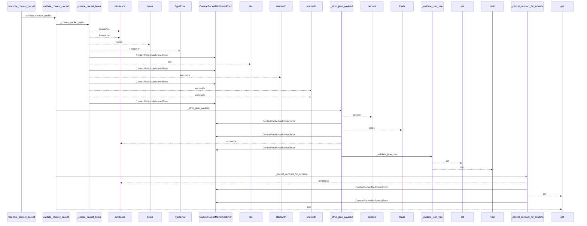
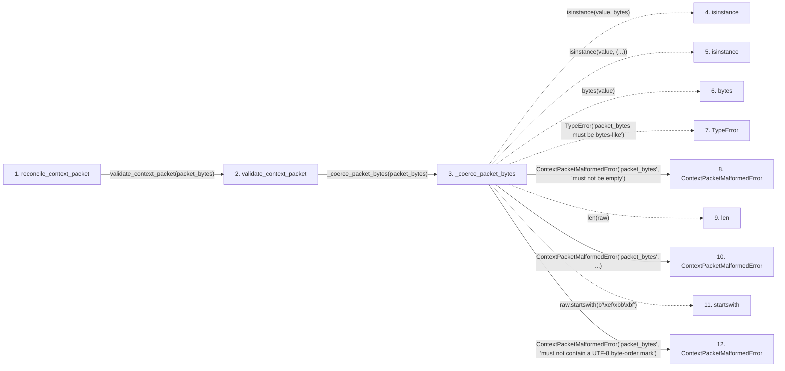

# reconcile_context_packet

**Entry point:** `reconcile_context_packet` (`api`)
**Source:** [context_packet](../modules/context_packet.md)
**Modules touched:** [common](../modules/common.md), [config](../modules/config.md), [context_packet](../modules/context_packet.md), [dependency_versions](../modules/dependency_versions.md), and 14 more

**Complete modules touched:**

- [common](../modules/common.md)
- [config](../modules/config.md)
- [context_packet](../modules/context_packet.md)
- [dependency_versions](../modules/dependency_versions.md)
- [documentation_queries](../modules/documentation_queries.md)
- [documentation_query_builder](../modules/documentation_query_builder.md)
- [imports](../modules/imports.md)
- [knowledge_envelope](../modules/knowledge_envelope.md)
- [knowledge_evidence](../modules/knowledge_evidence.md)
- [knowledge_verification](../modules/knowledge_verification.md)
- [plugins](../modules/plugins.md)
- [services_dependencies](../modules/services_dependencies.md)
- [source_selection](../modules/source_selection.md)
- [source_snapshot](../modules/source_snapshot.md)
- [validation](../modules/validation.md)
- [wiki_media](../modules/wiki_media.md)
- [wiki_surface](../modules/wiki_surface.md)
- [wiki_surface_index](../modules/wiki_surface_index.md)

## Call sequence

<!-- Auto-generated from static call edges. Dashed arrows are external or unresolved calls. Reviewed runtime conditions and side effects belong in Behavior. -->

> Call sequence diagram shows 30 of 1728 interactions; 1698 omitted to keep the visualization within the 30-interaction and generated-diagram limits.

> Trace truncated at the depth limit; deeper calls are omitted.

## Data flow

<!-- Auto-generated static analysis. Treat values and boundaries as best-effort hints, not runtime proof. -->

### Step data

| Step | Inputs | Reads | Writes | Returns |
|---|---|---|---|---|
| `reconcile_context_packet` | `packet_bytes: bytes \| bytearray \| memoryview`, `src_dir: str`, `wiki_dir: str`, `allow_external_src: bool`, `read_only: bool`, `job_request: ExtractionJobRequest \| None`, `plan_reporter: Callable[[ExtractionJobPlan], None] \| None`, `source_selection: str \| Path \| None` | `_RECONCILIATION_FACETS`, `CONTEXT_PACKET_RECONCILIATION_POLICY` | - | `ContextPacketReconciliation._from_official_read(...)` |
| `validate_context_packet` | `packet_bytes: bytes \| bytearray \| memoryview` | - | - | `ContextPacketValidation(...)` |
| `_coerce_packet_bytes` | `value: bytes \| bytearray \| memoryview` | `_MAX_PACKET_BYTES`, `_MAX_PACKET_BYTES` | - | `raw` |
| `isinstance` | - | - | - | - |
| `isinstance` | - | - | - | - |
| `bytes` | - | - | - | - |
| `TypeError` | - | - | - | - |
| `ContextPacketMalformedError` | - | - | - | - |
| `len` | - | - | - | - |
| `ContextPacketMalformedError` | - | - | - | - |
| `startswith` | - | - | - | - |
| `ContextPacketMalformedError` | - | - | - | - |

### Call data

| From | To | Line | Call |
|---|---|---:|---|
| reconcile_context_packet | validate_context_packet | 1577 | `validate_context_packet(packet_bytes)` |
| validate_context_packet | _coerce_packet_bytes | 1488 | `_coerce_packet_bytes(packet_bytes)` |
| _coerce_packet_bytes | isinstance | 2251 | `isinstance(value, bytes)` |
| _coerce_packet_bytes | isinstance | 2253 | `isinstance(value, (...))` |
| _coerce_packet_bytes | bytes | 2254 | `bytes(value)` |
| _coerce_packet_bytes | TypeError | 2256 | `TypeError('packet_bytes must be bytes-like')` |
| _coerce_packet_bytes | ContextPacketMalformedError | 2258 | `ContextPacketMalformedError('packet_bytes', 'must not be empty')` |
| _coerce_packet_bytes | len | 2259 | `len(raw)` |
| _coerce_packet_bytes | ContextPacketMalformedError | 2260 | `ContextPacketMalformedError('packet_bytes', ...)` |
| _coerce_packet_bytes | startswith | 2264 | `raw.startswith(b'\xef\xbb\xbf')` |
| _coerce_packet_bytes | ContextPacketMalformedError | 2265 | `ContextPacketMalformedError('packet_bytes', 'must not contain a UTF-8 byte-order mark')` |

### Boundary effects

*No boundary effects detected.*

### Static analysis gaps

| Kind | Step | Target | Line |
|---|---|---|---:|
| unresolved_call | `_coerce_packet_bytes` | `isinstance` | 2251 |
| unresolved_call | `_coerce_packet_bytes` | `isinstance` | 2253 |
| unresolved_call | `_coerce_packet_bytes` | `bytes` | 2254 |
| unresolved_call | `_coerce_packet_bytes` | `TypeError` | 2256 |
| unresolved_call | `_coerce_packet_bytes` | `raw.startswith` | 2264 |
| step_limit | `reconcile_context_packet` | `first 12 steps` | 0 |
| truncated_flow | `reconcile_context_packet` | `depth limit` | 0 |

## Behavior

This flow starts at `reconcile_context_packet` and is classified as `api`. The generated call and data-flow sections are bounded static projections; runtime conditions and side effects require source-level confirmation.
