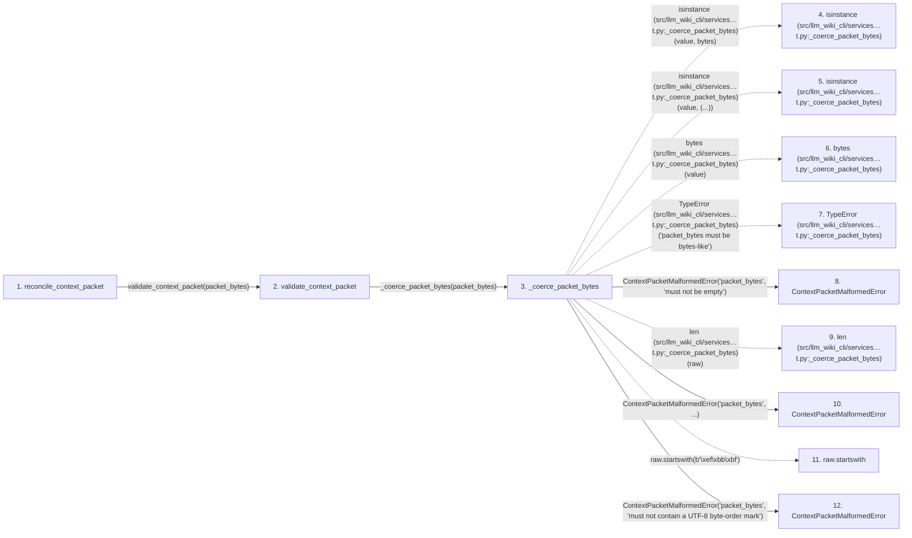

# reconcile_context_packet

**Entry point:** `reconcile_context_packet` (`api`)
**Source:** [context_packet](../modules/context_packet.md)
**Modules touched:** [analysis_capture](../modules/analysis_capture.md), [analysis_compatibility](../modules/analysis_compatibility.md), [change_selection](../modules/change_selection.md), [common](../modules/common.md), and 53 more

**Complete modules touched:**

- [analysis_capture](../modules/analysis_capture.md)
- [analysis_compatibility](../modules/analysis_compatibility.md)
- [change_selection](../modules/change_selection.md)
- [common](../modules/common.md)
- [config](../modules/config.md)
- [context_budget](../modules/context_budget.md)
- [context_packet](../modules/context_packet.md)
- [context_service](../modules/context_service.md)
- [data_flow](../modules/data_flow.md)
- [dependency_versions](../modules/dependency_versions.md)
- [documentation_queries](../modules/documentation_queries.md)
- [documentation_query_builder](../modules/documentation_query_builder.md)
- [entrypoints](../modules/entrypoints.md)
- [extraction_service](../modules/extraction_service.md)
- [filesystem_guard](../modules/filesystem_guard.md)
- [go_calls](../modules/go_calls.md)
- [immutable](../modules/immutable.md)
- [implementation_evidence](../modules/implementation_evidence.md)
- [imports](../modules/imports.md)
- [infrastructure_inventory](../modules/infrastructure_inventory.md)
- [infrastructure_sync](../modules/infrastructure_sync.md)
- [io](../modules/io.md)
- [knowledge_artifacts](../modules/knowledge_artifacts.md)
- [knowledge_consumption](../modules/knowledge_consumption.md)
- [knowledge_envelope](../modules/knowledge_envelope.md)
- [knowledge_evidence](../modules/knowledge_evidence.md)
- [knowledge_freshness](../modules/knowledge_freshness.md)
- [knowledge_generation](../modules/knowledge_generation.md)
- [knowledge_governance](../modules/knowledge_governance.md)
- [knowledge_loader](../modules/knowledge_loader.md)
- [knowledge_model](../modules/knowledge_model.md)
- [knowledge_orchestration](../modules/knowledge_orchestration.md)
- [knowledge_storage](../modules/knowledge_storage.md)
- [knowledge_storage_io](../modules/knowledge_storage_io.md)
- [knowledge_verification](../modules/knowledge_verification.md)
- [maintenance_evidence](../modules/maintenance_evidence.md)
- [maintenance_protocol](../modules/maintenance_protocol.md)
- [maintenance_service](../modules/maintenance_service.md)
- [maintenance_state](../modules/maintenance_state.md)
- [maintenance_status](../modules/maintenance_status.md)
- [manifest_storage](../modules/manifest_storage.md)
- [packages](../modules/packages.md)
- [packet_field_policy](../modules/packet_field_policy.md)
- [plugins](../modules/plugins.md)
- [python_bindings](../modules/python_bindings.md)
- [python_calls](../modules/python_calls.md)
- [python_implementation](../modules/python_implementation.md)
- [python_imports](../modules/python_imports.md)
- [services_dependencies](../modules/services_dependencies.md)
- [source_selection](../modules/source_selection.md)
- [source_snapshot](../modules/source_snapshot.md)
- [sync_manifest](../modules/sync_manifest.md)
- [validation](../modules/validation.md)
- [verification_contracts](../modules/verification_contracts.md)
- [wiki_media](../modules/wiki_media.md)
- [wiki_surface](../modules/wiki_surface.md)
- [wiki_surface_index](../modules/wiki_surface_index.md)

## Call sequence

> Static overview in presentation order, not runtime execution order. Arrows retain captured callers; siblings are shown before deeper helper detail.

<!-- Auto-generated from static call edges. Dashed arrows are external or unresolved calls. Reviewed runtime conditions and side effects belong in Behavior. -->

```mermaid
sequenceDiagram
    participant p0 as reconcile_context_packet
    participant p1 as validate_context_packet
    participant p2 as validation.packet.to_payload
    participant p3 as build_qualified_context
    participant p4 as live_packet.to_payload
    participant p5 as _reconcile_packet_views
    participant p6 as _coerce_packet_bytes
    participant p7 as _normalized_request
    participant p8 as _strict_json_payload
    participant p9 as _packet_contract_for_request
    participant p10 as _encode_packet_payload
    participant p11 as _packet_contract_for_schema
    participant p12 as capture_context_read
    participant p13 as payload.get (src/llm_wiki_cli/services…y:validate_context_packet)
    participant p14 as normalized.get (src/llm_wiki_cli/services…y:build_qualified_context)
    participant p15 as len (src/llm_wiki_cli/services…y:validate_context_packet)
    participant p16 as _reconciliation_facets
    participant p17 as ContextPacketMalformedError
    participant p18 as bool (src/llm_wiki_cli/services…y:build_qualified_context)
    participant p19 as any (src/llm_wiki_cli/services…y:_reconcile_packet_views)
    participant p20 as _validate_packet_shape
    participant p21 as set (src/llm_wiki_cli/services…y:build_qualified_context)
    participant p22 as required_states.values
    participant p23 as build_context_from_captured_read
    p0->>p1: validate_context_packet
    p0-->>p2: validation.packet.to_payload
    p0->>p3: build_qualified_context
    p0-->>p4: live_packet.to_payload
    p0->>p5: _reconcile_packet_views
    p1->>p6: _coerce_packet_bytes
    p3->>p7: _normalized_request
    p5->>p1: validate_context_packet
    p1->>p8: _strict_json_payload
    p3->>p9: _packet_contract_for_request
    p5->>p10: _encode_packet_payload
    p1->>p11: _packet_contract_for_schema
    p3->>p12: capture_context_read
    p5->>p1: validate_context_packet
    p1-->>p13: payload.get (src/llm_wiki_cli/services…y:validate_context_packet)('schema_version')
    p3-->>p14: normalized.get (src/llm_wiki_cli/services…y:build_qualified_context)('knowledge_mode')
    p5->>p10: _encode_packet_payload
    p1-->>p15: len (src/llm_wiki_cli/services…y:validate_context_packet)(raw)
    p3-->>p14: normalized.get (src/llm_wiki_cli/services…y:build_qualified_context)('knowledge_mode')
    p5->>p16: _reconciliation_facets
    p1->>p17: ContextPacketMalformedError
    p3-->>p18: bool (src/llm_wiki_cli/services…y:build_qualified_context)(...)
    p5-->>p19: any (src/llm_wiki_cli/services…y:_reconcile_packet_views)(...)
    p1->>p20: _validate_packet_shape
    p3-->>p21: set (src/llm_wiki_cli/services…y:build_qualified_context)(normalized[...])
    p5-->>p22: required_states.values
    p1->>p10: _encode_packet_payload
    p3->>p23: build_context_from_captured_read
    p5-->>p19: any (src/llm_wiki_cli/services…y:_reconcile_packet_views)(...)
    p1->>p17: ContextPacketMalformedError
```

> Call sequence diagram shows 30 of 4070 interactions; 4040 omitted to keep the visualization within the 30-interaction and generated-diagram limits, with uncertain identities omitted rather than inferred.

> Captured boundary calls: external 5 of 1350 (1345 omitted); unresolved 6 of 1357 (1351 omitted). These counts cover the captured static trace.

Omitted captured detail, grouped by actual caller occurrence and target module:

| Caller | Parent step | Target module | Kind | Omitted interactions |
| --- | --- | --- | --- | --- |
| `src/llm_wiki_cli/services/context_packet.py:_coerce_packet_bytes` | 3 | - | external | 5 |
| `src/llm_wiki_cli/services/context_packet.py:_coerce_packet_bytes` | 3 | [src/llm_wiki_cli/services/context_packet.py](../modules/context_packet.md) | internal | 4 |
| `src/llm_wiki_cli/services/context_packet.py:_coerce_packet_bytes` | 3 | - | unresolved | 3 |
| `src/llm_wiki_cli/services/context_packet.py:_strict_json_payload` | 16 | - | unresolved | 1 |
| `src/llm_wiki_cli/services/context_packet.py:_strict_json_payload` | 16 | [src/llm_wiki_cli/services/context_packet.py](../modules/context_packet.md) | internal | 4 |
| `src/llm_wiki_cli/services/context_packet.py:_strict_json_payload` | 16 | - | external | 2 |
| `src/llm_wiki_cli/services/context_packet.py:_validate_json_tree` | 23 | - | external | 1 |
| `src/llm_wiki_cli/services/context_packet.py:_validate_json_tree` | 23 | - | unresolved | 1 |
> Omission summary shows 8 of 889 groups; 881 further groups are not expanded here. Counts above include all omitted interactions.
> Detailed flow queries retain their own coverage and limits; omitted paths may execute at runtime.

> Trace truncated at the depth limit; deeper calls are omitted.

## Data flow

<!-- Auto-generated static analysis. Treat values and boundaries as best-effort hints, not runtime proof. -->

```mermaid
flowchart LR
    s1["1. reconcile_context_packet"]
    s2["2. validate_context_packet"]
    s3["3. _coerce_packet_bytes"]
    s4["4. isinstance (src/llm_wiki_cli/services…t.py:_coerce_packet_bytes)"]
    s5["5. isinstance (src/llm_wiki_cli/services…t.py:_coerce_packet_bytes)"]
    s6["6. bytes (src/llm_wiki_cli/services…t.py:_coerce_packet_bytes)"]
    s7["7. TypeError (src/llm_wiki_cli/services…t.py:_coerce_packet_bytes)"]
    s8["8. ContextPacketMalformedError"]
    s9["9. len (src/llm_wiki_cli/services…t.py:_coerce_packet_bytes)"]
    s10["10. ContextPacketMalformedError"]
    s11["11. raw.startswith"]
    s12["12. ContextPacketMalformedError"]
    s1 -->|"validate_context_packet(packet_bytes)"| s2
    s2 -->|"_coerce_packet_bytes(packet_bytes)"| s3
    s3 -. "isinstance (src/llm_wiki_cli/services…t.py:_coerce_packet_bytes)(value, bytes)" .-> s4
    s3 -. "isinstance (src/llm_wiki_cli/services…t.py:_coerce_packet_bytes)(value, (...))" .-> s5
    s3 -. "bytes (src/llm_wiki_cli/services…t.py:_coerce_packet_bytes)(value)" .-> s6
    s3 -. "TypeError (src/llm_wiki_cli/services…t.py:_coerce_packet_bytes)('packet_bytes must be bytes-like')" .-> s7
    s3 -->|"ContextPacketMalformedError('packet_bytes', 'must not be empty')"| s8
    s3 -. "len (src/llm_wiki_cli/services…t.py:_coerce_packet_bytes)(raw)" .-> s9
    s3 -->|"ContextPacketMalformedError('packet_bytes', ...)"| s10
    s3 -. "raw.startswith(b'\xef\xbb\xbf')" .-> s11
    s3 -->|"ContextPacketMalformedError('packet_bytes', 'must not contain a UTF-8 byte-order mark')"| s12
    click s1 "../modules/context_packet.md"
    click s2 "../modules/context_packet.md"
    click s3 "../modules/context_packet.md"
    click s8 "../modules/context_packet.md"
    click s10 "../modules/context_packet.md"
    click s12 "../modules/context_packet.md"
```

### Step data

| Step | Inputs | Reads | Writes | Returns |
|---|---|---|---|---|
| `reconcile_context_packet` | `packet_bytes: bytes \| bytearray \| memoryview`, `src_dir: str`, `wiki_dir: str`, `allow_external_src: bool`, `read_only: bool`, `job_request: ExtractionJobRequest \| None`, `plan_reporter: Callable[[ExtractionJobPlan], None] \| None`, `source_selection: str \| Path \| None` | - | - | `_reconcile_packet_views(...)` |
| `validate_context_packet` | `packet_bytes: bytes \| bytearray \| memoryview` | - | - | `ContextPacketValidation(...)` |
| `_coerce_packet_bytes` | `value: bytes \| bytearray \| memoryview` | `_MAX_PACKET_BYTES`, `_MAX_PACKET_BYTES` | - | `raw` |
| `isinstance (src/llm_wiki_cli/services…t.py:_coerce_packet_bytes)` | - | - | - | - |
| `isinstance (src/llm_wiki_cli/services…t.py:_coerce_packet_bytes)` | - | - | - | - |
| `bytes (src/llm_wiki_cli/services…t.py:_coerce_packet_bytes)` | - | - | - | - |
| `TypeError (src/llm_wiki_cli/services…t.py:_coerce_packet_bytes)` | - | - | - | - |
| `ContextPacketMalformedError` | - | - | - | - |
| `len (src/llm_wiki_cli/services…t.py:_coerce_packet_bytes)` | - | - | - | - |
| `ContextPacketMalformedError` | - | - | - | - |
| `raw.startswith` | - | - | - | - |
| `ContextPacketMalformedError` | - | - | - | - |

### Call data

| From | To | Line | Call |
|---|---|---:|---|
| reconcile_context_packet | validate_context_packet | 1804 | `validate_context_packet(packet_bytes)` |
| validate_context_packet | _coerce_packet_bytes | 1715 | `_coerce_packet_bytes(packet_bytes)` |
| _coerce_packet_bytes | isinstance (src/llm_wiki_cli/services…t.py:_coerce_packet_bytes) | 2496 | `isinstance(value, bytes)` |
| _coerce_packet_bytes | isinstance (src/llm_wiki_cli/services…t.py:_coerce_packet_bytes) | 2498 | `isinstance(value, (...))` |
| _coerce_packet_bytes | bytes (src/llm_wiki_cli/services…t.py:_coerce_packet_bytes) | 2499 | `bytes(value)` |
| _coerce_packet_bytes | TypeError (src/llm_wiki_cli/services…t.py:_coerce_packet_bytes) | 2501 | `TypeError('packet_bytes must be bytes-like')` |
| _coerce_packet_bytes | ContextPacketMalformedError | 2503 | `ContextPacketMalformedError('packet_bytes', 'must not be empty')` |
| _coerce_packet_bytes | len (src/llm_wiki_cli/services…t.py:_coerce_packet_bytes) | 2504 | `len(raw)` |
| _coerce_packet_bytes | ContextPacketMalformedError | 2505 | `ContextPacketMalformedError('packet_bytes', ...)` |
| _coerce_packet_bytes | raw.startswith | 2509 | `raw.startswith(b'\xef\xbb\xbf')` |
| _coerce_packet_bytes | ContextPacketMalformedError | 2510 | `ContextPacketMalformedError('packet_bytes', 'must not contain a UTF-8 byte-order mark')` |

### Boundary effects

*No boundary effects detected.*

### Static analysis gaps

| Kind | Step | Target | Line |
|---|---|---|---:|
| external_call | `_coerce_packet_bytes` | `isinstance` | 2496 |
| external_call | `_coerce_packet_bytes` | `isinstance` | 2498 |
| external_call | `_coerce_packet_bytes` | `bytes` | 2499 |
| external_call | `_coerce_packet_bytes` | `TypeError` | 2501 |
| unresolved_call | `_coerce_packet_bytes` | `raw.startswith` | 2509 |
| step_limit | `reconcile_context_packet` | `first 12 steps` | 0 |
| truncated_flow | `reconcile_context_packet` | `depth limit` | 0 |

## Behavior

This flow starts at `reconcile_context_packet` and is classified as `api`. The generated call and data-flow sections are bounded static projections; runtime conditions and side effects require source-level confirmation.
