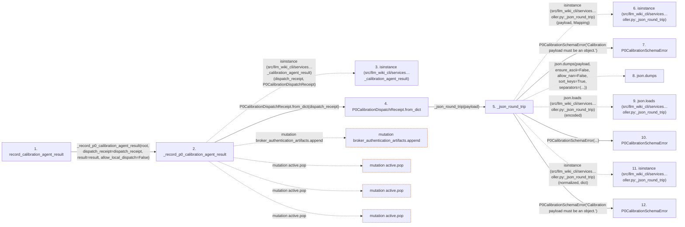

# record_calibration_agent_result

**Entry point:** `record_calibration_agent_result` (`api`)
**Source:** [controller](../modules/controller.md)
**Modules touched:** [broker](../modules/broker.md), [calibration_contracts](../modules/calibration_contracts.md), [controller](../modules/controller.md), [documentation_policy](../modules/documentation_policy.md), and 3 more

**Complete modules touched:**

- [broker](../modules/broker.md)
- [calibration_contracts](../modules/calibration_contracts.md)
- [controller](../modules/controller.md)
- [documentation_policy](../modules/documentation_policy.md)
- [host_broker](../modules/host_broker.md)
- [protected_artifacts](../modules/protected_artifacts.md)
- [validation](../modules/validation.md)

## Call sequence

```mermaid
sequenceDiagram
    participant p0 as record_calibration_agent_result
    participant p1 as _record_p0_calibration_agent_result
    participant p2 as isinstance (src/llm_wiki_cli/services…_calibration_agent_result)
    participant p3 as P0CalibrationDispatchReceipt.from_dict
    participant p4 as _json_round_trip
    participant p5 as isinstance (src/llm_wiki_cli/services…oller.py:_json_round_trip)
    participant p6 as P0CalibrationSchemaError
    participant p7 as json.dumps
    participant p8 as json.loads (src/llm_wiki_cli/services…oller.py:_json_round_trip)
    participant p9 as _validate_dispatch_receipt
    participant p10 as payload.get (src/llm_wiki_cli/services…validate_dispatch_receipt)
    participant p11 as _require_uuid
    participant p12 as require_uuid
    participant p13 as require_trimmed_text
    participant p14 as str (src/llm_wiki_cli/services…alidation.py:require_uuid)
    participant p15 as uuid.UUID
    participant p16 as _portable_id
    participant p17 as _require_text
    participant p18 as _PORTABLE_ID_RE.fullmatch
    p0->>p1: _record_p0_calibration_agent_result
    p1-->>p2: isinstance (src/llm_wiki_cli/services…_calibration_agent_result)
    p1->>p3: P0CalibrationDispatchReceipt.from_dict
    p3->>p4: _json_round_trip
    p4-->>p5: isinstance (src/llm_wiki_cli/services…oller.py:_json_round_trip)
    p4->>p6: P0CalibrationSchemaError
    p4-->>p7: json.dumps
    p4-->>p8: json.loads (src/llm_wiki_cli/services…oller.py:_json_round_trip)
    p4->>p6: P0CalibrationSchemaError
    p4-->>p5: isinstance (src/llm_wiki_cli/services…oller.py:_json_round_trip)
    p4->>p6: P0CalibrationSchemaError
    p3->>p9: _validate_dispatch_receipt
    p9-->>p10: payload.get (src/llm_wiki_cli/services…validate_dispatch_receipt)
    p9->>p6: P0CalibrationSchemaError
    p9->>p11: _require_uuid
    p11->>p12: require_uuid
    p12->>p13: require_trimmed_text
    p12-->>p14: str (src/llm_wiki_cli/services…alidation.py:require_uuid)
    p12-->>p15: uuid.UUID
    p11->>p6: P0CalibrationSchemaError
    p11->>p6: P0CalibrationSchemaError
    p11->>p6: P0CalibrationSchemaError
    p9-->>p10: payload.get (src/llm_wiki_cli/services…validate_dispatch_receipt)
    p9->>p16: _portable_id
    p16->>p17: _require_text
    p17->>p13: require_trimmed_text
    p17->>p6: P0CalibrationSchemaError
    p16-->>p18: _PORTABLE_ID_RE.fullmatch
    p16->>p6: P0CalibrationSchemaError
    p9-->>p10: payload.get (src/llm_wiki_cli/services…validate_dispatch_receipt)
```

<!-- Auto-generated from static call edges. Dashed arrows are external or unresolved calls. Reviewed runtime conditions and side effects belong in Behavior. -->

> Call sequence diagram shows 30 of 1721 interactions; 1691 omitted to keep the visualization within the 30-interaction and generated-diagram limits.

> Trace truncated at the depth limit; deeper calls are omitted.

## Data flow

<!-- Auto-generated static analysis. Treat values and boundaries as best-effort hints, not runtime proof. -->

### Step data

| Step | Inputs | Reads | Writes | Returns |
|---|---|---|---|---|
| `record_calibration_agent_result` | `root: str \| Path`, `dispatch_receipt: P0CalibrationDispatchReceipt \| Mapping[str, Any]`, `result: P0CalibrationAgentResult \| Mapping[str, Any]` | - | - | `_record_p0_calibration_agent_result(...)` |
| `_record_p0_calibration_agent_result` | `root: str \| Path`, `dispatch_receipt: P0CalibrationDispatchReceipt \| Mapping[str, Any]`, `result: P0CalibrationAgentResult \| Mapping[str, Any]`, `allow_local_dispatch: bool` | `P0CalibrationDispatchReceipt`, `P0CalibrationAgentResult`, `Mapping`, `CALIBRATION_TERMINAL_STATES`, `CALIBRATION_ROLES`, `Mapping`, `_MAX_RESULT_BYTES`, `_ExternalBrokerAuthenticationUnavailable` | `recorded[...]`, `roles[...]`, `receipts[...]`, `results[...]`, `artifacts[...]`, `artifacts[...]`, `receipt_authentications[...]`, `artifacts[...]` | `run`, `_commit_transition(...)`, `_commit_transition(...)` |
| `isinstance (src/llm_wiki_cli/services…_calibration_agent_result)` | - | - | - | - |
| `P0CalibrationDispatchReceipt.from_dict` | `payload: Mapping[str, Any]` | - | - | `cls(...)` |
| `_json_round_trip` | `payload: Mapping[str, Any]` | `Mapping` | - | `normalized` |
| `isinstance (src/llm_wiki_cli/services…oller.py:_json_round_trip)` | - | - | - | - |
| `P0CalibrationSchemaError` | - | - | - | - |
| `json.dumps` | - | - | - | - |
| `json.loads (src/llm_wiki_cli/services…oller.py:_json_round_trip)` | - | - | - | - |
| `P0CalibrationSchemaError` | - | - | - | - |
| `isinstance (src/llm_wiki_cli/services…oller.py:_json_round_trip)` | - | - | - | - |
| `P0CalibrationSchemaError` | - | - | - | - |

### Call data

| From | To | Line | Call |
|---|---|---:|---|
| record_calibration_agent_result | _record_p0_calibration_agent_result | 2610 | `_record_p0_calibration_agent_result(root, dispatch_receipt=dispatch_receipt, result=result, allow_local_dispatch=False)` |
| _record_p0_calibration_agent_result | isinstance (src/llm_wiki_cli/services…_calibration_agent_result) | 2627 | `isinstance(dispatch_receipt, P0CalibrationDispatchReceipt)` |
| _record_p0_calibration_agent_result | P0CalibrationDispatchReceipt.from_dict | 2628 | `P0CalibrationDispatchReceipt.from_dict(dispatch_receipt)` |
| P0CalibrationDispatchReceipt.from_dict | _json_round_trip | 452 | `_json_round_trip(payload)` |
| _json_round_trip | isinstance (src/llm_wiki_cli/services…oller.py:_json_round_trip) | 6865 | `isinstance(payload, Mapping)` |
| _json_round_trip | P0CalibrationSchemaError | 6866 | `P0CalibrationSchemaError('Calibration payload must be an object.')` |
| _json_round_trip | json.dumps | 6868 | `json.dumps(payload, ensure_ascii=False, allow_nan=False, sort_keys=True, separators=(...))` |
| _json_round_trip | json.loads (src/llm_wiki_cli/services…oller.py:_json_round_trip) | 6875 | `json.loads(encoded)` |
| _json_round_trip | P0CalibrationSchemaError | 6877 | `P0CalibrationSchemaError(...)` |
| _json_round_trip | isinstance (src/llm_wiki_cli/services…oller.py:_json_round_trip) | 6880 | `isinstance(normalized, dict)` |
| _json_round_trip | P0CalibrationSchemaError | 6881 | `P0CalibrationSchemaError('Calibration payload must be an object.')` |

### Boundary effects

| Kind | Target | Step | Line |
|---|---|---|---:|
| mutation | `broker_authentication_artifacts.append` | `_record_p0_calibration_agent_result` | 2777 |
| mutation | `active.pop` | `_record_p0_calibration_agent_result` | 2798 |
| mutation | `active.pop` | `_record_p0_calibration_agent_result` | 2908 |
| mutation | `active.pop` | `_record_p0_calibration_agent_result` | 2952 |

### Static analysis gaps

| Kind | Step | Target | Line |
|---|---|---|---:|
| external_call | `_record_p0_calibration_agent_result` | `isinstance` | 2627 |
| external_call | `_json_round_trip` | `isinstance` | 6865 |
| external_call | `_json_round_trip` | `json.dumps` | 6868 |
| external_call | `_json_round_trip` | `json.loads` | 6875 |
| external_call | `_json_round_trip` | `isinstance` | 6880 |
| step_limit | `record_calibration_agent_result` | `first 12 steps` | 0 |
| truncated_flow | `record_calibration_agent_result` | `depth limit` | 0 |

## Behavior

This flow starts at `record_calibration_agent_result` and is classified as `api`. The generated call and data-flow sections are bounded static projections; runtime conditions and side effects require source-level confirmation.
