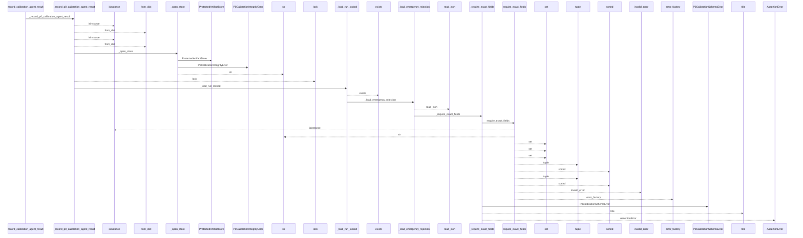
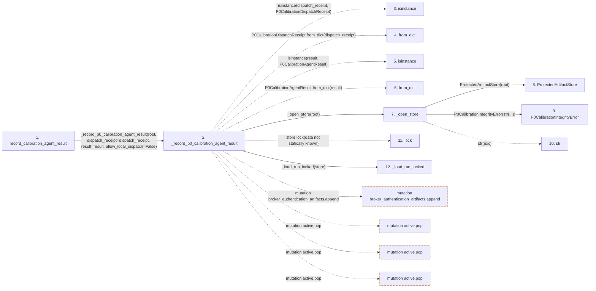

# record_calibration_agent_result

**Entry point:** `record_calibration_agent_result` (`api`)
**Source:** [controller](../modules/controller.md)
**Modules touched:** [calibration_contracts](../modules/calibration_contracts.md), [controller](../modules/controller.md), [documentation_policy](../modules/documentation_policy.md), [host_broker](../modules/host_broker.md), and 2 more

**Complete modules touched:**

- [calibration_contracts](../modules/calibration_contracts.md)
- [controller](../modules/controller.md)
- [documentation_policy](../modules/documentation_policy.md)
- [host_broker](../modules/host_broker.md)
- [protected_artifacts](../modules/protected_artifacts.md)
- [validation](../modules/validation.md)

## Call sequence

<!-- Auto-generated from static call edges. Dashed arrows are external or unresolved calls. Reviewed runtime conditions and side effects belong in Behavior. -->

> Call sequence diagram shows 30 of 1413 interactions; 1383 omitted to keep the visualization within the 30-interaction and generated-diagram limits.

> Trace truncated at the depth limit; deeper calls are omitted.

## Data flow

<!-- Auto-generated static analysis. Treat values and boundaries as best-effort hints, not runtime proof. -->

### Step data

| Step | Inputs | Reads | Writes | Returns |
|---|---|---|---|---|
| `record_calibration_agent_result` | `root: str \| Path`, `dispatch_receipt: P0CalibrationDispatchReceipt \| Mapping[str, Any]`, `result: P0CalibrationAgentResult \| Mapping[str, Any]` | - | - | `_record_p0_calibration_agent_result(...)` |
| `_record_p0_calibration_agent_result` | `root: str \| Path`, `dispatch_receipt: P0CalibrationDispatchReceipt \| Mapping[str, Any]`, `result: P0CalibrationAgentResult \| Mapping[str, Any]`, `allow_local_dispatch: bool` | `P0CalibrationDispatchReceipt`, `P0CalibrationAgentResult`, `Mapping`, `CALIBRATION_TERMINAL_STATES`, `CALIBRATION_ROLES`, `Mapping`, `_MAX_RESULT_BYTES`, `_ExternalBrokerAuthenticationUnavailable` | `recorded[...]`, `roles[...]`, `receipts[...]`, `results[...]`, `artifacts[...]`, `artifacts[...]`, `receipt_authentications[...]`, `artifacts[...]` | `run`, `_commit_transition(...)`, `_commit_transition(...)` |
| `isinstance` | - | - | - | - |
| `from_dict` | - | - | - | - |
| `isinstance` | - | - | - | - |
| `from_dict` | - | - | - | - |
| `_open_store` | `root: str \| Path` | `ProtectedArtifactError` | - | `ProtectedArtifactStore(...)` |
| `ProtectedArtifactStore` | - | - | - | - |
| `P0CalibrationIntegrityError` | - | - | - | - |
| `str` | - | - | - | - |
| `lock` | - | - | - | - |
| `_load_run_locked` | `store: ProtectedArtifactStore` | `P0CalibrationRecoveryError`, `P0CalibrationError`, `ProtectedArtifactError`, `ProtectedArtifactError`, `CALIBRATION_TERMINAL_STATES`, `P0CalibrationError`, `ProtectedArtifactError` | - | `_load_emergency_rejection(...)`, `_block_ambiguous_recovery(...)`, `_persist_emergency_rejection(...)`, `_terminal_transition_locked(...)`, `run`, `_persist_emergency_rejection(...)` |

### Call data

| From | To | Line | Call |
|---|---|---:|---|
| record_calibration_agent_result | _record_p0_calibration_agent_result | 2610 | `_record_p0_calibration_agent_result(root, dispatch_receipt=dispatch_receipt, result=result, allow_local_dispatch=False)` |
| _record_p0_calibration_agent_result | isinstance | 2627 | `isinstance(dispatch_receipt, P0CalibrationDispatchReceipt)` |
| _record_p0_calibration_agent_result | from_dict | 2628 | `P0CalibrationDispatchReceipt.from_dict(dispatch_receipt)` |
| _record_p0_calibration_agent_result | isinstance | 2632 | `isinstance(result, P0CalibrationAgentResult)` |
| _record_p0_calibration_agent_result | from_dict | 2633 | `P0CalibrationAgentResult.from_dict(result)` |
| _record_p0_calibration_agent_result | _open_store | 2635 | `_open_store(root)` |
| _open_store | ProtectedArtifactStore | 5824 | `ProtectedArtifactStore(root)` |
| _open_store | P0CalibrationIntegrityError | 5826 | `P0CalibrationIntegrityError(str(...))` |
| _open_store | str | 5826 | `str(exc)` |
| _record_p0_calibration_agent_result | lock | 2636 | `store.lock(data not statically known)` |
| _record_p0_calibration_agent_result | _load_run_locked | 2637 | `_load_run_locked(store)` |

### Boundary effects

| Kind | Target | Step | Line |
|---|---|---|---:|
| mutation | `broker_authentication_artifacts.append` | `_record_p0_calibration_agent_result` | 2777 |
| mutation | `active.pop` | `_record_p0_calibration_agent_result` | 2798 |
| mutation | `active.pop` | `_record_p0_calibration_agent_result` | 2908 |
| mutation | `active.pop` | `_record_p0_calibration_agent_result` | 2952 |

### Static analysis gaps

| Kind | Step | Target | Line |
|---|---|---|---:|
| unresolved_call | `_record_p0_calibration_agent_result` | `isinstance` | 2627 |
| unresolved_call | `_record_p0_calibration_agent_result` | `P0CalibrationDispatchReceipt.from_dict` | 2628 |
| unresolved_call | `_record_p0_calibration_agent_result` | `isinstance` | 2632 |
| unresolved_call | `_record_p0_calibration_agent_result` | `P0CalibrationAgentResult.from_dict` | 2633 |
| unresolved_call | `_record_p0_calibration_agent_result` | `store.lock` | 2636 |
| step_limit | `record_calibration_agent_result` | `first 12 steps` | 0 |
| truncated_flow | `record_calibration_agent_result` | `depth limit` | 0 |

## Behavior

This flow starts at `record_calibration_agent_result` and is classified as `api`. The generated call and data-flow sections are bounded static projections; runtime conditions and side effects require source-level confirmation.
