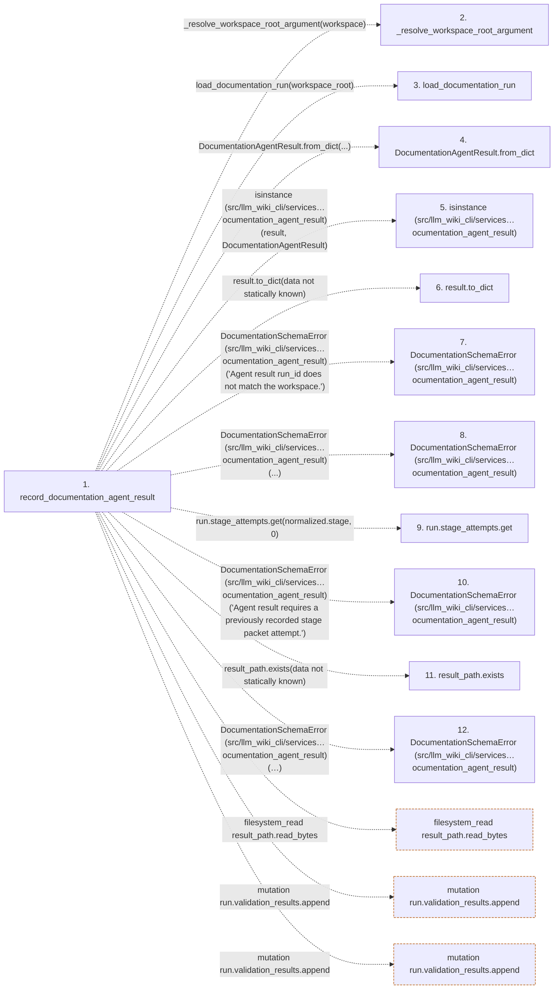

# record_documentation_agent_result

**Entry point:** `record_documentation_agent_result` (`api`)
**Source:** [record](../modules/record.md)
**Modules touched:** [record](../modules/record.md)

## Call sequence

```mermaid
sequenceDiagram
    participant p0 as record_documentation_agent_result
    participant p1 as _resolve_workspace_root_argument
    participant p2 as load_documentation_run
    participant p3 as DocumentationAgentResult.from_dict
    participant p4 as isinstance (src/llm_wiki_cli/services…ocumentation_agent_result)
    participant p5 as result.to_dict
    participant p6 as DocumentationSchemaError (src/llm_wiki_cli/services…ocumentation_agent_result)
    participant p7 as run.stage_attempts.get
    participant p8 as result_path.exists
    participant p9 as _verify_stage_dispatch_integrity
    participant p10 as _block_run_for_integrity
    participant p11 as DocumentationIntegrityError (src/llm_wiki_cli/services…ocumentation_agent_result)
    participant p12 as _verify_read_only_inputs
    participant p13 as str (src/llm_wiki_cli/services…ocumentation_agent_result)
    participant p14 as run.evidence.get (src/llm_wiki_cli/services…ocumentation_agent_result)
    participant p15 as _read_json (src/llm_wiki_cli/services…ocumentation_agent_result)
    participant p16 as _workspace_path (src/llm_wiki_cli/services…ocumentation_agent_result)
    participant p17 as TreeBaseline.from_dict
    participant p18 as capture_tree_baseline
    participant p19 as _changed_paths
    participant p20 as set (src/llm_wiki_cli/services…ocumentation_agent_result)
    participant p21 as sorted (src/llm_wiki_cli/services…ocumentation_agent_result)
    p0-->>p1: _resolve_workspace_root_argument
    p0-->>p2: load_documentation_run
    p0-->>p3: DocumentationAgentResult.from_dict
    p0-->>p4: isinstance (src/llm_wiki_cli/services…ocumentation_agent_result)
    p0-->>p5: result.to_dict
    p0-->>p6: DocumentationSchemaError (src/llm_wiki_cli/services…ocumentation_agent_result)
    p0-->>p6: DocumentationSchemaError (src/llm_wiki_cli/services…ocumentation_agent_result)
    p0-->>p7: run.stage_attempts.get
    p0-->>p6: DocumentationSchemaError (src/llm_wiki_cli/services…ocumentation_agent_result)
    p0-->>p8: result_path.exists
    p0-->>p6: DocumentationSchemaError (src/llm_wiki_cli/services…ocumentation_agent_result)
    p0-->>p9: _verify_stage_dispatch_integrity
    p0-->>p10: _block_run_for_integrity
    p0-->>p11: DocumentationIntegrityError (src/llm_wiki_cli/services…ocumentation_agent_result)
    p0-->>p12: _verify_read_only_inputs
    p0-->>p10: _block_run_for_integrity
    p0-->>p13: str (src/llm_wiki_cli/services…ocumentation_agent_result)
    p0-->>p14: run.evidence.get (src/llm_wiki_cli/services…ocumentation_agent_result)
    p0-->>p11: DocumentationIntegrityError (src/llm_wiki_cli/services…ocumentation_agent_result)
    p0-->>p15: _read_json (src/llm_wiki_cli/services…ocumentation_agent_result)
    p0-->>p16: _workspace_path (src/llm_wiki_cli/services…ocumentation_agent_result)
    p0-->>p17: TreeBaseline.from_dict
    p0-->>p18: capture_tree_baseline
    p0-->>p19: _changed_paths
    p0-->>p20: set (src/llm_wiki_cli/services…ocumentation_agent_result)
    p0-->>p20: set (src/llm_wiki_cli/services…ocumentation_agent_result)
    p0-->>p10: _block_run_for_integrity
    p0-->>p11: DocumentationIntegrityError (src/llm_wiki_cli/services…ocumentation_agent_result)
    p0-->>p21: sorted (src/llm_wiki_cli/services…ocumentation_agent_result)
    p0-->>p15: _read_json (src/llm_wiki_cli/services…ocumentation_agent_result)
```

<!-- Auto-generated from static call edges. Dashed arrows are external or unresolved calls. Reviewed runtime conditions and side effects belong in Behavior. -->

> Call sequence diagram shows 30 of 458 interactions; 428 omitted to keep the visualization within the 30-interaction and generated-diagram limits.

## Data flow

<!-- Auto-generated static analysis. Treat values and boundaries as best-effort hints, not runtime proof. -->

### Step data

| Step | Inputs | Reads | Writes | Returns |
|---|---|---|---|---|
| `record_documentation_agent_result` | `workspace: str \| Path`, `result: DocumentationAgentResult \| Mapping[str, Any]` | - | - | `run`, `run`, `run`, `run`, `run`, `run`, `run` |
| `_resolve_workspace_root_argument` | - | - | - | - |
| `load_documentation_run` | - | - | - | - |
| `DocumentationAgentResult.from_dict` | - | - | - | - |
| `isinstance (src/llm_wiki_cli/services…ocumentation_agent_result)` | - | - | - | - |
| `result.to_dict` | - | - | - | - |
| `DocumentationSchemaError (src/llm_wiki_cli/services…ocumentation_agent_result)` | - | - | - | - |
| `DocumentationSchemaError (src/llm_wiki_cli/services…ocumentation_agent_result)` | - | - | - | - |
| `run.stage_attempts.get` | - | - | - | - |
| `DocumentationSchemaError (src/llm_wiki_cli/services…ocumentation_agent_result)` | - | - | - | - |
| `result_path.exists` | - | - | - | - |
| `DocumentationSchemaError (src/llm_wiki_cli/services…ocumentation_agent_result)` | - | - | - | - |

### Call data

| From | To | Line | Call |
|---|---|---:|---|
| record_documentation_agent_result | _resolve_workspace_root_argument | 781 | `_resolve_workspace_root_argument(workspace)` |
| record_documentation_agent_result | load_documentation_run | 782 | `load_documentation_run(workspace_root)` |
| record_documentation_agent_result | DocumentationAgentResult.from_dict | 783 | `DocumentationAgentResult.from_dict(...)` |
| record_documentation_agent_result | isinstance (src/llm_wiki_cli/services…ocumentation_agent_result) | 784 | `isinstance(result, DocumentationAgentResult)` |
| record_documentation_agent_result | result.to_dict | 784 | `result.to_dict(data not statically known)` |
| record_documentation_agent_result | DocumentationSchemaError (src/llm_wiki_cli/services…ocumentation_agent_result) | 787 | `DocumentationSchemaError('Agent result run_id does not match the workspace.')` |
| record_documentation_agent_result | DocumentationSchemaError (src/llm_wiki_cli/services…ocumentation_agent_result) | 791 | `DocumentationSchemaError(...)` |
| record_documentation_agent_result | run.stage_attempts.get | 795 | `run.stage_attempts.get(normalized.stage, 0)` |
| record_documentation_agent_result | DocumentationSchemaError (src/llm_wiki_cli/services…ocumentation_agent_result) | 797 | `DocumentationSchemaError('Agent result requires a previously recorded stage packet attempt.')` |
| record_documentation_agent_result | result_path.exists | 802 | `result_path.exists(data not statically known)` |
| record_documentation_agent_result | DocumentationSchemaError (src/llm_wiki_cli/services…ocumentation_agent_result) | 803 | `DocumentationSchemaError('This stage-packet attempt already has a result; build a new packet before recording another result.')` |

### Boundary effects

| Kind | Target | Step | Line |
|---|---|---|---:|
| filesystem_read | `result_path.read_bytes` | `record_documentation_agent_result` | 1018 |
| mutation | `run.validation_results.append` | `record_documentation_agent_result` | 1039 |
| mutation | `run.validation_results.append` | `record_documentation_agent_result` | 1100 |

### Static analysis gaps

| Kind | Step | Target | Line |
|---|---|---|---:|
| unresolved_call | `record_documentation_agent_result` | `_resolve_workspace_root_argument` | 781 |
| unresolved_call | `record_documentation_agent_result` | `load_documentation_run` | 782 |
| unresolved_call | `record_documentation_agent_result` | `DocumentationAgentResult.from_dict` | 783 |
| unresolved_call | `record_documentation_agent_result` | `isinstance` | 784 |
| unresolved_call | `record_documentation_agent_result` | `result.to_dict` | 784 |
| unresolved_call | `record_documentation_agent_result` | `DocumentationSchemaError` | 787 |
| unresolved_call | `record_documentation_agent_result` | `DocumentationSchemaError` | 791 |
| unresolved_call | `record_documentation_agent_result` | `run.stage_attempts.get` | 795 |
| unresolved_call | `record_documentation_agent_result` | `DocumentationSchemaError` | 797 |
| unresolved_call | `record_documentation_agent_result` | `result_path.exists` | 802 |
| unresolved_call | `record_documentation_agent_result` | `DocumentationSchemaError` | 803 |
| step_limit | `record_documentation_agent_result` | `first 12 steps` | 0 |

## Behavior

This flow starts at `record_documentation_agent_result` and is classified as `api`. The generated call and data-flow sections are bounded static projections; runtime conditions and side effects require source-level confirmation.
