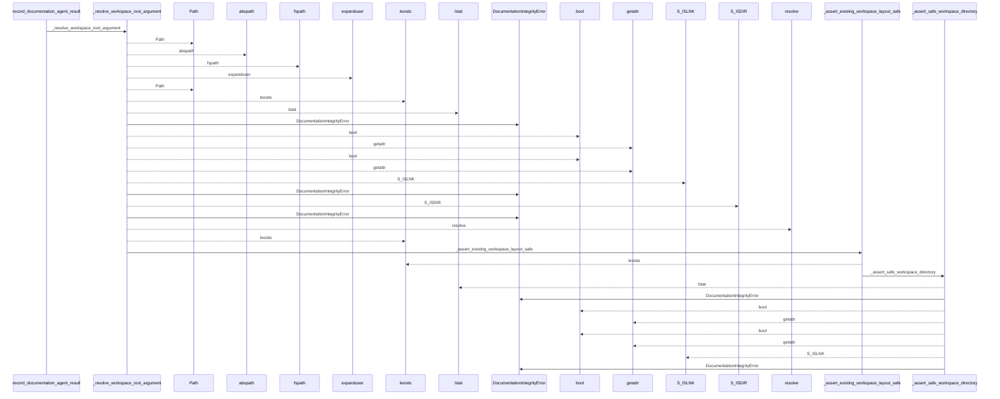
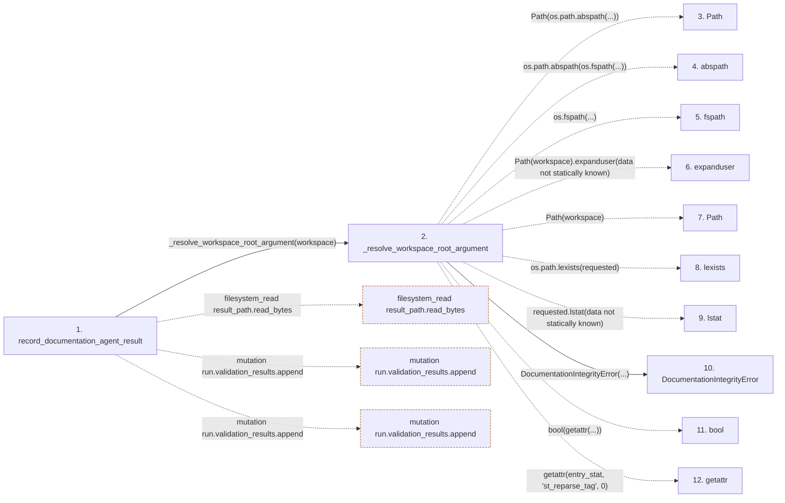

# record_documentation_agent_result

**Entry point:** `record_documentation_agent_result` (`api`)
**Source:** [record](../modules/record.md)
**Modules touched:** [api_contracts](../modules/api_contracts.md), [bootstrap_runtime](../modules/bootstrap_runtime.md), [common](../modules/common.md), [config](../modules/config.md), and 52 more

**Complete modules touched:**

- [api_contracts](../modules/api_contracts.md)
- [bootstrap_runtime](../modules/bootstrap_runtime.md)
- [common](../modules/common.md)
- [config](../modules/config.md)
- [context_service](../modules/context_service.md)
- [data_flow](../modules/data_flow.md)
- [documentation_claim_evidence](../modules/documentation_claim_evidence.md)
- [documentation_native](../modules/documentation_native.md)
- [documentation_policy](../modules/documentation_policy.md)
- [documentation_queries](../modules/documentation_queries.md)
- [documentation_query_builder](../modules/documentation_query_builder.md)
- [documentation_review](../modules/documentation_review.md)
- [documentation_run_contracts](../modules/documentation_run_contracts.md)
- [documentation_run_schema](../modules/documentation_run_schema.md)
- [documentation_wiki_input](../modules/documentation_wiki_input.md)
- [entrypoints](../modules/entrypoints.md)
- [extraction_service](../modules/extraction_service.md)
- [filesystem_guard](../modules/filesystem_guard.md)
- [imports](../modules/imports.md)
- [infrastructure_inventory](../modules/infrastructure_inventory.md)
- [infrastructure_sync](../modules/infrastructure_sync.md)
- [integrity](../modules/integrity.md)
- [inventory_cache](../modules/inventory_cache.md)
- [io](../modules/io.md)
- [knowledge_artifacts](../modules/knowledge_artifacts.md)
- [knowledge_consumption](../modules/knowledge_consumption.md)
- [knowledge_envelope](../modules/knowledge_envelope.md)
- [knowledge_evidence](../modules/knowledge_evidence.md)
- [knowledge_freshness](../modules/knowledge_freshness.md)
- [knowledge_generation](../modules/knowledge_generation.md)
- [knowledge_governance](../modules/knowledge_governance.md)
- [knowledge_graph](../modules/knowledge_graph.md)
- [knowledge_index](../modules/knowledge_index.md)
- [knowledge_loader](../modules/knowledge_loader.md)
- [knowledge_model](../modules/knowledge_model.md)
- [knowledge_observability](../modules/knowledge_observability.md)
- [knowledge_orchestration](../modules/knowledge_orchestration.md)
- [knowledge_verification](../modules/knowledge_verification.md)
- [lint_service](../modules/lint_service.md)
- [paths](../modules/paths.md)
- [plugins](../modules/plugins.md)
- [record](../modules/record.md)
- [refresh](../modules/refresh.md)
- [section_ownership](../modules/section_ownership.md)
- [services_dependencies](../modules/services_dependencies.md)
- [source_selection](../modules/source_selection.md)
- [source_snapshot](../modules/source_snapshot.md)
- [sync_analysis](../modules/sync_analysis.md)
- [team](../modules/team.md)
- [validation](../modules/validation.md)
- [verification_contracts](../modules/verification_contracts.md)
- [wiki_lifecycle](../modules/wiki_lifecycle.md)
- [wiki_media](../modules/wiki_media.md)
- [wiki_surface](../modules/wiki_surface.md)
- [wiki_surface_index](../modules/wiki_surface_index.md)
- [workspace](../modules/workspace.md)

## Call sequence

<!-- Auto-generated from static call edges. Dashed arrows are external or unresolved calls. Reviewed runtime conditions and side effects belong in Behavior. -->

> Call sequence diagram shows 30 of 5425 interactions; 5395 omitted to keep the visualization within the 30-interaction and generated-diagram limits.

> Trace truncated at the depth limit; deeper calls are omitted.

## Data flow

<!-- Auto-generated static analysis. Treat values and boundaries as best-effort hints, not runtime proof. -->

### Step data

| Step | Inputs | Reads | Writes | Returns |
|---|---|---|---|---|
| `record_documentation_agent_result` | `workspace: str \| Path`, `result: DocumentationAgentResult \| Mapping[str, Any]` | - | - | `run`, `run`, `run`, `run`, `run`, `run`, `run` |
| `_resolve_workspace_root_argument` | `workspace: str \| Path` | - | - | `resolved` |
| `Path` | - | - | - | - |
| `abspath` | - | - | - | - |
| `fspath` | - | - | - | - |
| `expanduser` | - | - | - | - |
| `Path` | - | - | - | - |
| `lexists` | - | - | - | - |
| `lstat` | - | - | - | - |
| `DocumentationIntegrityError` | - | - | - | - |
| `bool` | - | - | - | - |
| `getattr` | - | - | - | - |

### Call data

| From | To | Line | Call |
|---|---|---:|---|
| record_documentation_agent_result | _resolve_workspace_root_argument | 781 | `_resolve_workspace_root_argument(workspace)` |
| _resolve_workspace_root_argument | Path | 102 | `Path(os.path.abspath(...))` |
| _resolve_workspace_root_argument | abspath | 102 | `os.path.abspath(os.fspath(...))` |
| _resolve_workspace_root_argument | fspath | 102 | `os.fspath(...)` |
| _resolve_workspace_root_argument | expanduser | 102 | `Path(workspace).expanduser(data not statically known)` |
| _resolve_workspace_root_argument | Path | 102 | `Path(workspace)` |
| _resolve_workspace_root_argument | lexists | 103 | `os.path.lexists(requested)` |
| _resolve_workspace_root_argument | lstat | 105 | `requested.lstat(data not statically known)` |
| _resolve_workspace_root_argument | DocumentationIntegrityError | 107 | `DocumentationIntegrityError(...)` |
| _resolve_workspace_root_argument | bool | 110 | `bool(getattr(...))` |
| _resolve_workspace_root_argument | getattr | 110 | `getattr(entry_stat, 'st_reparse_tag', 0)` |

### Boundary effects

| Kind | Target | Step | Line |
|---|---|---|---:|
| filesystem_read | `result_path.read_bytes` | `record_documentation_agent_result` | 1018 |
| mutation | `run.validation_results.append` | `record_documentation_agent_result` | 1039 |
| mutation | `run.validation_results.append` | `record_documentation_agent_result` | 1100 |

### Static analysis gaps

| Kind | Step | Target | Line |
|---|---|---|---:|
| unresolved_call | `_resolve_workspace_root_argument` | `os.path.abspath` | 102 |
| unresolved_call | `_resolve_workspace_root_argument` | `os.fspath` | 102 |
| unresolved_call | `_resolve_workspace_root_argument` | `Path(workspace).expanduser` | 102 |
| unresolved_call | `_resolve_workspace_root_argument` | `os.path.lexists` | 103 |
| unresolved_call | `_resolve_workspace_root_argument` | `requested.lstat` | 105 |
| unresolved_call | `_resolve_workspace_root_argument` | `getattr` | 110 |
| step_limit | `record_documentation_agent_result` | `first 12 steps` | 0 |
| truncated_flow | `record_documentation_agent_result` | `depth limit` | 0 |

## Behavior

This flow starts at `record_documentation_agent_result` and is classified as `api`. The generated call and data-flow sections are bounded static projections; runtime conditions and side effects require source-level confirmation.
