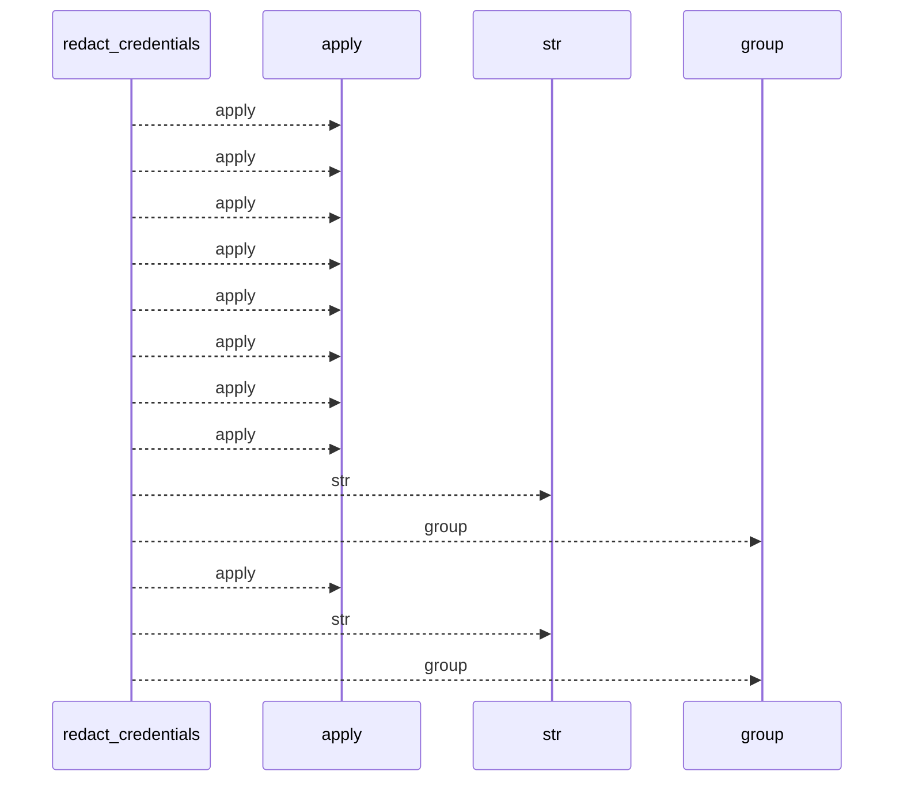
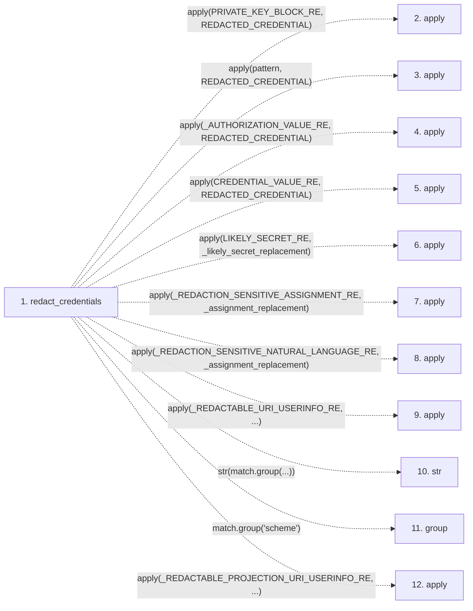

# redact_credentials

**Entry point:** `redact_credentials` (`api`)
**Source:** [redaction](../modules/redaction.md)
**Modules touched:** [redaction](../modules/redaction.md)

## Call sequence

<!-- Auto-generated from static call edges. Dashed arrows are external or unresolved calls. Reviewed runtime conditions and side effects belong in Behavior. -->

## Data flow

<!-- Auto-generated static analysis. Treat values and boundaries as best-effort hints, not runtime proof. -->

### Step data

| Step | Inputs | Reads | Writes | Returns |
|---|---|---|---|---|
| `redact_credentials` | `text: str` | `PRIVATE_KEY_BLOCK_RE`, `REDACTED_CREDENTIAL`, `COMMON_TOKEN_PATTERNS`, `REDACTED_CREDENTIAL`, `_AUTHORIZATION_VALUE_RE`, `REDACTED_CREDENTIAL`, `CREDENTIAL_VALUE_RE`, `REDACTED_CREDENTIAL` | - | `(...)` |
| `apply` | - | - | - | - |
| `apply` | - | - | - | - |
| `apply` | - | - | - | - |
| `apply` | - | - | - | - |
| `apply` | - | - | - | - |
| `apply` | - | - | - | - |
| `apply` | - | - | - | - |
| `apply` | - | - | - | - |
| `str` | - | - | - | - |
| `group` | - | - | - | - |
| `apply` | - | - | - | - |

### Call data

| From | To | Line | Call |
|---|---|---:|---|
| redact_credentials | apply | 326 | `apply(PRIVATE_KEY_BLOCK_RE, REDACTED_CREDENTIAL)` |
| redact_credentials | apply | 328 | `apply(pattern, REDACTED_CREDENTIAL)` |
| redact_credentials | apply | 329 | `apply(_AUTHORIZATION_VALUE_RE, REDACTED_CREDENTIAL)` |
| redact_credentials | apply | 330 | `apply(CREDENTIAL_VALUE_RE, REDACTED_CREDENTIAL)` |
| redact_credentials | apply | 331 | `apply(LIKELY_SECRET_RE, _likely_secret_replacement)` |
| redact_credentials | apply | 332 | `apply(_REDACTION_SENSITIVE_ASSIGNMENT_RE, _assignment_replacement)` |
| redact_credentials | apply | 333 | `apply(_REDACTION_SENSITIVE_NATURAL_LANGUAGE_RE, _assignment_replacement)` |
| redact_credentials | apply | 334 | `apply(_REDACTABLE_URI_USERINFO_RE, ...)` |
| redact_credentials | str | 336 | `str(match.group(...))` |
| redact_credentials | group | 336 | `match.group('scheme')` |
| redact_credentials | apply | 338 | `apply(_REDACTABLE_PROJECTION_URI_USERINFO_RE, ...)` |

### Boundary effects

*No boundary effects detected.*

### Static analysis gaps

| Kind | Step | Target | Line |
|---|---|---|---:|
| unresolved_call | `redact_credentials` | `apply` | 326 |
| unresolved_call | `redact_credentials` | `apply` | 328 |
| unresolved_call | `redact_credentials` | `apply` | 329 |
| unresolved_call | `redact_credentials` | `apply` | 330 |
| unresolved_call | `redact_credentials` | `apply` | 331 |
| unresolved_call | `redact_credentials` | `apply` | 332 |
| unresolved_call | `redact_credentials` | `apply` | 333 |
| unresolved_call | `redact_credentials` | `apply` | 334 |
| unresolved_call | `redact_credentials` | `match.group` | 336 |
| unresolved_call | `redact_credentials` | `apply` | 338 |
| step_limit | `redact_credentials` | `first 12 steps` | 0 |

## Behavior

This flow starts at `redact_credentials` and is classified as `api`. The generated call and data-flow sections are bounded static projections; runtime conditions and side effects require source-level confirmation.
