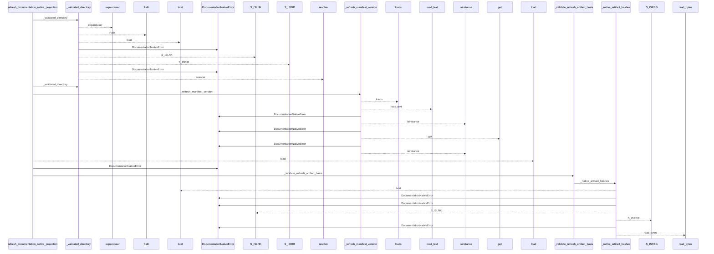
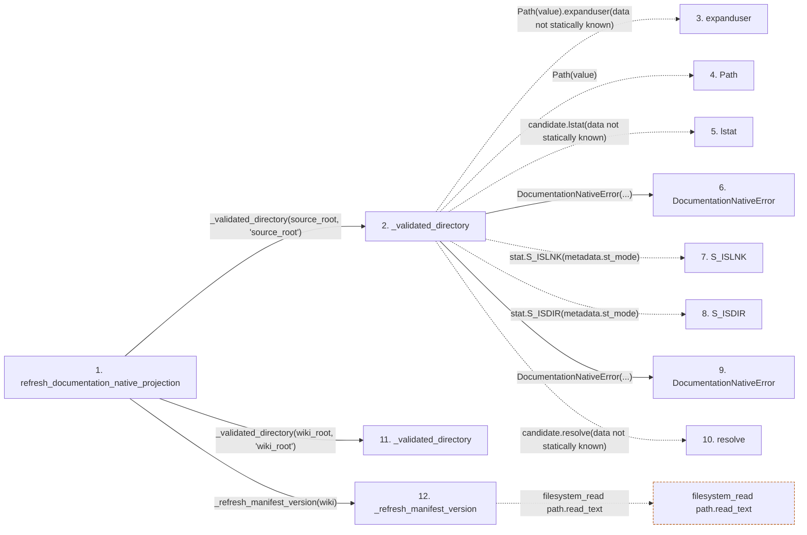

# refresh_documentation_native_projection

**Entry point:** `refresh_documentation_native_projection` (`api`)
**Source:** [documentation_native](../modules/documentation_native.md)
**Modules touched:** [api_contracts](../modules/api_contracts.md), [bootstrap_runtime](../modules/bootstrap_runtime.md), [common](../modules/common.md), [concept_identity](../modules/concept_identity.md), and 39 more

**Complete modules touched:**

- [api_contracts](../modules/api_contracts.md)
- [bootstrap_runtime](../modules/bootstrap_runtime.md)
- [common](../modules/common.md)
- [concept_identity](../modules/concept_identity.md)
- [config](../modules/config.md)
- [context_service](../modules/context_service.md)
- [data_flow](../modules/data_flow.md)
- [documentation_native](../modules/documentation_native.md)
- [entrypoints](../modules/entrypoints.md)
- [extraction_jobs](../modules/extraction_jobs.md)
- [extraction_service](../modules/extraction_service.md)
- [imports](../modules/imports.md)
- [infrastructure_inventory](../modules/infrastructure_inventory.md)
- [infrastructure_sync](../modules/infrastructure_sync.md)
- [inventory_cache](../modules/inventory_cache.md)
- [io](../modules/io.md)
- [knowledge_artifacts](../modules/knowledge_artifacts.md)
- [knowledge_consumption](../modules/knowledge_consumption.md)
- [knowledge_envelope](../modules/knowledge_envelope.md)
- [knowledge_evidence](../modules/knowledge_evidence.md)
- [knowledge_freshness](../modules/knowledge_freshness.md)
- [knowledge_generation](../modules/knowledge_generation.md)
- [knowledge_governance](../modules/knowledge_governance.md)
- [knowledge_graph](../modules/knowledge_graph.md)
- [knowledge_index](../modules/knowledge_index.md)
- [knowledge_links](../modules/knowledge_links.md)
- [knowledge_loader](../modules/knowledge_loader.md)
- [knowledge_model](../modules/knowledge_model.md)
- [knowledge_orchestration](../modules/knowledge_orchestration.md)
- [knowledge_verification](../modules/knowledge_verification.md)
- [packages](../modules/packages.md)
- [paths](../modules/paths.md)
- [plugins](../modules/plugins.md)
- [resource_diagnostics](../modules/resource_diagnostics.md)
- [section_ownership](../modules/section_ownership.md)
- [source_selection](../modules/source_selection.md)
- [source_snapshot](../modules/source_snapshot.md)
- [sync_manifest](../modules/sync_manifest.md)
- [validation](../modules/validation.md)
- [verification_contracts](../modules/verification_contracts.md)
- [wiki_media](../modules/wiki_media.md)
- [wiki_surface](../modules/wiki_surface.md)
- [wiki_surface_index](../modules/wiki_surface_index.md)

## Call sequence

<!-- Auto-generated from static call edges. Dashed arrows are external or unresolved calls. Reviewed runtime conditions and side effects belong in Behavior. -->

> Call sequence diagram shows 30 of 4447 interactions; 4417 omitted to keep the visualization within the 30-interaction and generated-diagram limits.

> Trace truncated at the depth limit; deeper calls are omitted.

## Data flow

<!-- Auto-generated static analysis. Treat values and boundaries as best-effort hints, not runtime proof. -->

### Step data

| Step | Inputs | Reads | Writes | Returns |
|---|---|---|---|---|
| `refresh_documentation_native_projection` | `source_root: str \| Path`, `wiki_root: str \| Path`, `trust_source_plugins: bool`, `helper_cache_dir: str \| Path \| None`, `source_selection: str \| Path \| None`, `fault_injector: Callable[[CommitStage], None] \| None` | `RUNTIME_GENERATION_OPTION_DEFAULTS`, `RUNTIME_GENERATION_OPTION_DEFAULTS`, `DocumentationNativeError` | - | `DocumentationNativeRefresh(...)` |
| `_validated_directory` | `value: str \| Path`, `field_name: str` | - | - | `candidate.resolve(...)` |
| `expanduser` | - | - | - | - |
| `Path` | - | - | - | - |
| `lstat` | - | - | - | - |
| `DocumentationNativeError` | - | - | - | - |
| `S_ISLNK` | - | - | - | - |
| `S_ISDIR` | - | - | - | - |
| `DocumentationNativeError` | - | - | - | - |
| `resolve` | - | - | - | - |
| `_validated_directory` | `value: str \| Path`, `field_name: str` | - | - | `candidate.resolve(...)` |
| `_refresh_manifest_version` | `wiki_root: Path` | `MANIFEST_FILENAME`, `Mapping`, `LEGACY_MANIFEST_VERSION`, `MANIFEST_VERSION`, `LEGACY_MANIFEST_VERSION`, `MANIFEST_VERSION` | - | `version` |

### Call data

| From | To | Line | Call |
|---|---|---:|---|
| refresh_documentation_native_projection | _validated_directory | 313 | `_validated_directory(source_root, 'source_root')` |
| _validated_directory | expanduser | 1078 | `Path(value).expanduser(data not statically known)` |
| _validated_directory | Path | 1078 | `Path(value)` |
| _validated_directory | lstat | 1080 | `candidate.lstat(data not statically known)` |
| _validated_directory | DocumentationNativeError | 1082 | `DocumentationNativeError(...)` |
| _validated_directory | S_ISLNK | 1085 | `stat.S_ISLNK(metadata.st_mode)` |
| _validated_directory | S_ISDIR | 1085 | `stat.S_ISDIR(metadata.st_mode)` |
| _validated_directory | DocumentationNativeError | 1086 | `DocumentationNativeError(...)` |
| _validated_directory | resolve | 1089 | `candidate.resolve(data not statically known)` |
| refresh_documentation_native_projection | _validated_directory | 314 | `_validated_directory(wiki_root, 'wiki_root')` |
| refresh_documentation_native_projection | _refresh_manifest_version | 315 | `_refresh_manifest_version(wiki)` |

### Boundary effects

| Kind | Target | Step | Line |
|---|---|---|---:|
| filesystem_read | `path.read_text` | `_refresh_manifest_version` | 943 |

### Static analysis gaps

| Kind | Step | Target | Line |
|---|---|---|---:|
| unresolved_call | `_validated_directory` | `Path(value).expanduser` | 1078 |
| unresolved_call | `_validated_directory` | `candidate.lstat` | 1080 |
| external_call | `_validated_directory` | `stat.S_ISLNK` | 1085 |
| external_call | `_validated_directory` | `stat.S_ISDIR` | 1085 |
| unresolved_call | `_validated_directory` | `candidate.resolve` | 1089 |
| step_limit | `refresh_documentation_native_projection` | `first 12 steps` | 0 |
| truncated_flow | `refresh_documentation_native_projection` | `depth limit` | 0 |

## Behavior

This flow starts at `refresh_documentation_native_projection` and is classified as `api`. The generated call and data-flow sections are bounded static projections; runtime conditions and side effects require source-level confirmation.
