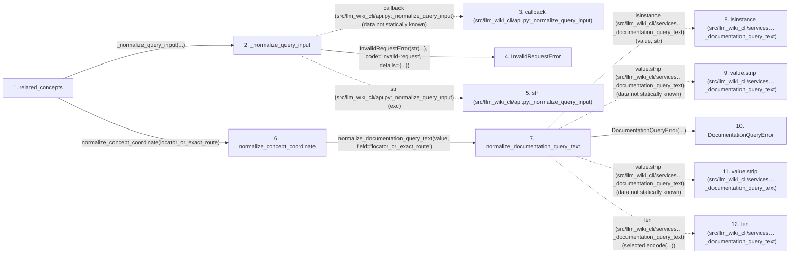

# related_concepts

**Entry point:** `related_concepts` (`api`)
**Source:** [api](../modules/api.md)
**Modules touched:** [api](../modules/api.md), [common](../modules/common.md), [config](../modules/config.md), [documentation_queries](../modules/documentation_queries.md), and 8 more

**Complete modules touched:**

- [api](../modules/api.md)
- [common](../modules/common.md)
- [config](../modules/config.md)
- [documentation_queries](../modules/documentation_queries.md)
- [documentation_query_builder](../modules/documentation_query_builder.md)
- [filesystem_guard](../modules/filesystem_guard.md)
- [io](../modules/io.md)
- [source_selection](../modules/source_selection.md)
- [source_snapshot](../modules/source_snapshot.md)
- [sync_manifest](../modules/sync_manifest.md)
- [validation](../modules/validation.md)
- [wiki_surface](../modules/wiki_surface.md)

## Call sequence

```mermaid
sequenceDiagram
    participant p0 as related_concepts
    participant p1 as _normalize_query_input
    participant p2 as callback (src/llm_wiki_cli/api.py:_normalize_query_input)
    participant p3 as InvalidRequestError
    participant p4 as str (src/llm_wiki_cli/api.py:_normalize_query_input)
    participant p5 as normalize_concept_coordinate
    participant p6 as normalize_documentation_query_text
    participant p7 as isinstance (src/llm_wiki_cli/services…_documentation_query_text)
    participant p8 as value.strip (src/llm_wiki_cli/services…_documentation_query_text)
    participant p9 as DocumentationQueryError
    participant p10 as len (src/llm_wiki_cli/services…_documentation_query_text)
    participant p11 as selected.encode
    participant p12 as validate_exact_page_coordinate
    participant p13 as isinstance (src/llm_wiki_cli/services…ate_exact_page_coordinate)
    participant p14 as value.strip (src/llm_wiki_cli/services…ate_exact_page_coordinate)
    participant p15 as WikiSurfaceError
    participant p16 as any (src/llm_wiki_cli/services…ate_exact_page_coordinate)
    participant p17 as ord
    participant p18 as _matches_directory_path
    participant p19 as coordinate.startswith (src/llm_wiki_cli/services…y:_matches_directory_path)
    participant p20 as coordinate.endswith
    participant p21 as len (src/llm_wiki_cli/services…y:_matches_directory_path)
    participant p22 as bool (src/llm_wiki_cli/services…y:_matches_directory_path)
    participant p23 as is_safe_page_id
    participant p24 as isinstance (src/llm_wiki_cli/services…urface.py:is_safe_page_id)
    p0->>p1: _normalize_query_input
    p1-->>p2: callback (src/llm_wiki_cli/api.py:_normalize_query_input)
    p1->>p3: InvalidRequestError
    p1-->>p4: str (src/llm_wiki_cli/api.py:_normalize_query_input)
    p0->>p5: normalize_concept_coordinate
    p5->>p6: normalize_documentation_query_text
    p6-->>p7: isinstance (src/llm_wiki_cli/services…_documentation_query_text)
    p6-->>p8: value.strip (src/llm_wiki_cli/services…_documentation_query_text)
    p6->>p9: DocumentationQueryError
    p6-->>p8: value.strip (src/llm_wiki_cli/services…_documentation_query_text)
    p6-->>p10: len (src/llm_wiki_cli/services…_documentation_query_text)
    p6-->>p11: selected.encode
    p6->>p9: DocumentationQueryError
    p5->>p12: validate_exact_page_coordinate
    p12-->>p13: isinstance (src/llm_wiki_cli/services…ate_exact_page_coordinate)
    p12-->>p14: value.strip (src/llm_wiki_cli/services…ate_exact_page_coordinate)
    p12->>p15: WikiSurfaceError
    p12-->>p14: value.strip (src/llm_wiki_cli/services…ate_exact_page_coordinate)
    p12-->>p16: any (src/llm_wiki_cli/services…ate_exact_page_coordinate)
    p12-->>p17: ord
    p12-->>p17: ord
    p12->>p15: WikiSurfaceError
    p12->>p18: _matches_directory_path
    p18-->>p19: coordinate.startswith (src/llm_wiki_cli/services…y:_matches_directory_path)
    p18-->>p20: coordinate.endswith
    p18-->>p21: len (src/llm_wiki_cli/services…y:_matches_directory_path)
    p18-->>p21: len (src/llm_wiki_cli/services…y:_matches_directory_path)
    p18-->>p22: bool (src/llm_wiki_cli/services…y:_matches_directory_path)
    p18->>p23: is_safe_page_id
    p23-->>p24: isinstance (src/llm_wiki_cli/services…urface.py:is_safe_page_id)
```

<!-- Auto-generated from static call edges. Dashed arrows are external or unresolved calls. Reviewed runtime conditions and side effects belong in Behavior. -->

> Call sequence diagram shows 30 of 430 interactions; 400 omitted to keep the visualization within the 30-interaction and generated-diagram limits.

> Trace truncated at the depth limit; deeper calls are omitted.

## Data flow

<!-- Auto-generated static analysis. Treat values and boundaries as best-effort hints, not runtime proof. -->

### Step data

| Step | Inputs | Reads | Writes | Returns |
|---|---|---|---|---|
| `related_concepts` | `locator_or_exact_route: object`, `direction: str`, `kinds: Iterable[str] \| None`, `service: DocumentationGraphQueryService \| None`, `src_dir: str`, `wiki_dir: str`, `limit: int`, `allow_external_src: bool` | `_KNOWLEDGE_QUERY_DIRECTIONS`, `_KNOWLEDGE_QUERY_KINDS`, `RelatedConceptsResult` | - | `cast(...)` |
| `_normalize_query_input` | `callback: Callable[[], _R]`, `field: str` | `DocumentationQueryError` | - | `callback(...)` |
| `callback (src/llm_wiki_cli/api.py:_normalize_query_input)` | - | - | - | - |
| `InvalidRequestError` | - | - | - | - |
| `str (src/llm_wiki_cli/api.py:_normalize_query_input)` | - | - | - | - |
| `normalize_concept_coordinate` | `value: object` | `wiki_surface`, `validate_concept_uid`, `validate_natural_key`, `ConceptIdentityError` | - | `wiki_surface.validate_exact_page_coordinate(...)`, `validator(...)` |
| `normalize_documentation_query_text` | `value: object`, `field: str` | `QUERY_IDENTITY_BYTE_LIMIT`, `QUERY_IDENTITY_BYTE_LIMIT` | - | `selected` |
| `isinstance (src/llm_wiki_cli/services…_documentation_query_text)` | - | - | - | - |
| `value.strip (src/llm_wiki_cli/services…_documentation_query_text)` | - | - | - | - |
| `DocumentationQueryError` | - | - | - | - |
| `value.strip (src/llm_wiki_cli/services…_documentation_query_text)` | - | - | - | - |
| `len (src/llm_wiki_cli/services…_documentation_query_text)` | - | - | - | - |

### Call data

| From | To | Line | Call |
|---|---|---:|---|
| related_concepts | _normalize_query_input | 1590 | `_normalize_query_input(...)` |
| _normalize_query_input | callback (src/llm_wiki_cli/api.py:_normalize_query_input) | 1197 | `callback(data not statically known)` |
| _normalize_query_input | InvalidRequestError | 1199 | `InvalidRequestError(str(...), code='invalid-request', details={...})` |
| _normalize_query_input | str (src/llm_wiki_cli/api.py:_normalize_query_input) | 1200 | `str(exc)` |
| related_concepts | normalize_concept_coordinate | 1591 | `normalize_concept_coordinate(locator_or_exact_route)` |
| normalize_concept_coordinate | normalize_documentation_query_text | 73 | `normalize_documentation_query_text(value, field='locator_or_exact_route')` |
| normalize_documentation_query_text | isinstance (src/llm_wiki_cli/services…_documentation_query_text) | 60 | `isinstance(value, str)` |
| normalize_documentation_query_text | value.strip (src/llm_wiki_cli/services…_documentation_query_text) | 60 | `value.strip(data not statically known)` |
| normalize_documentation_query_text | DocumentationQueryError | 61 | `DocumentationQueryError(...)` |
| normalize_documentation_query_text | value.strip (src/llm_wiki_cli/services…_documentation_query_text) | 62 | `value.strip(data not statically known)` |
| normalize_documentation_query_text | len (src/llm_wiki_cli/services…_documentation_query_text) | 63 | `len(selected.encode(...))` |

### Boundary effects

*No boundary effects detected.*

### Static analysis gaps

| Kind | Step | Target | Line |
|---|---|---|---:|
| unresolved_call | `_normalize_query_input` | `callback` | 1197 |
| external_call | `normalize_documentation_query_text` | `isinstance` | 60 |
| unresolved_call | `normalize_documentation_query_text` | `value.strip` | 60 |
| unresolved_call | `normalize_documentation_query_text` | `value.strip` | 62 |
| step_limit | `related_concepts` | `first 12 steps` | 0 |
| truncated_flow | `related_concepts` | `depth limit` | 0 |

## Behavior

This flow starts at `related_concepts` and is classified as `api`. The generated call and data-flow sections are bounded static projections; runtime conditions and side effects require source-level confirmation.
