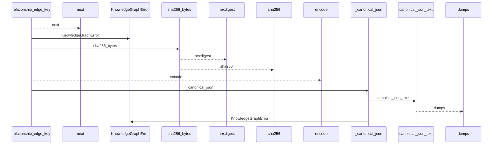
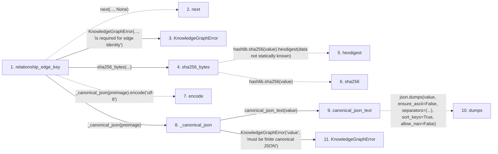

# relationship_edge_key

**Entry point:** `relationship_edge_key` (`api`)
**Source:** [knowledge_graph](../modules/knowledge_graph.md)
**Modules touched:** [knowledge_evidence](../modules/knowledge_evidence.md), [knowledge_graph](../modules/knowledge_graph.md)

## Call sequence

<!-- Auto-generated from static call edges. Dashed arrows are external or unresolved calls. Reviewed runtime conditions and side effects belong in Behavior. -->

## Data flow

<!-- Auto-generated static analysis. Treat values and boundaries as best-effort hints, not runtime proof. -->

### Step data

| Step | Inputs | Reads | Writes | Returns |
|---|---|---|---|---|
| `relationship_edge_key` | `identity: Mapping[str, Any]` | `TYPED_GRAPH_SCHEMA_VERSION` | - | `sha256_bytes(...)` |
| `next` | - | - | - | - |
| `KnowledgeGraphError` | - | - | - | - |
| `sha256_bytes` | `value: bytes` | - | - | `...` |
| `hexdigest` | - | - | - | - |
| `sha256` | - | - | - | - |
| `encode` | - | - | - | - |
| `_canonical_json` | `value: object` | - | - | `canonical_json_text(...)` |
| `canonical_json_text` | `value: Any` | - | - | `json.dumps(...)` |
| `dumps` | - | - | - | - |
| `KnowledgeGraphError` | - | - | - | - |

### Call data

| From | To | Line | Call |
|---|---|---:|---|
| relationship_edge_key | next | 302 | `next(..., None)` |
| relationship_edge_key | KnowledgeGraphError | 304 | `KnowledgeGraphError(..., 'is required for edge identity')` |
| relationship_edge_key | sha256_bytes | 309 | `sha256_bytes(...)` |
| sha256_bytes | hexdigest | 197 | `hashlib.sha256(value).hexdigest(data not statically known)` |
| sha256_bytes | sha256 | 197 | `hashlib.sha256(value)` |
| relationship_edge_key | encode | 309 | `_canonical_json(preimage).encode('utf-8')` |
| relationship_edge_key | _canonical_json | 309 | `_canonical_json(preimage)` |
| _canonical_json | canonical_json_text | 2229 | `canonical_json_text(value)` |
| canonical_json_text | dumps | 158 | `json.dumps(value, ensure_ascii=False, separators=(...), sort_keys=True, allow_nan=False)` |
| _canonical_json | KnowledgeGraphError | 2231 | `KnowledgeGraphError('value', 'must be finite canonical JSON')` |

### Boundary effects

*No boundary effects detected.*

### Static analysis gaps

| Kind | Step | Target | Line |
|---|---|---|---:|
| unresolved_call | `relationship_edge_key` | `next` | 302 |
| external_call | `sha256_bytes` | `hashlib.sha256(value).hexdigest` | 197 |
| external_call | `sha256_bytes` | `hashlib.sha256` | 197 |
| unresolved_call | `relationship_edge_key` | `_canonical_json(preimage).encode` | 309 |
| external_call | `canonical_json_text` | `json.dumps` | 158 |

## Behavior

This flow starts at `relationship_edge_key` and is classified as `api`. The generated call and data-flow sections are bounded static projections; runtime conditions and side effects require source-level confirmation.
