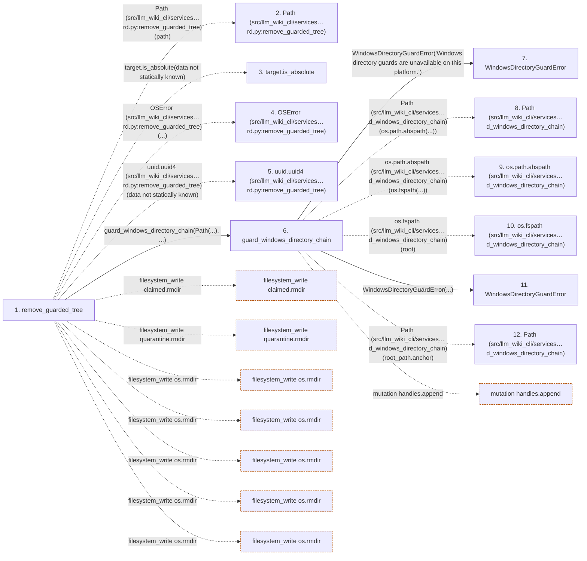

# remove_guarded_tree

**Entry point:** `remove_guarded_tree` (`api`)
**Source:** [filesystem_guard](../modules/filesystem_guard.md)
**Modules touched:** [filesystem_guard](../modules/filesystem_guard.md)

## Call sequence

```mermaid
sequenceDiagram
    participant p0 as remove_guarded_tree
    participant p1 as Path (src/llm_wiki_cli/services…rd.py:remove_guarded_tree)
    participant p2 as target.is_absolute
    participant p3 as OSError (src/llm_wiki_cli/services…rd.py:remove_guarded_tree)
    participant p4 as uuid.uuid4 (src/llm_wiki_cli/services…rd.py:remove_guarded_tree)
    participant p5 as guard_windows_directory_chain
    participant p6 as WindowsDirectoryGuardError
    participant p7 as Path (src/llm_wiki_cli/services…d_windows_directory_chain)
    participant p8 as os.path.abspath (src/llm_wiki_cli/services…d_windows_directory_chain)
    participant p9 as os.fspath (src/llm_wiki_cli/services…d_windows_directory_chain)
    participant p10 as handles.append
    participant p11 as _open_windows_directory_guard
    participant p12 as ctypes.WinDLL (src/llm_wiki_cli/services…n_windows_directory_guard)
    participant p13 as create_file (src/llm_wiki_cli/services…n_windows_directory_guard)
    participant p14 as _windows_api_path
    participant p15 as os.path.abspath (src/llm_wiki_cli/services…uard.py:_windows_api_path)
    participant p16 as os.fspath (src/llm_wiki_cli/services…uard.py:_windows_api_path)
    participant p17 as value.startswith
    participant p18 as wintypes.HANDLE (src/llm_wiki_cli/services…n_windows_directory_guard)
    participant p19 as ctypes.get_last_error (src/llm_wiki_cli/services…n_windows_directory_guard)
    participant p20 as ctypes.WinError (src/llm_wiki_cli/services…n_windows_directory_guard)
    participant p21 as _WindowsDirectoryGuardUnavailableError
    participant p22 as _ByHandleFileInformation (src/llm_wiki_cli/services…n_windows_directory_guard)
    participant p23 as get_information (src/llm_wiki_cli/services…n_windows_directory_guard)
    participant p24 as ctypes.byref (src/llm_wiki_cli/services…n_windows_directory_guard)
    p0-->>p1: Path (src/llm_wiki_cli/services…rd.py:remove_guarded_tree)
    p0-->>p2: target.is_absolute
    p0-->>p3: OSError (src/llm_wiki_cli/services…rd.py:remove_guarded_tree)
    p0-->>p4: uuid.uuid4 (src/llm_wiki_cli/services…rd.py:remove_guarded_tree)
    p0->>p5: guard_windows_directory_chain
    p5->>p6: WindowsDirectoryGuardError
    p5-->>p7: Path (src/llm_wiki_cli/services…d_windows_directory_chain)
    p5-->>p8: os.path.abspath (src/llm_wiki_cli/services…d_windows_directory_chain)
    p5-->>p9: os.fspath (src/llm_wiki_cli/services…d_windows_directory_chain)
    p5->>p6: WindowsDirectoryGuardError
    p5-->>p7: Path (src/llm_wiki_cli/services…d_windows_directory_chain)
    p5-->>p10: handles.append
    p5->>p11: _open_windows_directory_guard
    p11-->>p12: ctypes.WinDLL (src/llm_wiki_cli/services…n_windows_directory_guard)
    p11-->>p13: create_file (src/llm_wiki_cli/services…n_windows_directory_guard)
    p11->>p14: _windows_api_path
    p14-->>p15: os.path.abspath (src/llm_wiki_cli/services…uard.py:_windows_api_path)
    p14-->>p16: os.fspath (src/llm_wiki_cli/services…uard.py:_windows_api_path)
    p14-->>p17: value.startswith
    p14-->>p17: value.startswith
    p11-->>p18: wintypes.HANDLE (src/llm_wiki_cli/services…n_windows_directory_guard)
    p11-->>p19: ctypes.get_last_error (src/llm_wiki_cli/services…n_windows_directory_guard)
    p11-->>p20: ctypes.WinError (src/llm_wiki_cli/services…n_windows_directory_guard)
    p11->>p21: _WindowsDirectoryGuardUnavailableError
    p11->>p6: WindowsDirectoryGuardError
    p11-->>p22: _ByHandleFileInformation (src/llm_wiki_cli/services…n_windows_directory_guard)
    p11-->>p23: get_information (src/llm_wiki_cli/services…n_windows_directory_guard)
    p11-->>p24: ctypes.byref (src/llm_wiki_cli/services…n_windows_directory_guard)
    p11-->>p20: ctypes.WinError (src/llm_wiki_cli/services…n_windows_directory_guard)
    p11-->>p19: ctypes.get_last_error (src/llm_wiki_cli/services…n_windows_directory_guard)
```

<!-- Auto-generated from static call edges. Dashed arrows are external or unresolved calls. Reviewed runtime conditions and side effects belong in Behavior. -->

> Call sequence diagram shows 30 of 385 interactions; 355 omitted to keep the visualization within the 30-interaction and generated-diagram limits.

## Data flow

<!-- Auto-generated static analysis. Treat values and boundaries as best-effort hints, not runtime proof. -->

### Step data

| Step | Inputs | Reads | Writes | Returns |
|---|---|---|---|---|
| `remove_guarded_tree` | `path: Path`, `expected_identity: tuple[int, int] \| None`, `expected_manifest: GuardedTreeManifest \| None` | `os`, `os`, `os`, `os` | - | `none` |
| `Path (src/llm_wiki_cli/services…rd.py:remove_guarded_tree)` | - | - | - | - |
| `target.is_absolute` | - | - | - | - |
| `OSError (src/llm_wiki_cli/services…rd.py:remove_guarded_tree)` | - | - | - | - |
| `uuid.uuid4 (src/llm_wiki_cli/services…rd.py:remove_guarded_tree)` | - | - | - | - |
| `guard_windows_directory_chain` | `root: Path`, `relative_components: Sequence[str]`, `create_missing: bool`, `require_restrictive_dacl: bool` | `os`, `WindowsDurabilityError` | - | - |
| `WindowsDirectoryGuardError` | - | - | - | - |
| `Path (src/llm_wiki_cli/services…d_windows_directory_chain)` | - | - | - | - |
| `os.path.abspath (src/llm_wiki_cli/services…d_windows_directory_chain)` | - | - | - | - |
| `os.fspath (src/llm_wiki_cli/services…d_windows_directory_chain)` | - | - | - | - |
| `WindowsDirectoryGuardError` | - | - | - | - |
| `Path (src/llm_wiki_cli/services…d_windows_directory_chain)` | - | - | - | - |

### Call data

| From | To | Line | Call |
|---|---|---:|---|
| remove_guarded_tree | Path (src/llm_wiki_cli/services…rd.py:remove_guarded_tree) | 1780 | `Path(path)` |
| remove_guarded_tree | target.is_absolute | 1781 | `target.is_absolute(data not statically known)` |
| remove_guarded_tree | OSError (src/llm_wiki_cli/services…rd.py:remove_guarded_tree) | 1782 | `OSError(...)` |
| remove_guarded_tree | uuid.uuid4 (src/llm_wiki_cli/services…rd.py:remove_guarded_tree) | 1784 | `uuid.uuid4(data not statically known)` |
| remove_guarded_tree | guard_windows_directory_chain | 1901 | `guard_windows_directory_chain(Path(...), ...)` |
| guard_windows_directory_chain | WindowsDirectoryGuardError | 170 | `WindowsDirectoryGuardError('Windows directory guards are unavailable on this platform.')` |
| guard_windows_directory_chain | Path (src/llm_wiki_cli/services…d_windows_directory_chain) | 174 | `Path(os.path.abspath(...))` |
| guard_windows_directory_chain | os.path.abspath (src/llm_wiki_cli/services…d_windows_directory_chain) | 174 | `os.path.abspath(os.fspath(...))` |
| guard_windows_directory_chain | os.fspath (src/llm_wiki_cli/services…d_windows_directory_chain) | 174 | `os.fspath(root)` |
| guard_windows_directory_chain | WindowsDirectoryGuardError | 176 | `WindowsDirectoryGuardError(...)` |
| guard_windows_directory_chain | Path (src/llm_wiki_cli/services…d_windows_directory_chain) | 179 | `Path(root_path.anchor)` |

### Boundary effects

| Kind | Target | Step | Line |
|---|---|---|---:|
| filesystem_write | `claimed.rmdir` | `remove_guarded_tree` | 1953 |
| filesystem_write | `quarantine.rmdir` | `remove_guarded_tree` | 1966 |
| filesystem_write | `os.rmdir` | `remove_guarded_tree` | 2170 |
| filesystem_write | `os.rmdir` | `remove_guarded_tree` | 2176 |
| filesystem_write | `os.rmdir` | `remove_guarded_tree` | 2195 |
| filesystem_write | `os.rmdir` | `remove_guarded_tree` | 2205 |
| filesystem_write | `os.rmdir` | `remove_guarded_tree` | 2217 |
| mutation | `handles.append` | `guard_windows_directory_chain` | 182 |

### Static analysis gaps

| Kind | Step | Target | Line |
|---|---|---|---:|
| unresolved_call | `remove_guarded_tree` | `target.is_absolute` | 1781 |
| external_call | `remove_guarded_tree` | `OSError` | 1782 |
| external_call | `remove_guarded_tree` | `uuid.uuid4` | 1784 |
| external_call | `guard_windows_directory_chain` | `os.path.abspath` | 174 |
| external_call | `guard_windows_directory_chain` | `os.fspath` | 174 |
| step_limit | `remove_guarded_tree` | `first 12 steps` | 0 |

## Behavior

This flow starts at `remove_guarded_tree` and is classified as `api`. The generated call and data-flow sections are bounded static projections; runtime conditions and side effects require source-level confirmation.
