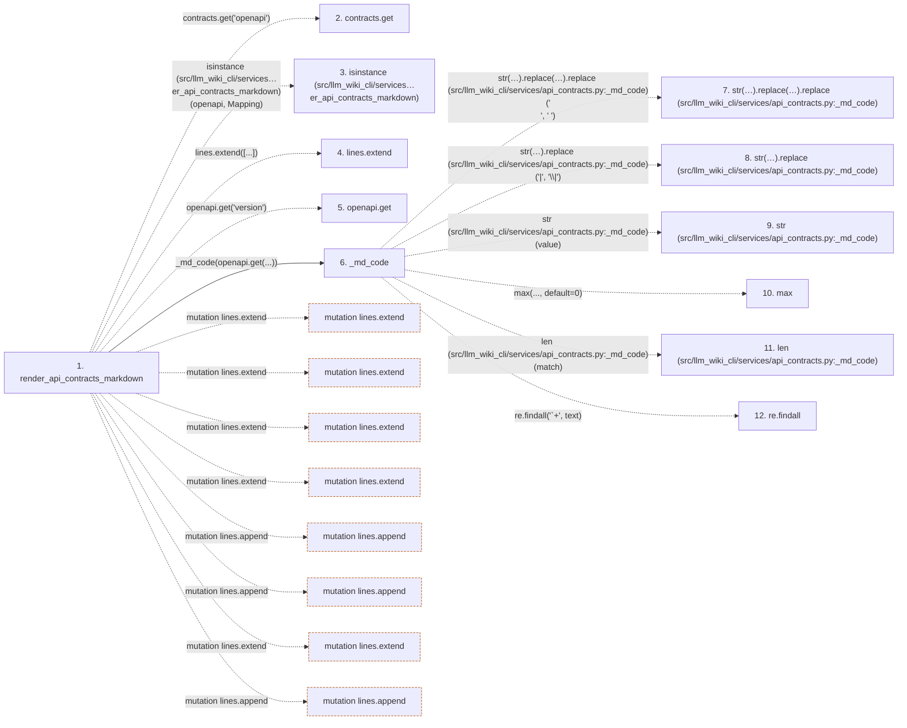

# render_api_contracts_markdown

**Entry point:** `render_api_contracts_markdown` (`api`)
**Source:** [api_contracts](../modules/api_contracts.md)
**Modules touched:** [api_contracts](../modules/api_contracts.md)

## Call sequence

```mermaid
sequenceDiagram
    participant p0 as render_api_contracts_markdown
    participant p1 as contracts.get
    participant p2 as isinstance (src/llm_wiki_cli/services…er_api_contracts_markdown)
    participant p3 as lines.extend
    participant p4 as openapi.get
    participant p5 as _md_code
    participant p6 as str(…).replace(…).replace (src/llm_wiki_cli/services/api_contracts.py:_md_code)
    participant p7 as str(…).replace (src/llm_wiki_cli/services/api_contracts.py:_md_code)
    participant p8 as str (src/llm_wiki_cli/services/api_contracts.py:_md_code)
    participant p9 as max
    participant p10 as len (src/llm_wiki_cli/services/api_contracts.py:_md_code)
    participant p11 as re.findall
    participant p12 as text.startswith
    participant p13 as text.endswith
    participant p14 as list
    participant p15 as application.get
    participant p16 as ', '.join
    participant p17 as _md_text
    participant p18 as str(…).replace(…).replace(…).replace
    participant p19 as str(…).replace(…).replace (src/llm_wiki_cli/services/api_contracts.py:_md_text)
    participant p20 as str(…).replace (src/llm_wiki_cli/services/api_contracts.py:_md_text)
    participant p21 as str (src/llm_wiki_cli/services/api_contracts.py:_md_text)
    p0-->>p1: contracts.get
    p0-->>p2: isinstance (src/llm_wiki_cli/services…er_api_contracts_markdown)
    p0-->>p3: lines.extend
    p0-->>p4: openapi.get
    p0->>p5: _md_code
    p5-->>p6: str(…).replace(…).replace (src/llm_wiki_cli/services/api_contracts.py:_md_code)
    p5-->>p7: str(…).replace (src/llm_wiki_cli/services/api_contracts.py:_md_code)
    p5-->>p8: str (src/llm_wiki_cli/services/api_contracts.py:_md_code)
    p5-->>p9: max
    p5-->>p10: len (src/llm_wiki_cli/services/api_contracts.py:_md_code)
    p5-->>p11: re.findall
    p5-->>p9: max
    p5-->>p12: text.startswith
    p5-->>p13: text.endswith
    p0-->>p4: openapi.get
    p0->>p5: _md_code
    p0-->>p4: openapi.get
    p0-->>p3: lines.extend
    p0-->>p14: list
    p0-->>p1: contracts.get
    p0-->>p3: lines.extend
    p0-->>p3: lines.extend
    p0-->>p15: application.get
    p0-->>p2: isinstance (src/llm_wiki_cli/services…er_api_contracts_markdown)
    p0-->>p16: ', '.join
    p0->>p17: _md_text
    p17-->>p18: str(…).replace(…).replace(…).replace
    p17-->>p19: str(…).replace(…).replace (src/llm_wiki_cli/services/api_contracts.py:_md_text)
    p17-->>p20: str(…).replace (src/llm_wiki_cli/services/api_contracts.py:_md_text)
    p17-->>p21: str (src/llm_wiki_cli/services/api_contracts.py:_md_text)
```

<!-- Auto-generated from static call edges. Dashed arrows are external or unresolved calls. Reviewed runtime conditions and side effects belong in Behavior. -->

> Call sequence diagram shows 30 of 187 interactions; 157 omitted to keep the visualization within the 30-interaction and generated-diagram limits.

## Data flow

<!-- Auto-generated static analysis. Treat values and boundaries as best-effort hints, not runtime proof. -->

### Step data

| Step | Inputs | Reads | Writes | Returns |
|---|---|---|---|---|
| `render_api_contracts_markdown` | `contracts: Mapping[str, Any]`, `module_page_map: Mapping[str, str] \| None`, `entity_page_map: Mapping[Any, str] \| None` | `Mapping`, `Mapping`, `Mapping`, `Mapping` | - | `...` |
| `contracts.get` | - | - | - | - |
| `isinstance (src/llm_wiki_cli/services…er_api_contracts_markdown)` | - | - | - | - |
| `lines.extend` | - | - | - | - |
| `openapi.get` | - | - | - | - |
| `_md_code` | `value: Any` | - | - | `...` |
| `str(…).replace(…).replace (src/llm_wiki_cli/services/api_contracts.py:_md_code)` | - | - | - | - |
| `str(…).replace (src/llm_wiki_cli/services/api_contracts.py:_md_code)` | - | - | - | - |
| `str (src/llm_wiki_cli/services/api_contracts.py:_md_code)` | - | - | - | - |
| `max` | - | - | - | - |
| `len (src/llm_wiki_cli/services/api_contracts.py:_md_code)` | - | - | - | - |
| `re.findall` | - | - | - | - |

### Call data

| From | To | Line | Call |
|---|---|---:|---|
| render_api_contracts_markdown | contracts.get | 2022 | `contracts.get('openapi')` |
| render_api_contracts_markdown | isinstance (src/llm_wiki_cli/services…er_api_contracts_markdown) | 2023 | `isinstance(openapi, Mapping)` |
| render_api_contracts_markdown | lines.extend | 2024 | `lines.extend([...])` |
| render_api_contracts_markdown | openapi.get | 2026 | `openapi.get('version')` |
| render_api_contracts_markdown | _md_code | 2026 | `_md_code(openapi.get(...))` |
| _md_code | str(…).replace(…).replace (src/llm_wiki_cli/services/api_contracts.py:_md_code) | 1973 | `str(value).replace('\|', '\\\|').replace('\n', ' ')` |
| _md_code | str(…).replace (src/llm_wiki_cli/services/api_contracts.py:_md_code) | 1973 | `str(value).replace('\|', '\\\|')` |
| _md_code | str (src/llm_wiki_cli/services/api_contracts.py:_md_code) | 1973 | `str(value)` |
| _md_code | max | 1975 | `max(..., default=0)` |
| _md_code | len (src/llm_wiki_cli/services/api_contracts.py:_md_code) | 1975 | `len(match)` |
| _md_code | re.findall | 1975 | `re.findall('`+', text)` |

### Boundary effects

| Kind | Target | Step | Line |
|---|---|---|---:|
| mutation | `lines.extend` | `render_api_contracts_markdown` | 2024 |
| mutation | `lines.extend` | `render_api_contracts_markdown` | 2032 |
| mutation | `lines.extend` | `render_api_contracts_markdown` | 2041 |
| mutation | `lines.extend` | `render_api_contracts_markdown` | 2043 |
| mutation | `lines.append` | `render_api_contracts_markdown` | 2060 |
| mutation | `lines.append` | `render_api_contracts_markdown` | 2073 |
| mutation | `lines.extend` | `render_api_contracts_markdown` | 2081 |
| mutation | `lines.append` | `render_api_contracts_markdown` | 2083 |

### Static analysis gaps

| Kind | Step | Target | Line |
|---|---|---|---:|
| unresolved_call | `render_api_contracts_markdown` | `contracts.get` | 2022 |
| external_call | `render_api_contracts_markdown` | `isinstance` | 2023 |
| unresolved_call | `render_api_contracts_markdown` | `openapi.get` | 2026 |
| unresolved_call | `_md_code` | `str(value).replace('\|', '\\\|').replace` | 1973 |
| unresolved_call | `_md_code` | `str(value).replace` | 1973 |
| external_call | `_md_code` | `max` | 1975 |
| external_call | `_md_code` | `re.findall` | 1975 |
| step_limit | `render_api_contracts_markdown` | `first 12 steps` | 0 |

## Behavior

This flow starts at `render_api_contracts_markdown` and is classified as `api`. The generated call and data-flow sections are bounded static projections; runtime conditions and side effects require source-level confirmation.
