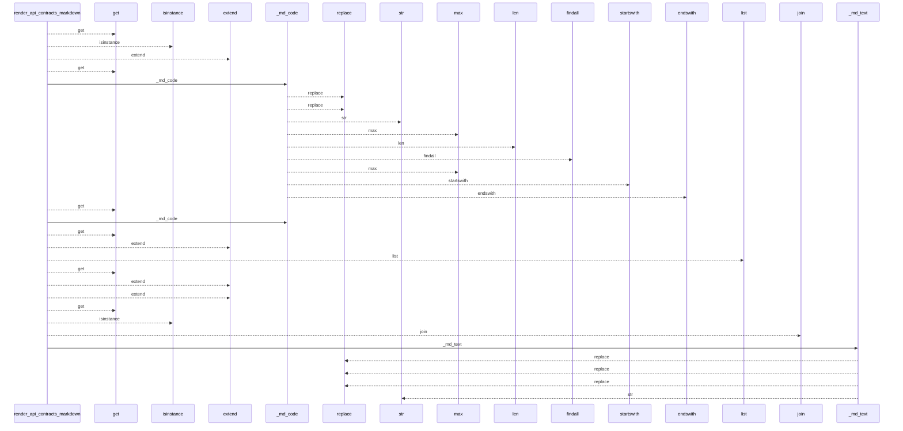
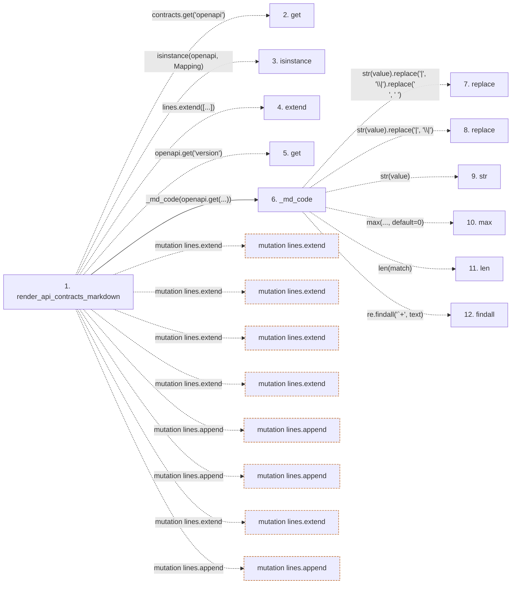

# render_api_contracts_markdown

**Entry point:** `render_api_contracts_markdown` (`api`)
**Source:** [api_contracts](../modules/api_contracts.md)
**Modules touched:** [api_contracts](../modules/api_contracts.md)

## Call sequence

<!-- Auto-generated from static call edges. Dashed arrows are external or unresolved calls. Reviewed runtime conditions and side effects belong in Behavior. -->

> Call sequence diagram shows 30 of 187 interactions; 157 omitted to keep the visualization within the 30-interaction and generated-diagram limits.

## Data flow

<!-- Auto-generated static analysis. Treat values and boundaries as best-effort hints, not runtime proof. -->

### Step data

| Step | Inputs | Reads | Writes | Returns |
|---|---|---|---|---|
| `render_api_contracts_markdown` | `contracts: Mapping[str, Any]`, `module_page_map: Mapping[str, str] \| None`, `entity_page_map: Mapping[Any, str] \| None` | `Mapping`, `Mapping`, `Mapping`, `Mapping` | - | `...` |
| `get` | - | - | - | - |
| `isinstance` | - | - | - | - |
| `extend` | - | - | - | - |
| `get` | - | - | - | - |
| `_md_code` | `value: Any` | - | - | `...` |
| `replace` | - | - | - | - |
| `replace` | - | - | - | - |
| `str` | - | - | - | - |
| `max` | - | - | - | - |
| `len` | - | - | - | - |
| `findall` | - | - | - | - |

### Call data

| From | To | Line | Call |
|---|---|---:|---|
| render_api_contracts_markdown | get | 1935 | `contracts.get('openapi')` |
| render_api_contracts_markdown | isinstance | 1936 | `isinstance(openapi, Mapping)` |
| render_api_contracts_markdown | extend | 1937 | `lines.extend([...])` |
| render_api_contracts_markdown | get | 1939 | `openapi.get('version')` |
| render_api_contracts_markdown | _md_code | 1939 | `_md_code(openapi.get(...))` |
| _md_code | replace | 1886 | `str(value).replace('\|', '\\\|').replace('\n', ' ')` |
| _md_code | replace | 1886 | `str(value).replace('\|', '\\\|')` |
| _md_code | str | 1886 | `str(value)` |
| _md_code | max | 1888 | `max(..., default=0)` |
| _md_code | len | 1888 | `len(match)` |
| _md_code | findall | 1888 | `re.findall('`+', text)` |

### Boundary effects

| Kind | Target | Step | Line |
|---|---|---|---:|
| mutation | `lines.extend` | `render_api_contracts_markdown` | 1937 |
| mutation | `lines.extend` | `render_api_contracts_markdown` | 1945 |
| mutation | `lines.extend` | `render_api_contracts_markdown` | 1954 |
| mutation | `lines.extend` | `render_api_contracts_markdown` | 1956 |
| mutation | `lines.append` | `render_api_contracts_markdown` | 1973 |
| mutation | `lines.append` | `render_api_contracts_markdown` | 1986 |
| mutation | `lines.extend` | `render_api_contracts_markdown` | 1994 |
| mutation | `lines.append` | `render_api_contracts_markdown` | 1996 |

### Static analysis gaps

| Kind | Step | Target | Line |
|---|---|---|---:|
| unresolved_call | `render_api_contracts_markdown` | `contracts.get` | 1935 |
| unresolved_call | `render_api_contracts_markdown` | `isinstance` | 1936 |
| unresolved_call | `render_api_contracts_markdown` | `openapi.get` | 1939 |
| unresolved_call | `_md_code` | `str(value).replace('\|', '\\\|').replace` | 1886 |
| unresolved_call | `_md_code` | `str(value).replace` | 1886 |
| unresolved_call | `_md_code` | `max` | 1888 |
| external_call | `_md_code` | `re.findall` | 1888 |
| step_limit | `render_api_contracts_markdown` | `first 12 steps` | 0 |

## Behavior

This flow starts at `render_api_contracts_markdown` and is classified as `api`. The generated call and data-flow sections are bounded static projections; runtime conditions and side effects require source-level confirmation.
