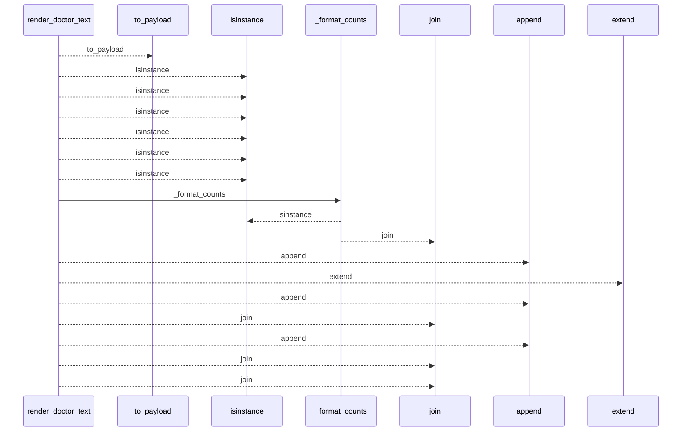
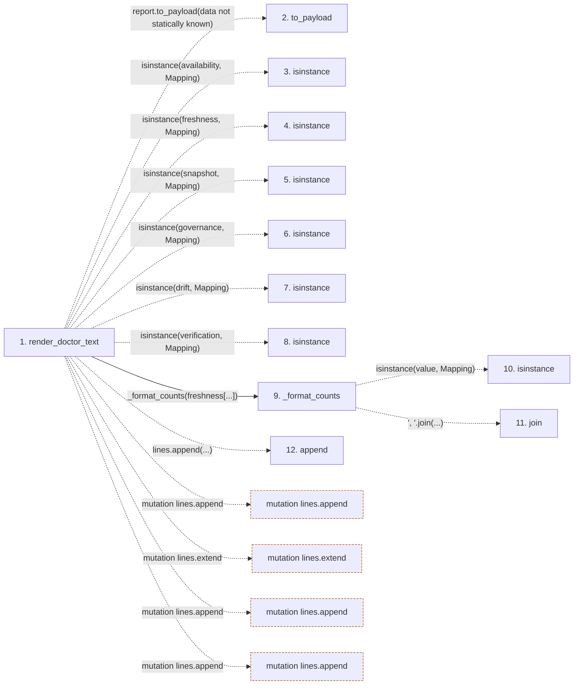

# render_doctor_text

**Entry point:** `render_doctor_text` (`api`)
**Source:** [doctor_service](../modules/doctor_service.md)
**Modules touched:** [doctor_service](../modules/doctor_service.md)

## Call sequence

<!-- Auto-generated from static call edges. Dashed arrows are external or unresolved calls. Reviewed runtime conditions and side effects belong in Behavior. -->

## Data flow

<!-- Auto-generated static analysis. Treat values and boundaries as best-effort hints, not runtime proof. -->

### Step data

| Step | Inputs | Reads | Writes | Returns |
|---|---|---|---|---|
| `render_doctor_text` | `report: DoctorReport` | `Mapping`, `Mapping`, `Mapping`, `Mapping`, `Mapping`, `Mapping` | - | `...` |
| `to_payload` | - | - | - | - |
| `isinstance` | - | - | - | - |
| `isinstance` | - | - | - | - |
| `isinstance` | - | - | - | - |
| `isinstance` | - | - | - | - |
| `isinstance` | - | - | - | - |
| `isinstance` | - | - | - | - |
| `_format_counts` | `value: object` | `Mapping`, `_FRESHNESS_STATES` | - | `None`, `...` |
| `isinstance` | - | - | - | - |
| `join` | - | - | - | - |
| `append` | - | - | - | - |

### Call data

| From | To | Line | Call |
|---|---|---:|---|
| render_doctor_text | to_payload | 219 | `report.to_payload(data not statically known)` |
| render_doctor_text | isinstance | 226 | `isinstance(availability, Mapping)` |
| render_doctor_text | isinstance | 227 | `isinstance(freshness, Mapping)` |
| render_doctor_text | isinstance | 228 | `isinstance(snapshot, Mapping)` |
| render_doctor_text | isinstance | 229 | `isinstance(governance, Mapping)` |
| render_doctor_text | isinstance | 230 | `isinstance(drift, Mapping)` |
| render_doctor_text | isinstance | 231 | `isinstance(verification, Mapping)` |
| render_doctor_text | _format_counts | 233 | `_format_counts(freshness[...])` |
| _format_counts | isinstance | 651 | `isinstance(value, Mapping)` |
| _format_counts | join | 653 | `', '.join(...)` |
| render_doctor_text | append | 244 | `lines.append(...)` |

### Boundary effects

| Kind | Target | Step | Line |
|---|---|---|---:|
| mutation | `lines.append` | `render_doctor_text` | 244 |
| mutation | `lines.extend` | `render_doctor_text` | 245 |
| mutation | `lines.append` | `render_doctor_text` | 272 |
| mutation | `lines.append` | `render_doctor_text` | 274 |

### Static analysis gaps

| Kind | Step | Target | Line |
|---|---|---|---:|
| unresolved_call | `render_doctor_text` | `report.to_payload` | 219 |
| unresolved_call | `render_doctor_text` | `isinstance` | 226 |
| unresolved_call | `render_doctor_text` | `isinstance` | 227 |
| unresolved_call | `render_doctor_text` | `isinstance` | 228 |
| unresolved_call | `render_doctor_text` | `isinstance` | 229 |
| unresolved_call | `render_doctor_text` | `isinstance` | 230 |
| unresolved_call | `render_doctor_text` | `isinstance` | 231 |
| unresolved_call | `_format_counts` | `isinstance` | 651 |
| unresolved_call | `_format_counts` | `', '.join` | 653 |
| step_limit | `render_doctor_text` | `first 12 steps` | 0 |

## Behavior

This flow starts at `render_doctor_text` and is classified as `api`. The generated call and data-flow sections are bounded static projections; runtime conditions and side effects require source-level confirmation.
