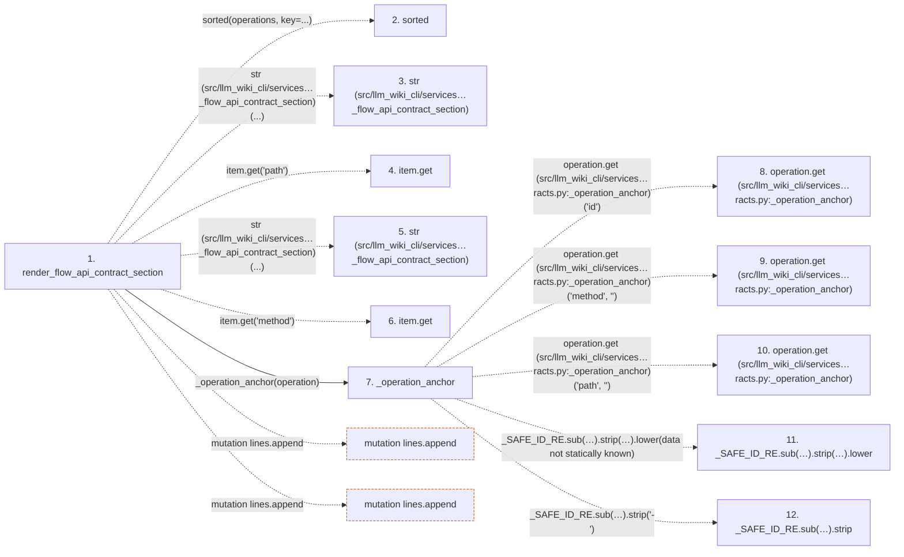

# render_flow_api_contract_section

**Entry point:** `render_flow_api_contract_section` (`api`)
**Source:** [api_contracts](../modules/api_contracts.md)
**Modules touched:** [api_contracts](../modules/api_contracts.md)

## Call sequence

```mermaid
sequenceDiagram
    participant p0 as render_flow_api_contract_section
    participant p1 as sorted
    participant p2 as str (src/llm_wiki_cli/services…_flow_api_contract_section)
    participant p3 as item.get
    participant p4 as _operation_anchor
    participant p5 as operation.get (src/llm_wiki_cli/services…racts.py:_operation_anchor)
    participant p6 as _SAFE_ID_RE.sub(…).strip(…).lower
    participant p7 as _SAFE_ID_RE.sub(…).strip
    participant p8 as _SAFE_ID_RE.sub
    participant p9 as str (src/llm_wiki_cli/services…racts.py:_operation_anchor)
    participant p10 as operation.get (src/llm_wiki_cli/services…_flow_api_contract_section)
    participant p11 as lines.append
    participant p12 as _md_code
    participant p13 as str(…).replace(…).replace
    participant p14 as str(…).replace
    participant p15 as str (src/llm_wiki_cli/services/api_contracts.py:_md_code)
    participant p16 as max
    participant p17 as len
    participant p18 as re.findall
    participant p19 as text.startswith
    participant p20 as text.endswith
    participant p21 as '\n'.join
    p0-->>p1: sorted
    p0-->>p2: str (src/llm_wiki_cli/services…_flow_api_contract_section)
    p0-->>p3: item.get
    p0-->>p2: str (src/llm_wiki_cli/services…_flow_api_contract_section)
    p0-->>p3: item.get
    p0->>p4: _operation_anchor
    p4-->>p5: operation.get (src/llm_wiki_cli/services…racts.py:_operation_anchor)
    p4-->>p5: operation.get (src/llm_wiki_cli/services…racts.py:_operation_anchor)
    p4-->>p5: operation.get (src/llm_wiki_cli/services…racts.py:_operation_anchor)
    p4-->>p6: _SAFE_ID_RE.sub(…).strip(…).lower
    p4-->>p7: _SAFE_ID_RE.sub(…).strip
    p4-->>p8: _SAFE_ID_RE.sub
    p4-->>p9: str (src/llm_wiki_cli/services…racts.py:_operation_anchor)
    p0-->>p10: operation.get (src/llm_wiki_cli/services…_flow_api_contract_section)
    p0-->>p10: operation.get (src/llm_wiki_cli/services…_flow_api_contract_section)
    p0-->>p11: lines.append
    p0->>p12: _md_code
    p12-->>p13: str(…).replace(…).replace
    p12-->>p14: str(…).replace
    p12-->>p15: str (src/llm_wiki_cli/services/api_contracts.py:_md_code)
    p12-->>p16: max
    p12-->>p17: len
    p12-->>p18: re.findall
    p12-->>p16: max
    p12-->>p19: text.startswith
    p12-->>p20: text.endswith
    p0-->>p11: lines.append
    p0-->>p21: '\n'.join
```

<!-- Auto-generated from static call edges. Dashed arrows are external or unresolved calls. Reviewed runtime conditions and side effects belong in Behavior. -->

## Data flow

<!-- Auto-generated static analysis. Treat values and boundaries as best-effort hints, not runtime proof. -->

### Step data

| Step | Inputs | Reads | Writes | Returns |
|---|---|---|---|---|
| `render_flow_api_contract_section` | `operations: Sequence[Mapping[str, Any]]` | - | - | `''`, `...` |
| `sorted` | - | - | - | - |
| `str (src/llm_wiki_cli/services…_flow_api_contract_section)` | - | - | - | - |
| `item.get` | - | - | - | - |
| `str (src/llm_wiki_cli/services…_flow_api_contract_section)` | - | - | - | - |
| `item.get` | - | - | - | - |
| `_operation_anchor` | `operation: Mapping[str, Any]` | - | - | `...` |
| `operation.get (src/llm_wiki_cli/services…racts.py:_operation_anchor)` | - | - | - | - |
| `operation.get (src/llm_wiki_cli/services…racts.py:_operation_anchor)` | - | - | - | - |
| `operation.get (src/llm_wiki_cli/services…racts.py:_operation_anchor)` | - | - | - | - |
| `_SAFE_ID_RE.sub(…).strip(…).lower` | - | - | - | - |
| `_SAFE_ID_RE.sub(…).strip` | - | - | - | - |

### Call data

| From | To | Line | Call |
|---|---|---:|---|
| render_flow_api_contract_section | sorted | 2215 | `sorted(operations, key=...)` |
| render_flow_api_contract_section | str (src/llm_wiki_cli/services…_flow_api_contract_section) | 2216 | `str(...)` |
| render_flow_api_contract_section | item.get | 2216 | `item.get('path')` |
| render_flow_api_contract_section | str (src/llm_wiki_cli/services…_flow_api_contract_section) | 2216 | `str(...)` |
| render_flow_api_contract_section | item.get | 2216 | `item.get('method')` |
| render_flow_api_contract_section | _operation_anchor | 2218 | `_operation_anchor(operation)` |
| _operation_anchor | operation.get (src/llm_wiki_cli/services…racts.py:_operation_anchor) | 1948 | `operation.get('id')` |
| _operation_anchor | operation.get (src/llm_wiki_cli/services…racts.py:_operation_anchor) | 1949 | `operation.get('method', '')` |
| _operation_anchor | operation.get (src/llm_wiki_cli/services…racts.py:_operation_anchor) | 1949 | `operation.get('path', '')` |
| _operation_anchor | _SAFE_ID_RE.sub(…).strip(…).lower | 1951 | `_SAFE_ID_RE.sub('-', str(identity)).strip('-').lower(data not statically known)` |
| _operation_anchor | _SAFE_ID_RE.sub(…).strip | 1951 | `_SAFE_ID_RE.sub('-', str(identity)).strip('-')` |

### Boundary effects

| Kind | Target | Step | Line |
|---|---|---|---:|
| mutation | `lines.append` | `render_flow_api_contract_section` | 2220 |
| mutation | `lines.append` | `render_flow_api_contract_section` | 2224 |

### Static analysis gaps

| Kind | Step | Target | Line |
|---|---|---|---:|
| external_call | `render_flow_api_contract_section` | `sorted` | 2215 |
| unresolved_call | `render_flow_api_contract_section` | `item.get` | 2216 |
| unresolved_call | `_operation_anchor` | `operation.get` | 1948 |
| unresolved_call | `_operation_anchor` | `operation.get` | 1949 |
| unresolved_call | `_operation_anchor` | `_SAFE_ID_RE.sub('-', str(identity)).strip('-').lower` | 1951 |
| unresolved_call | `_operation_anchor` | `_SAFE_ID_RE.sub('-', str(identity)).strip` | 1951 |
| step_limit | `render_flow_api_contract_section` | `first 12 steps` | 0 |

## Behavior

This flow starts at `render_flow_api_contract_section` and is classified as `api`. The generated call and data-flow sections are bounded static projections; runtime conditions and side effects require source-level confirmation.
