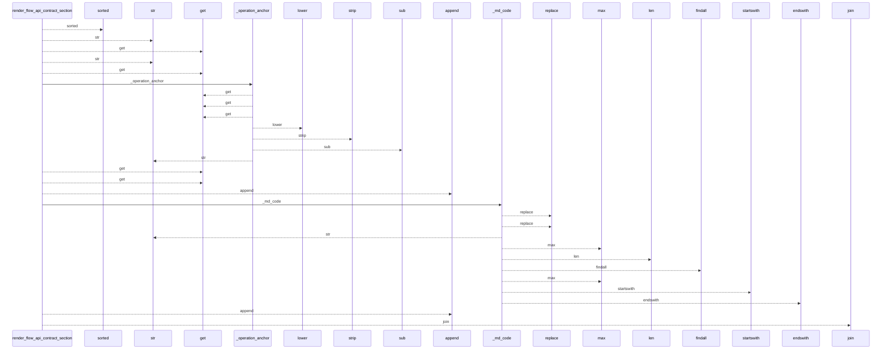
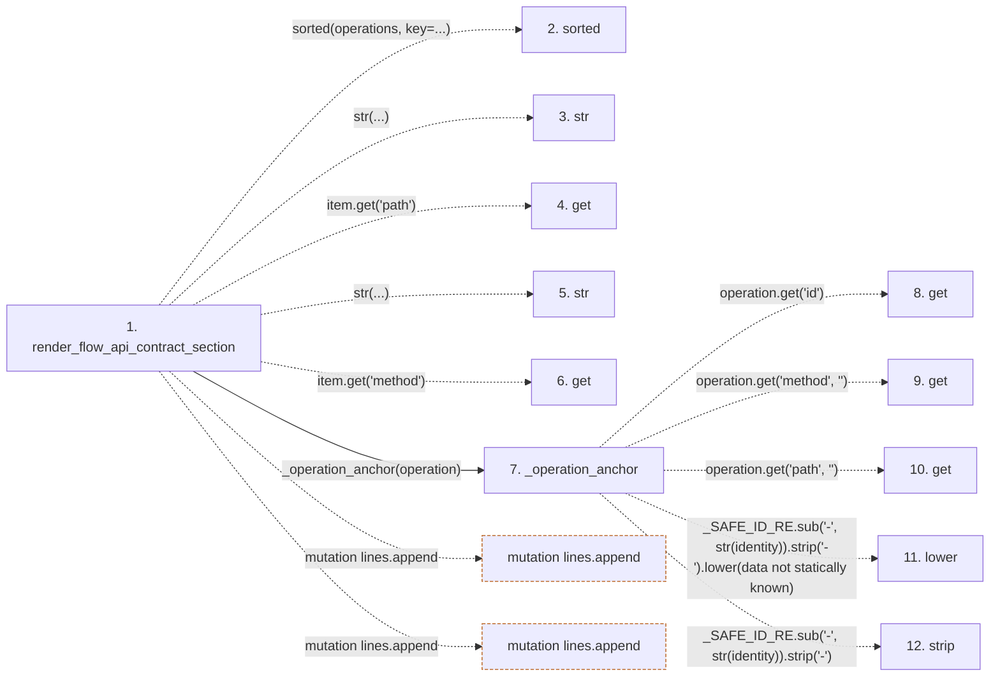

# render_flow_api_contract_section

**Entry point:** `render_flow_api_contract_section` (`api`)
**Source:** [api_contracts](../modules/api_contracts.md)
**Modules touched:** [api_contracts](../modules/api_contracts.md)

## Call sequence

<!-- Auto-generated from static call edges. Dashed arrows are external or unresolved calls. Reviewed runtime conditions and side effects belong in Behavior. -->

## Data flow

<!-- Auto-generated static analysis. Treat values and boundaries as best-effort hints, not runtime proof. -->

### Step data

| Step | Inputs | Reads | Writes | Returns |
|---|---|---|---|---|
| `render_flow_api_contract_section` | `operations: Sequence[Mapping[str, Any]]` | - | - | `''`, `...` |
| `sorted` | - | - | - | - |
| `str` | - | - | - | - |
| `get` | - | - | - | - |
| `str` | - | - | - | - |
| `get` | - | - | - | - |
| `_operation_anchor` | `operation: Mapping[str, Any]` | - | - | `...` |
| `get` | - | - | - | - |
| `get` | - | - | - | - |
| `get` | - | - | - | - |
| `lower` | - | - | - | - |
| `strip` | - | - | - | - |

### Call data

| From | To | Line | Call |
|---|---|---:|---|
| render_flow_api_contract_section | sorted | 2162 | `sorted(operations, key=...)` |
| render_flow_api_contract_section | str | 2163 | `str(...)` |
| render_flow_api_contract_section | get | 2163 | `item.get('path')` |
| render_flow_api_contract_section | str | 2163 | `str(...)` |
| render_flow_api_contract_section | get | 2163 | `item.get('method')` |
| render_flow_api_contract_section | _operation_anchor | 2165 | `_operation_anchor(operation)` |
| _operation_anchor | get | 1895 | `operation.get('id')` |
| _operation_anchor | get | 1896 | `operation.get('method', '')` |
| _operation_anchor | get | 1896 | `operation.get('path', '')` |
| _operation_anchor | lower | 1898 | `_SAFE_ID_RE.sub('-', str(identity)).strip('-').lower(data not statically known)` |
| _operation_anchor | strip | 1898 | `_SAFE_ID_RE.sub('-', str(identity)).strip('-')` |

### Boundary effects

| Kind | Target | Step | Line |
|---|---|---|---:|
| mutation | `lines.append` | `render_flow_api_contract_section` | 2167 |
| mutation | `lines.append` | `render_flow_api_contract_section` | 2171 |

### Static analysis gaps

| Kind | Step | Target | Line |
|---|---|---|---:|
| unresolved_call | `render_flow_api_contract_section` | `sorted` | 2162 |
| unresolved_call | `render_flow_api_contract_section` | `item.get` | 2163 |
| unresolved_call | `_operation_anchor` | `operation.get` | 1895 |
| unresolved_call | `_operation_anchor` | `operation.get` | 1896 |
| unresolved_call | `_operation_anchor` | `_SAFE_ID_RE.sub('-', str(identity)).strip('-').lower` | 1898 |
| unresolved_call | `_operation_anchor` | `_SAFE_ID_RE.sub('-', str(identity)).strip` | 1898 |
| step_limit | `render_flow_api_contract_section` | `first 12 steps` | 0 |

## Behavior

This flow starts at `render_flow_api_contract_section` and is classified as `api`. The generated call and data-flow sections are bounded static projections; runtime conditions and side effects require source-level confirmation.
