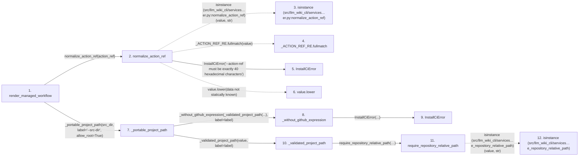

# render_managed_workflow

**Entry point:** `render_managed_workflow` (`api`)
**Source:** [ci_installer](../modules/ci_installer.md)
**Modules touched:** [ci_installer](../modules/ci_installer.md), [validation](../modules/validation.md)

## Call sequence

```mermaid
sequenceDiagram
    participant p0 as render_managed_workflow
    participant p1 as normalize_action_ref
    participant p2 as isinstance (src/llm_wiki_cli/services…er.py:normalize_action_ref)
    participant p3 as _ACTION_REF_RE.fullmatch
    participant p4 as InstallCiError
    participant p5 as value.lower
    participant p6 as _portable_project_path
    participant p7 as _without_github_expression
    participant p8 as _validated_project_path
    participant p9 as require_repository_relative_path
    participant p10 as isinstance (src/llm_wiki_cli/services…e_repository_relative_path)
    participant p11 as _syntax_key
    participant p12 as type
    participant p13 as len (src/llm_wiki_cli/services/validation.py:_syntax_key)
    participant p14 as any (src/llm_wiki_cli/services/validation.py:_syntax_key)
    participant p15 as _known_syntax
    participant p16 as _PATH_SYNTAX.get
    participant p17 as _PATH_SYNTAX.move_to_end (src/llm_wiki_cli/services…alidation.py:_known_syntax)
    participant p18 as value.strip
    participant p19 as any (src/llm_wiki_cli/services…e_repository_relative_path)
    participant p20 as ord (src/llm_wiki_cli/services…e_repository_relative_path)
    participant p21 as value.startswith
    participant p22 as _WINDOWS_DRIVE_PREFIX_RE.match
    participant p23 as value.split
    participant p24 as PurePosixPath (src/llm_wiki_cli/services…e_repository_relative_path)
    p0->>p1: normalize_action_ref
    p1-->>p2: isinstance (src/llm_wiki_cli/services…er.py:normalize_action_ref)
    p1-->>p3: _ACTION_REF_RE.fullmatch
    p1->>p4: InstallCiError
    p1-->>p5: value.lower
    p0->>p6: _portable_project_path
    p6->>p7: _without_github_expression
    p7->>p4: InstallCiError
    p6->>p8: _validated_project_path
    p8->>p9: require_repository_relative_path
    p9-->>p10: isinstance (src/llm_wiki_cli/services…e_repository_relative_path)
    p9->>p11: _syntax_key
    p11-->>p12: type
    p11-->>p13: len (src/llm_wiki_cli/services/validation.py:_syntax_key)
    p11-->>p14: any (src/llm_wiki_cli/services/validation.py:_syntax_key)
    p11-->>p12: type
    p11-->>p12: type
    p11-->>p13: len (src/llm_wiki_cli/services/validation.py:_syntax_key)
    p9->>p15: _known_syntax
    p15-->>p16: _PATH_SYNTAX.get
    p15-->>p17: _PATH_SYNTAX.move_to_end (src/llm_wiki_cli/services…alidation.py:_known_syntax)
    p9-->>p18: value.strip
    p9-->>p19: any (src/llm_wiki_cli/services…e_repository_relative_path)
    p9-->>p20: ord (src/llm_wiki_cli/services…e_repository_relative_path)
    p9-->>p20: ord (src/llm_wiki_cli/services…e_repository_relative_path)
    p9-->>p21: value.startswith
    p9-->>p21: value.startswith
    p9-->>p22: _WINDOWS_DRIVE_PREFIX_RE.match
    p9-->>p23: value.split
    p9-->>p24: PurePosixPath (src/llm_wiki_cli/services…e_repository_relative_path)
```

<!-- Auto-generated from static call edges. Dashed arrows are external or unresolved calls. Reviewed runtime conditions and side effects belong in Behavior. -->

> Call sequence diagram shows 30 of 97 interactions; 67 omitted to keep the visualization within the 30-interaction and generated-diagram limits.

> Trace truncated at the depth limit; deeper calls are omitted.

## Data flow

<!-- Auto-generated static analysis. Treat values and boundaries as best-effort hints, not runtime proof. -->

### Step data

| Step | Inputs | Reads | Writes | Returns |
|---|---|---|---|---|
| `render_managed_workflow` | `action_ref: str`, `src_dir: str`, `wiki_dir: str` | `MANAGED_WORKFLOW_SCHEMA` | - | `...` |
| `normalize_action_ref` | `value: object` | - | - | `value.lower(...)` |
| `isinstance (src/llm_wiki_cli/services…er.py:normalize_action_ref)` | - | - | - | - |
| `_ACTION_REF_RE.fullmatch` | - | - | - | - |
| `InstallCiError` | - | - | - | - |
| `value.lower` | - | - | - | - |
| `_portable_project_path` | `value: object`, `label: str`, `allow_root: bool` | - | - | `'.'`, `_without_github_expression(...)` |
| `_without_github_expression` | `path: str`, `label: str` | - | - | `path` |
| `InstallCiError` | - | - | - | - |
| `_validated_project_path` | `value: object`, `label: str` | - | - | `require_repository_relative_path(...)` |
| `require_repository_relative_path` | `value: object`, `text_error: Exception`, `posix_error: Exception`, `normalized_error: Exception`, `absolute_error: Exception \| None`, `separator_error: Exception \| None`, `control_error: Exception \| None`, `reject_delete_character: bool` | - | - | `cached`, `_remember_syntax(...)` |
| `isinstance (src/llm_wiki_cli/services…e_repository_relative_path)` | - | - | - | - |

### Call data

| From | To | Line | Call |
|---|---|---:|---|
| render_managed_workflow | normalize_action_ref | 215 | `normalize_action_ref(action_ref)` |
| normalize_action_ref | isinstance (src/llm_wiki_cli/services…er.py:normalize_action_ref) | 63 | `isinstance(value, str)` |
| normalize_action_ref | _ACTION_REF_RE.fullmatch | 63 | `_ACTION_REF_RE.fullmatch(value)` |
| normalize_action_ref | InstallCiError | 64 | `InstallCiError('--action-ref must be exactly 40 hexadecimal characters')` |
| normalize_action_ref | value.lower | 65 | `value.lower(data not statically known)` |
| render_managed_workflow | _portable_project_path | 216 | `_portable_project_path(src_dir, label='--src-dir', allow_root=True)` |
| _portable_project_path | _without_github_expression | 100 | `_without_github_expression(_validated_project_path(...), label=label)` |
| _without_github_expression | InstallCiError | 93 | `InstallCiError(...)` |
| _portable_project_path | _validated_project_path | 101 | `_validated_project_path(value, label=label)` |
| _validated_project_path | require_repository_relative_path | 69 | `require_repository_relative_path(value, text_error=InstallCiError(...), posix_error=InstallCiError(...), normalized_error=InstallCiError(...), absolute_error=InstallCiError(...), separator_error=InstallCiError(...), control_error=InstallCiError(...), reject_delete_character=True, leading_backslash_is_absolute=True, portability_error=InstallCiError(...))` |
| require_repository_relative_path | isinstance (src/llm_wiki_cli/services…e_repository_relative_path) | 299 | `isinstance(value, str)` |

### Boundary effects

*No boundary effects detected.*

### Static analysis gaps

| Kind | Step | Target | Line |
|---|---|---|---:|
| external_call | `normalize_action_ref` | `isinstance` | 63 |
| unresolved_call | `normalize_action_ref` | `_ACTION_REF_RE.fullmatch` | 63 |
| unresolved_call | `normalize_action_ref` | `value.lower` | 65 |
| external_call | `require_repository_relative_path` | `isinstance` | 299 |
| step_limit | `render_managed_workflow` | `first 12 steps` | 0 |
| truncated_flow | `render_managed_workflow` | `depth limit` | 0 |

## Behavior

This flow starts at `render_managed_workflow` and is classified as `api`. The generated call and data-flow sections are bounded static projections; runtime conditions and side effects require source-level confirmation.
