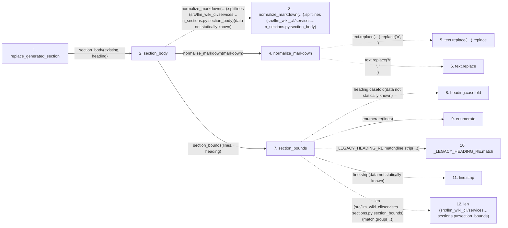

# replace_generated_section

**Entry point:** `replace_generated_section` (`api`)
**Source:** [section_ownership](../modules/section_ownership.md)
**Modules touched:** [markdown_sections](../modules/markdown_sections.md), [section_ownership](../modules/section_ownership.md)

## Call sequence

```mermaid
sequenceDiagram
    participant p0 as replace_generated_section
    participant p1 as section_body
    participant p2 as normalize_markdown(…).splitlines (src/llm_wiki_cli/services…n_sections.py:section_body)
    participant p3 as normalize_markdown
    participant p4 as text.replace(…).replace
    participant p5 as text.replace
    participant p6 as section_bounds
    participant p7 as heading.casefold
    participant p8 as enumerate
    participant p9 as _LEGACY_HEADING_RE.match
    participant p10 as line.strip
    participant p11 as len (src/llm_wiki_cli/services…sections.py:section_bounds)
    participant p12 as match.group
    participant p13 as match.group(…).strip().casefold
    participant p14 as match.group(…).strip
    participant p15 as range
    participant p16 as lines[…].strip (src/llm_wiki_cli/services…sections.py:section_bounds)
    participant p17 as next_match.group
    participant p18 as (…).join(…).strip
    participant p19 as '\n'.join (src/llm_wiki_cli/services…n_sections.py:section_body)
    participant p20 as trim_blank_lines
    participant p21 as len (src/llm_wiki_cli/services…ctions.py:trim_blank_lines)
    participant p22 as lines[…].strip (src/llm_wiki_cli/services…ons.py:trim_blank_lines, 1)
    participant p23 as lines[…].strip (src/llm_wiki_cli/services…ctions.py:trim_blank_lines)
    participant p24 as replace_section_body
    p0->>p1: section_body
    p1-->>p2: normalize_markdown(…).splitlines (src/llm_wiki_cli/services…n_sections.py:section_body)
    p1->>p3: normalize_markdown
    p3-->>p4: text.replace(…).replace
    p3-->>p5: text.replace
    p1->>p6: section_bounds
    p6-->>p7: heading.casefold
    p6-->>p8: enumerate
    p6-->>p9: _LEGACY_HEADING_RE.match
    p6-->>p10: line.strip
    p6-->>p11: len (src/llm_wiki_cli/services…sections.py:section_bounds)
    p6-->>p12: match.group
    p6-->>p13: match.group(…).strip().casefold
    p6-->>p14: match.group(…).strip
    p6-->>p12: match.group
    p6-->>p11: len (src/llm_wiki_cli/services…sections.py:section_bounds)
    p6-->>p15: range
    p6-->>p11: len (src/llm_wiki_cli/services…sections.py:section_bounds)
    p6-->>p9: _LEGACY_HEADING_RE.match
    p6-->>p16: lines[…].strip (src/llm_wiki_cli/services…sections.py:section_bounds)
    p6-->>p11: len (src/llm_wiki_cli/services…sections.py:section_bounds)
    p6-->>p17: next_match.group
    p1-->>p18: (…).join(…).strip
    p1-->>p19: '\n'.join (src/llm_wiki_cli/services…n_sections.py:section_body)
    p1->>p20: trim_blank_lines
    p20-->>p21: len (src/llm_wiki_cli/services…ctions.py:trim_blank_lines)
    p20-->>p22: lines[…].strip (src/llm_wiki_cli/services…ons.py:trim_blank_lines, 1)
    p20-->>p23: lines[…].strip (src/llm_wiki_cli/services…ctions.py:trim_blank_lines)
    p0->>p1: section_body
    p0->>p24: replace_section_body
```

<!-- Auto-generated from static call edges. Dashed arrows are external or unresolved calls. Reviewed runtime conditions and side effects belong in Behavior. -->

> Call sequence diagram shows 30 of 37 interactions; 7 omitted to keep the visualization within the 30-interaction and generated-diagram limits.

## Data flow

<!-- Auto-generated static analysis. Treat values and boundaries as best-effort hints, not runtime proof. -->

### Step data

| Step | Inputs | Reads | Writes | Returns |
|---|---|---|---|---|
| `replace_generated_section` | `existing: str`, `generated: str`, `heading: str` | - | - | `existing`, `existing`, `updated` |
| `section_body` | `markdown: str`, `heading: str` | - | - | `None`, `...` |
| `normalize_markdown(…).splitlines (src/llm_wiki_cli/services…n_sections.py:section_body)` | - | - | - | - |
| `normalize_markdown` | `text: str` | - | - | `...` |
| `text.replace(…).replace` | - | - | - | - |
| `text.replace` | - | - | - | - |
| `section_bounds` | `lines: list[str]`, `heading: str` | - | - | `(...)`, `None` |
| `heading.casefold` | - | - | - | - |
| `enumerate` | - | - | - | - |
| `_LEGACY_HEADING_RE.match` | - | - | - | - |
| `line.strip` | - | - | - | - |
| `len (src/llm_wiki_cli/services…sections.py:section_bounds)` | - | - | - | - |

### Call data

| From | To | Line | Call |
|---|---|---:|---|
| replace_generated_section | section_body | 1236 | `section_body(existing, heading)` |
| section_body | normalize_markdown(…).splitlines (src/llm_wiki_cli/services…n_sections.py:section_body) | 695 | `normalize_markdown(markdown).splitlines(data not statically known)` |
| section_body | normalize_markdown | 695 | `normalize_markdown(markdown)` |
| normalize_markdown | text.replace(…).replace | 81 | `text.replace('\r\n', '\n').replace('\r', '\n')` |
| normalize_markdown | text.replace | 81 | `text.replace('\r\n', '\n')` |
| section_body | section_bounds | 696 | `section_bounds(lines, heading)` |
| section_bounds | heading.casefold | 661 | `heading.casefold(data not statically known)` |
| section_bounds | enumerate | 662 | `enumerate(lines)` |
| section_bounds | _LEGACY_HEADING_RE.match | 663 | `_LEGACY_HEADING_RE.match(line.strip(...))` |
| section_bounds | line.strip | 663 | `line.strip(data not statically known)` |
| section_bounds | len (src/llm_wiki_cli/services…sections.py:section_bounds) | 666 | `len(match.group(...))` |

### Boundary effects

*No boundary effects detected.*

### Static analysis gaps

| Kind | Step | Target | Line |
|---|---|---|---:|
| unresolved_call | `section_body` | `normalize_markdown(markdown).splitlines` | 695 |
| unresolved_call | `normalize_markdown` | `text.replace('\r\n', '\n').replace` | 81 |
| unresolved_call | `normalize_markdown` | `text.replace` | 81 |
| unresolved_call | `section_bounds` | `heading.casefold` | 661 |
| external_call | `section_bounds` | `enumerate` | 662 |
| unresolved_call | `section_bounds` | `_LEGACY_HEADING_RE.match` | 663 |
| unresolved_call | `section_bounds` | `line.strip` | 663 |
| step_limit | `replace_generated_section` | `first 12 steps` | 0 |

## Behavior

This flow starts at `replace_generated_section` and is classified as `api`. The generated call and data-flow sections are bounded static projections; runtime conditions and side effects require source-level confirmation.
