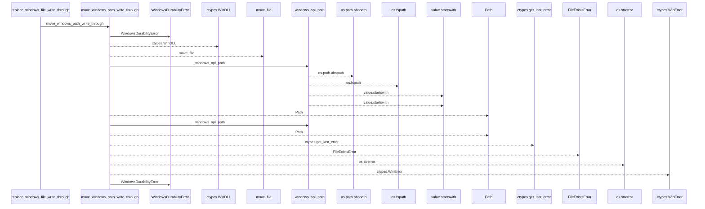
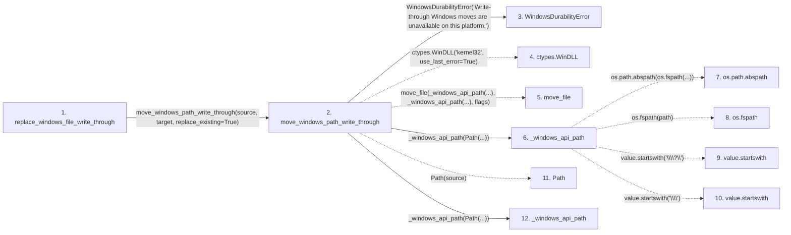

# replace_windows_file_write_through

**Entry point:** `replace_windows_file_write_through` (`api`)
**Source:** [filesystem_guard](../modules/filesystem_guard.md)
**Modules touched:** [filesystem_guard](../modules/filesystem_guard.md)

## Call sequence

<!-- Auto-generated from static call edges. Dashed arrows are external or unresolved calls. Reviewed runtime conditions and side effects belong in Behavior. -->

## Data flow

<!-- Auto-generated static analysis. Treat values and boundaries as best-effort hints, not runtime proof. -->

### Step data

| Step | Inputs | Reads | Writes | Returns |
|---|---|---|---|---|
| `replace_windows_file_write_through` | `source: Path`, `target: Path` | - | - | - |
| `move_windows_path_write_through` | `source: Path`, `target: Path`, `replace_existing: bool` | `os` | `move_file.argtypes`, `move_file.restype` | - |
| `WindowsDurabilityError` | - | - | - | - |
| `ctypes.WinDLL` | - | - | - | - |
| `move_file` | - | - | - | - |
| `_windows_api_path` | `path: Path` | - | - | `value`, `...`, `...` |
| `os.path.abspath` | - | - | - | - |
| `os.fspath` | - | - | - | - |
| `value.startswith` | - | - | - | - |
| `value.startswith` | - | - | - | - |
| `Path` | - | - | - | - |
| `_windows_api_path` | `path: Path` | - | - | `value`, `...`, `...` |

### Call data

| From | To | Line | Call |
|---|---|---:|---|
| replace_windows_file_write_through | move_windows_path_write_through | 673 | `move_windows_path_write_through(source, target, replace_existing=True)` |
| move_windows_path_write_through | WindowsDurabilityError | 689 | `WindowsDurabilityError('Write-through Windows moves are unavailable on this platform.')` |
| move_windows_path_write_through | ctypes.WinDLL | 694 | `ctypes.WinDLL('kernel32', use_last_error=True)` |
| move_windows_path_write_through | move_file | 701 | `move_file(_windows_api_path(...), _windows_api_path(...), flags)` |
| move_windows_path_write_through | _windows_api_path | 702 | `_windows_api_path(Path(...))` |
| _windows_api_path | os.path.abspath | 1298 | `os.path.abspath(os.fspath(...))` |
| _windows_api_path | os.fspath | 1298 | `os.fspath(path)` |
| _windows_api_path | value.startswith | 1299 | `value.startswith('\\\\?\\')` |
| _windows_api_path | value.startswith | 1301 | `value.startswith('\\\\')` |
| move_windows_path_write_through | Path | 702 | `Path(source)` |
| move_windows_path_write_through | _windows_api_path | 703 | `_windows_api_path(Path(...))` |

### Boundary effects

*No boundary effects detected.*

### Static analysis gaps

| Kind | Step | Target | Line |
|---|---|---|---:|
| external_call | `move_windows_path_write_through` | `ctypes.WinDLL` | 694 |
| unresolved_call | `move_windows_path_write_through` | `move_file` | 701 |
| external_call | `_windows_api_path` | `os.path.abspath` | 1298 |
| external_call | `_windows_api_path` | `os.fspath` | 1298 |
| unresolved_call | `_windows_api_path` | `value.startswith` | 1299 |
| unresolved_call | `_windows_api_path` | `value.startswith` | 1301 |
| step_limit | `replace_windows_file_write_through` | `first 12 steps` | 0 |

## Behavior

This flow starts at `replace_windows_file_write_through` and is classified as `api`. The generated call and data-flow sections are bounded static projections; runtime conditions and side effects require source-level confirmation.
