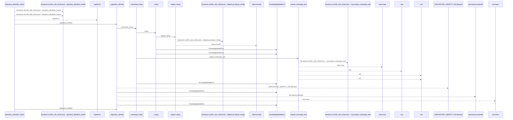
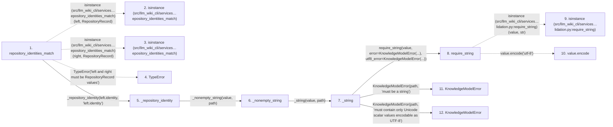

# repository_identities_match

**Entry point:** `repository_identities_match` (`api`)
**Source:** [knowledge_model](../modules/knowledge_model.md)
**Modules touched:** [knowledge_model](../modules/knowledge_model.md), [validation](../modules/validation.md)

## Call sequence

<!-- Auto-generated from static call edges. Dashed arrows are external or unresolved calls. Reviewed runtime conditions and side effects belong in Behavior. -->

## Data flow

<!-- Auto-generated static analysis. Treat values and boundaries as best-effort hints, not runtime proof. -->

### Step data

| Step | Inputs | Reads | Writes | Returns |
|---|---|---|---|---|
| `repository_identities_match` | `left: RepositoryRecord`, `right: RepositoryRecord` | `RepositoryRecord`, `RepositoryRecord`, `RepositoryIdentitySource`, `RepositoryIdentitySource` | - | `False`, `...` |
| `isinstance (src/llm_wiki_cli/services…epository_identities_match)` | - | - | - | - |
| `isinstance (src/llm_wiki_cli/services…epository_identities_match)` | - | - | - | - |
| `TypeError` | - | - | - | - |
| `_repository_identity` | `value: object`, `path: str` | - | - | `text` |
| `_nonempty_string` | `value: object`, `path: str` | - | - | `require_nonempty_text(...)` |
| `_string` | `value: object`, `path: str` | - | - | `require_string(...)` |
| `require_string` | `value: object`, `error: Exception`, `utf8_error: Exception \| None` | - | - | `value` |
| `isinstance (src/llm_wiki_cli/services…lidation.py:require_string)` | - | - | - | - |
| `value.encode` | - | - | - | - |
| `KnowledgeModelError` | - | - | - | - |
| `KnowledgeModelError` | - | - | - | - |

### Call data

| From | To | Line | Call |
|---|---|---:|---|
| repository_identities_match | isinstance (src/llm_wiki_cli/services…epository_identities_match) | 503 | `isinstance(left, RepositoryRecord)` |
| repository_identities_match | isinstance (src/llm_wiki_cli/services…epository_identities_match) | 503 | `isinstance(right, RepositoryRecord)` |
| repository_identities_match | TypeError | 506 | `TypeError('left and right must be RepositoryRecord values')` |
| repository_identities_match | _repository_identity | 507 | `_repository_identity(left.identity, 'left.identity')` |
| _repository_identity | _nonempty_string | 1796 | `_nonempty_string(value, path)` |
| _nonempty_string | _string | 1703 | `_string(value, path)` |
| _string | require_string | 1692 | `require_string(value, error=KnowledgeModelError(...), utf8_error=KnowledgeModelError(...))` |
| require_string | isinstance (src/llm_wiki_cli/services…lidation.py:require_string) | 706 | `isinstance(value, str)` |
| require_string | value.encode | 710 | `value.encode('utf-8')` |
| _string | KnowledgeModelError | 1694 | `KnowledgeModelError(path, 'must be a string')` |
| _string | KnowledgeModelError | 1695 | `KnowledgeModelError(path, 'must contain only Unicode scalar values encodable as UTF-8')` |

### Boundary effects

*No boundary effects detected.*

### Static analysis gaps

| Kind | Step | Target | Line |
|---|---|---|---:|
| external_call | `repository_identities_match` | `isinstance` | 503 |
| external_call | `repository_identities_match` | `TypeError` | 506 |
| external_call | `require_string` | `isinstance` | 706 |
| unresolved_call | `require_string` | `value.encode` | 710 |
| step_limit | `repository_identities_match` | `first 12 steps` | 0 |

## Behavior

This flow starts at `repository_identities_match` and is classified as `api`. The generated call and data-flow sections are bounded static projections; runtime conditions and side effects require source-level confirmation.
