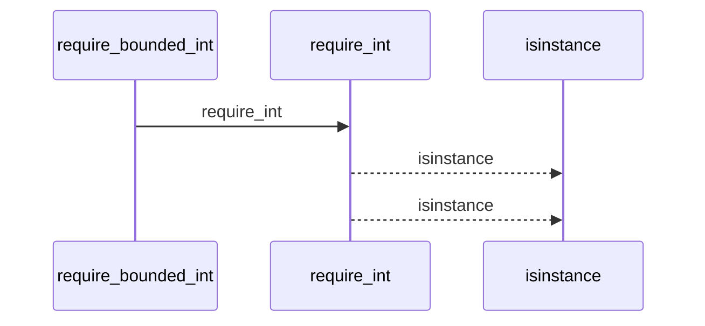
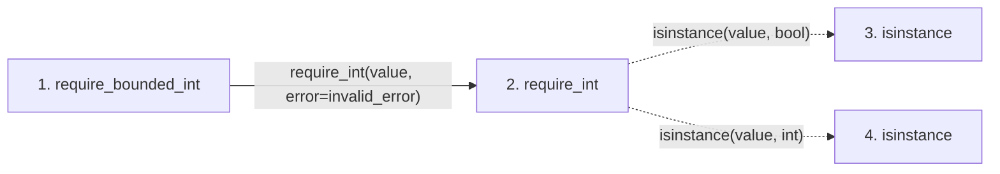

# require_bounded_int

**Entry point:** `require_bounded_int` (`api`)
**Source:** [validation](../modules/validation.md)
**Modules touched:** [validation](../modules/validation.md)

## Call sequence

<!-- Auto-generated from static call edges. Dashed arrows are external or unresolved calls. Reviewed runtime conditions and side effects belong in Behavior. -->

## Data flow

<!-- Auto-generated static analysis. Treat values and boundaries as best-effort hints, not runtime proof. -->

### Step data

| Step | Inputs | Reads | Writes | Returns |
|---|---|---|---|---|
| `require_bounded_int` | `value: object`, `minimum: int`, `maximum: int`, `invalid_error: Exception`, `bounds_error: Exception \| None` | - | - | `parsed` |
| `require_int` | `value: object`, `error: Exception` | - | - | `value` |
| `isinstance` | - | - | - | - |
| `isinstance` | - | - | - | - |

### Call data

| From | To | Line | Call |
|---|---|---:|---|
| require_bounded_int | require_int | 840 | `require_int(value, error=invalid_error)` |
| require_int | isinstance | 780 | `isinstance(value, bool)` |
| require_int | isinstance | 780 | `isinstance(value, int)` |

### Boundary effects

*No boundary effects detected.*

### Static analysis gaps

| Kind | Step | Target | Line |
|---|---|---|---:|
| unresolved_call | `require_int` | `isinstance` | 780 |

## Behavior

This flow starts at `require_bounded_int` and is classified as `api`. The generated call and data-flow sections are bounded static projections; runtime conditions and side effects require source-level confirmation.
