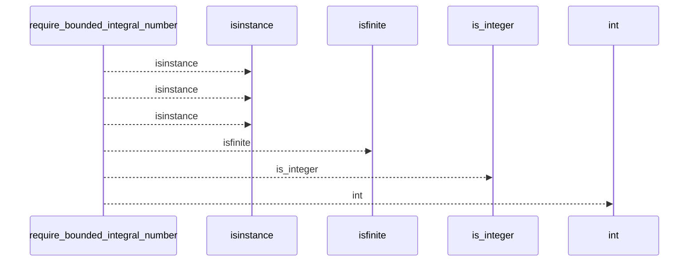
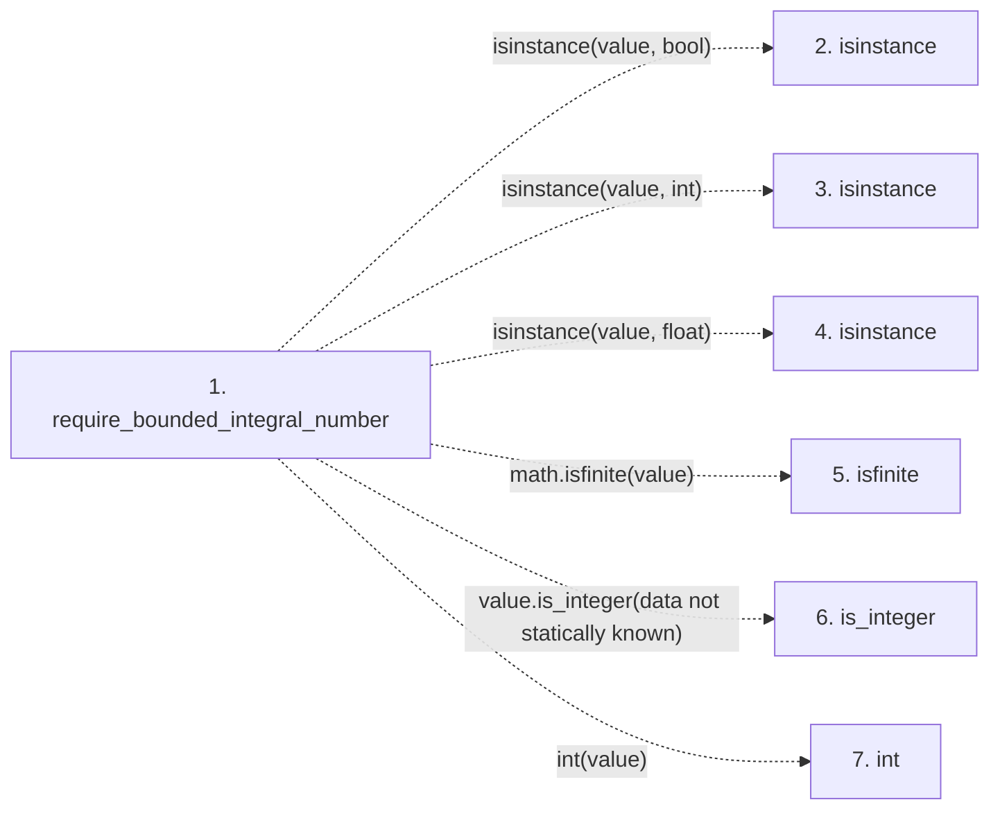

# require_bounded_integral_number

**Entry point:** `require_bounded_integral_number` (`api`)
**Source:** [validation](../modules/validation.md)
**Modules touched:** [validation](../modules/validation.md)

## Call sequence

<!-- Auto-generated from static call edges. Dashed arrows are external or unresolved calls. Reviewed runtime conditions and side effects belong in Behavior. -->

## Data flow

<!-- Auto-generated static analysis. Treat values and boundaries as best-effort hints, not runtime proof. -->

### Step data

| Step | Inputs | Reads | Writes | Returns |
|---|---|---|---|---|
| `require_bounded_integral_number` | `value: object`, `invalid_error: Exception`, `minimum: int \| None`, `maximum: int \| None`, `bounds_error: Exception \| None`, `zero_error: Exception \| None` | - | - | `parsed` |
| `isinstance` | - | - | - | - |
| `isinstance` | - | - | - | - |
| `isinstance` | - | - | - | - |
| `isfinite` | - | - | - | - |
| `is_integer` | - | - | - | - |
| `int` | - | - | - | - |

### Call data

| From | To | Line | Call |
|---|---|---:|---|
| require_bounded_integral_number | isinstance | 857 | `isinstance(value, bool)` |
| require_bounded_integral_number | isinstance | 859 | `isinstance(value, int)` |
| require_bounded_integral_number | isinstance | 861 | `isinstance(value, float)` |
| require_bounded_integral_number | isfinite | 861 | `math.isfinite(value)` |
| require_bounded_integral_number | is_integer | 861 | `value.is_integer(data not statically known)` |
| require_bounded_integral_number | int | 862 | `int(value)` |

### Boundary effects

*No boundary effects detected.*

### Static analysis gaps

| Kind | Step | Target | Line |
|---|---|---|---:|
| unresolved_call | `require_bounded_integral_number` | `isinstance` | 857 |
| unresolved_call | `require_bounded_integral_number` | `isinstance` | 859 |
| unresolved_call | `require_bounded_integral_number` | `isinstance` | 861 |
| external_call | `require_bounded_integral_number` | `math.isfinite` | 861 |
| unresolved_call | `require_bounded_integral_number` | `value.is_integer` | 861 |

## Behavior

This flow starts at `require_bounded_integral_number` and is classified as `api`. The generated call and data-flow sections are bounded static projections; runtime conditions and side effects require source-level confirmation.
