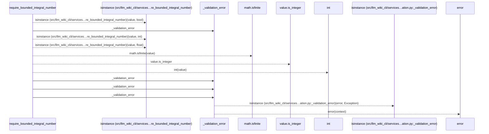
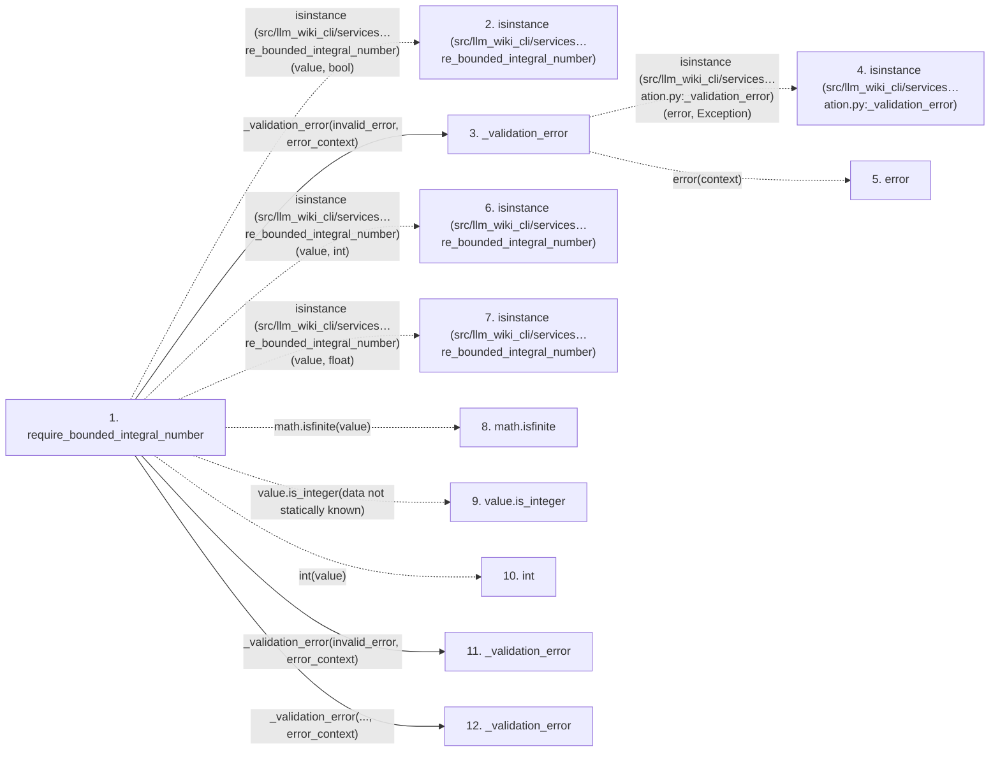

# require_bounded_integral_number

**Entry point:** `require_bounded_integral_number` (`api`)
**Source:** [validation](../modules/validation.md)
**Modules touched:** [validation](../modules/validation.md)

## Call sequence

> Static overview in presentation order, not runtime execution order. Arrows retain captured callers; representative internal continuations and boundary examples precede repeated helper detail.

<!-- Auto-generated from static call edges. Dashed arrows are external or unresolved calls. Reviewed runtime conditions and side effects belong in Behavior. -->

```mermaid
sequenceDiagram
    participant p0 as require_bounded_integral_number
    participant p1 as isinstance (src/llm_wiki_cli/services…re_bounded_integral_number)
    participant p2 as _validation_error
    participant p3 as math.isfinite
    participant p4 as value.is_integer
    participant p5 as int
    participant p6 as isinstance (src/llm_wiki_cli/services…ation.py:_validation_error)
    participant p7 as error
    p0-->>p1: isinstance (src/llm_wiki_cli/services…re_bounded_integral_number)(value, bool)
    p0->>p2: _validation_error
    p0-->>p1: isinstance (src/llm_wiki_cli/services…re_bounded_integral_number)(value, int)
    p0-->>p1: isinstance (src/llm_wiki_cli/services…re_bounded_integral_number)(value, float)
    p0-->>p3: math.isfinite(value)
    p0-->>p4: value.is_integer
    p0-->>p5: int(value)
    p0->>p2: _validation_error
    p0->>p2: _validation_error
    p0->>p2: _validation_error
    p2-->>p6: isinstance (src/llm_wiki_cli/services…ation.py:_validation_error)(error, Exception)
    p2-->>p7: error(context)
```

> Call sequence diagram shows 12 of 12 interactions; 0 omitted to keep the visualization within the 30-interaction and generated-diagram limits, with uncertain identities omitted rather than inferred.

> Captured boundary calls: external 6 of 6 (0 omitted); unresolved 2 of 2 (0 omitted). These counts cover the captured static trace.
> Detailed flow queries retain their own coverage and limits; omitted paths may execute at runtime.

## Data flow

<!-- Auto-generated static analysis. Treat values and boundaries as best-effort hints, not runtime proof. -->

### Analysis coverage

**Effect analysis evaluated.** Flow assembly and source effect analysis are separate; empty observations do not prove an empty handler body.

Source steps: 5; effect analysis evaluated: 5, partial: 0, unavailable: 0. Counts include steps omitted from the displayed trace.

Collector observations for 5 source steps with known totals: observed: 20, emitted: 20, omitted: 0. Unavailable totals are excluded.

```mermaid
flowchart LR
    s1["1. require_bounded_integral_number"]
    s2["2. isinstance (src/llm_wiki_cli/services…re_bounded_integral_number)"]
    s3["3. _validation_error"]
    s4["4. isinstance (src/llm_wiki_cli/services…ation.py:_validation_error)"]
    s5["5. error"]
    s6["6. isinstance (src/llm_wiki_cli/services…re_bounded_integral_number)"]
    s7["7. isinstance (src/llm_wiki_cli/services…re_bounded_integral_number)"]
    s8["8. math.isfinite"]
    s9["9. value.is_integer"]
    s10["10. int"]
    s11["11. _validation_error"]
    s12["12. _validation_error"]
    s1 -. "isinstance (src/llm_wiki_cli/services…re_bounded_integral_number)(value, bool)" .-> s2
    s1 -->|"_validation_error(invalid_error, error_context)"| s3
    s3 -. "isinstance (src/llm_wiki_cli/services…ation.py:_validation_error)(error, Exception)" .-> s4
    s3 -. "error(context)" .-> s5
    s1 -. "isinstance (src/llm_wiki_cli/services…re_bounded_integral_number)(value, int)" .-> s6
    s1 -. "isinstance (src/llm_wiki_cli/services…re_bounded_integral_number)(value, float)" .-> s7
    s1 -. "math.isfinite(value)" .-> s8
    s1 -. "value.is_integer(data not statically known)" .-> s9
    s1 -. "int(value)" .-> s10
    s1 -->|"_validation_error(invalid_error, error_context)"| s11
    s1 -->|"_validation_error(..., error_context)"| s12
    click s1 "../modules/validation.md"
    click s3 "../modules/validation.md"
    click s11 "../modules/validation.md"
    click s12 "../modules/validation.md"
```

### Step data

| Step | Inputs | Reads | Writes | Returns |
|---|---|---|---|---|
| `require_bounded_integral_number` | `value: object`, `invalid_error: _ValidationError`, `error_context: str`, `minimum: int \| None`, `maximum: int \| None`, `bounds_error: _ValidationError \| None`, `zero_error: _ValidationError \| None` | - | - | `parsed` |
| `isinstance (src/llm_wiki_cli/services…re_bounded_integral_number)` | - | - | - | - |
| `_validation_error` | `error: _ValidationError`, `context: str` | - | - | `...` |
| `isinstance (src/llm_wiki_cli/services…ation.py:_validation_error)` | - | - | - | - |
| `error` | - | - | - | - |
| `isinstance (src/llm_wiki_cli/services…re_bounded_integral_number)` | - | - | - | - |
| `isinstance (src/llm_wiki_cli/services…re_bounded_integral_number)` | - | - | - | - |
| `math.isfinite` | - | - | - | - |
| `value.is_integer` | - | - | - | - |
| `int` | - | - | - | - |
| `_validation_error` | `error: _ValidationError`, `context: str` | - | - | `...` |
| `_validation_error` | `error: _ValidationError`, `context: str` | - | - | `...` |

### Call data

| From | To | Line | Call |
|---|---|---:|---|
| require_bounded_integral_number | isinstance (src/llm_wiki_cli/services…re_bounded_integral_number) | 915 | `isinstance(value, bool)` |
| require_bounded_integral_number | _validation_error | 916 | `_validation_error(invalid_error, error_context)` |
| _validation_error | isinstance (src/llm_wiki_cli/services…ation.py:_validation_error) | 95 | `isinstance(error, Exception)` |
| _validation_error | error | 95 | `error(context)` |
| require_bounded_integral_number | isinstance (src/llm_wiki_cli/services…re_bounded_integral_number) | 917 | `isinstance(value, int)` |
| require_bounded_integral_number | isinstance (src/llm_wiki_cli/services…re_bounded_integral_number) | 919 | `isinstance(value, float)` |
| require_bounded_integral_number | math.isfinite | 919 | `math.isfinite(value)` |
| require_bounded_integral_number | value.is_integer | 919 | `value.is_integer(data not statically known)` |
| require_bounded_integral_number | int | 920 | `int(value)` |
| require_bounded_integral_number | _validation_error | 922 | `_validation_error(invalid_error, error_context)` |
| require_bounded_integral_number | _validation_error | 927 | `_validation_error(..., error_context)` |

### Boundary effects

*No boundary-effect observations were captured in this static trace.*

### Static analysis gaps

| Kind | Step | Target | Line |
|---|---|---|---:|
| external_call | `require_bounded_integral_number` | `isinstance` | 915 |
| external_call | `_validation_error` | `isinstance` | 95 |
| unresolved_call | `_validation_error` | `error` | 95 |
| external_call | `require_bounded_integral_number` | `isinstance` | 917 |
| external_call | `require_bounded_integral_number` | `isinstance` | 919 |
| external_call | `require_bounded_integral_number` | `math.isfinite` | 919 |
| unresolved_call | `require_bounded_integral_number` | `value.is_integer` | 919 |
| step_limit | `require_bounded_integral_number` | `first 12 steps` | 0 |

## Behavior

This flow starts at `require_bounded_integral_number` and is classified as `api`. The generated call and data-flow sections are bounded static projections; runtime conditions and side effects require source-level confirmation.
