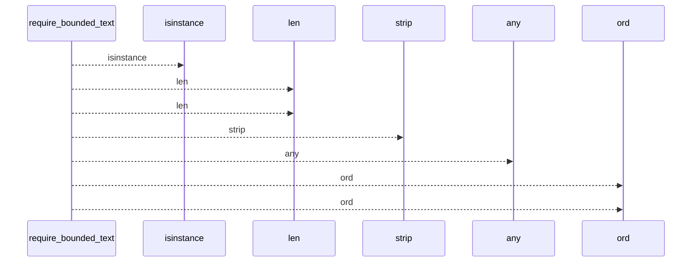
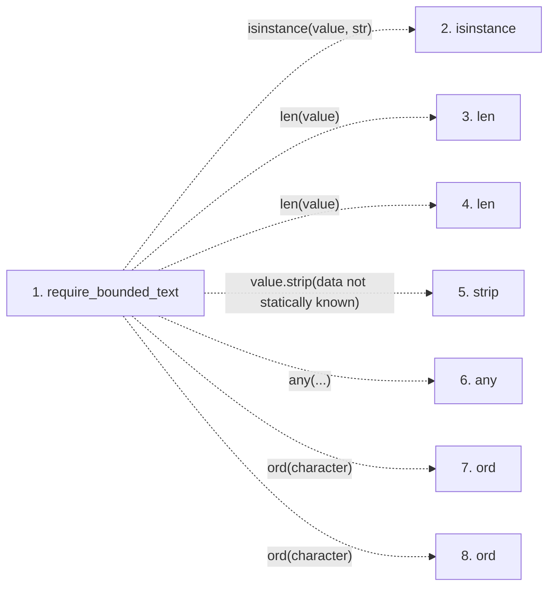

# require_bounded_text

**Entry point:** `require_bounded_text` (`api`)
**Source:** [validation](../modules/validation.md)
**Modules touched:** [validation](../modules/validation.md)

## Call sequence

<!-- Auto-generated from static call edges. Dashed arrows are external or unresolved calls. Reviewed runtime conditions and side effects belong in Behavior. -->

## Data flow

<!-- Auto-generated static analysis. Treat values and boundaries as best-effort hints, not runtime proof. -->

### Step data

| Step | Inputs | Reads | Writes | Returns |
|---|---|---|---|---|
| `require_bounded_text` | `value: object`, `maximum: int`, `error: Exception`, `minimum: int`, `control_error: Exception \| None`, `require_trimmed: bool`, `reject_control_characters: bool`, `reject_delete_character: bool` | - | - | `value` |
| `isinstance` | - | - | - | - |
| `len` | - | - | - | - |
| `len` | - | - | - | - |
| `strip` | - | - | - | - |
| `any` | - | - | - | - |
| `ord` | - | - | - | - |
| `ord` | - | - | - | - |

### Call data

| From | To | Line | Call |
|---|---|---:|---|
| require_bounded_text | isinstance | 605 | `isinstance(value, str)` |
| require_bounded_text | len | 606 | `len(value)` |
| require_bounded_text | len | 607 | `len(value)` |
| require_bounded_text | strip | 608 | `value.strip(data not statically known)` |
| require_bounded_text | any | 611 | `any(...)` |
| require_bounded_text | ord | 612 | `ord(character)` |
| require_bounded_text | ord | 613 | `ord(character)` |

### Boundary effects

*No boundary effects detected.*

### Static analysis gaps

| Kind | Step | Target | Line |
|---|---|---|---:|
| unresolved_call | `require_bounded_text` | `isinstance` | 605 |
| unresolved_call | `require_bounded_text` | `value.strip` | 608 |
| unresolved_call | `require_bounded_text` | `any` | 611 |
| unresolved_call | `require_bounded_text` | `ord` | 612 |
| unresolved_call | `require_bounded_text` | `ord` | 613 |

## Behavior

This flow starts at `require_bounded_text` and is classified as `api`. The generated call and data-flow sections are bounded static projections; runtime conditions and side effects require source-level confirmation.
