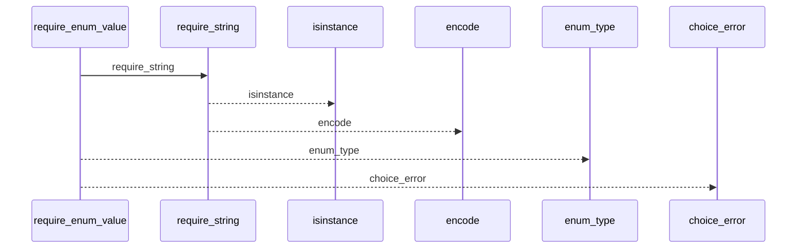
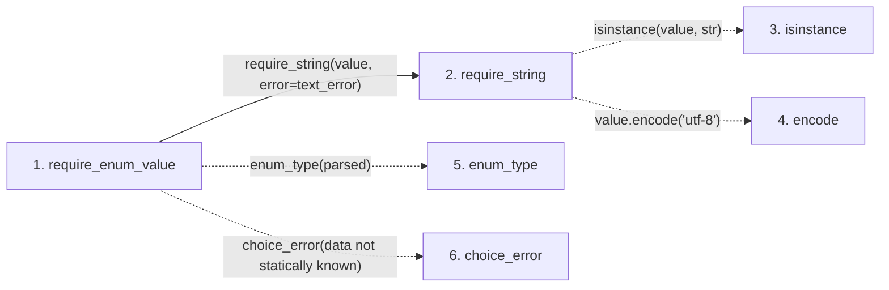

# require_enum_value

**Entry point:** `require_enum_value` (`api`)
**Source:** [validation](../modules/validation.md)
**Modules touched:** [validation](../modules/validation.md)

## Call sequence

<!-- Auto-generated from static call edges. Dashed arrows are external or unresolved calls. Reviewed runtime conditions and side effects belong in Behavior. -->

## Data flow

<!-- Auto-generated static analysis. Treat values and boundaries as best-effort hints, not runtime proof. -->

### Step data

| Step | Inputs | Reads | Writes | Returns |
|---|---|---|---|---|
| `require_enum_value` | `value: object`, `enum_type: Callable[[str], _EnumValue]`, `text_error: Exception`, `choice_error: Callable[[], Exception]` | - | - | `enum_type(...)` |
| `require_string` | `value: object`, `error: Exception`, `utf8_error: Exception \| None` | - | - | `value` |
| `isinstance` | - | - | - | - |
| `encode` | - | - | - | - |
| `enum_type` | - | - | - | - |
| `choice_error` | - | - | - | - |

### Call data

| From | To | Line | Call |
|---|---|---:|---|
| require_enum_value | require_string | 1069 | `require_string(value, error=text_error)` |
| require_string | isinstance | 706 | `isinstance(value, str)` |
| require_string | encode | 710 | `value.encode('utf-8')` |
| require_enum_value | enum_type | 1071 | `enum_type(parsed)` |
| require_enum_value | choice_error | 1073 | `choice_error(data not statically known)` |

### Boundary effects

*No boundary effects detected.*

### Static analysis gaps

| Kind | Step | Target | Line |
|---|---|---|---:|
| unresolved_call | `require_string` | `isinstance` | 706 |
| unresolved_call | `require_string` | `value.encode` | 710 |
| unresolved_call | `require_enum_value` | `enum_type` | 1071 |
| unresolved_call | `require_enum_value` | `choice_error` | 1073 |

## Behavior

This flow starts at `require_enum_value` and is classified as `api`. The generated call and data-flow sections are bounded static projections; runtime conditions and side effects require source-level confirmation.
