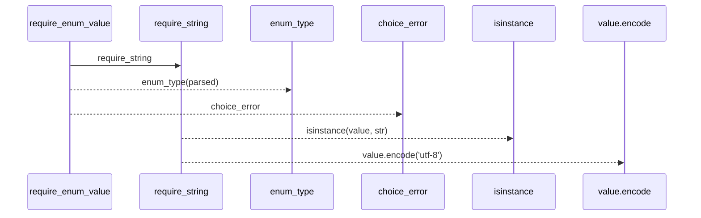
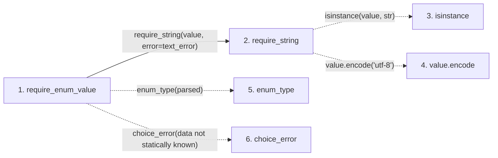

# require_enum_value

**Entry point:** `require_enum_value` (`api`)
**Source:** [validation](../modules/validation.md)
**Modules touched:** [validation](../modules/validation.md)

## Call sequence

> Static overview in presentation order, not runtime execution order. Arrows retain captured callers; siblings are shown before deeper helper detail.

<!-- Auto-generated from static call edges. Dashed arrows are external or unresolved calls. Reviewed runtime conditions and side effects belong in Behavior. -->

```mermaid
sequenceDiagram
    participant p0 as require_enum_value
    participant p1 as require_string
    participant p2 as enum_type
    participant p3 as choice_error
    participant p4 as isinstance
    participant p5 as value.encode
    p0->>p1: require_string
    p0-->>p2: enum_type(parsed)
    p0-->>p3: choice_error
    p1-->>p4: isinstance(value, str)
    p1-->>p5: value.encode('utf-8')
```

> Call sequence diagram shows 5 of 5 interactions; 0 omitted to keep the visualization within the 30-interaction and generated-diagram limits, with uncertain identities omitted rather than inferred.

> Captured boundary calls: external 1 of 1 (0 omitted); unresolved 3 of 3 (0 omitted). These counts cover the captured static trace.
> Detailed flow queries retain their own coverage and limits; omitted paths may execute at runtime.

## Data flow

<!-- Auto-generated static analysis. Treat values and boundaries as best-effort hints, not runtime proof. -->

```mermaid
flowchart LR
    s1["1. require_enum_value"]
    s2["2. require_string"]
    s3["3. isinstance"]
    s4["4. value.encode"]
    s5["5. enum_type"]
    s6["6. choice_error"]
    s1 -->|"require_string(value, error=text_error)"| s2
    s2 -. "isinstance(value, str)" .-> s3
    s2 -. "value.encode('utf-8')" .-> s4
    s1 -. "enum_type(parsed)" .-> s5
    s1 -. "choice_error(data not statically known)" .-> s6
    click s1 "../modules/validation.md"
    click s2 "../modules/validation.md"
```

### Step data

| Step | Inputs | Reads | Writes | Returns |
|---|---|---|---|---|
| `require_enum_value` | `value: object`, `enum_type: Callable[[str], _EnumValue]`, `text_error: Exception`, `choice_error: Callable[[], Exception]` | - | - | `enum_type(...)` |
| `require_string` | `value: object`, `error: Exception`, `utf8_error: Exception \| None` | - | - | `value` |
| `isinstance` | - | - | - | - |
| `value.encode` | - | - | - | - |
| `enum_type` | - | - | - | - |
| `choice_error` | - | - | - | - |

### Call data

| From | To | Line | Call |
|---|---|---:|---|
| require_enum_value | require_string | 1107 | `require_string(value, error=text_error)` |
| require_string | isinstance | 744 | `isinstance(value, str)` |
| require_string | value.encode | 748 | `value.encode('utf-8')` |
| require_enum_value | enum_type | 1109 | `enum_type(parsed)` |
| require_enum_value | choice_error | 1111 | `choice_error(data not statically known)` |

### Boundary effects

*No boundary effects detected.*

### Static analysis gaps

| Kind | Step | Target | Line |
|---|---|---|---:|
| external_call | `require_string` | `isinstance` | 744 |
| unresolved_call | `require_string` | `value.encode` | 748 |
| unresolved_call | `require_enum_value` | `enum_type` | 1109 |
| unresolved_call | `require_enum_value` | `choice_error` | 1111 |

## Behavior

This flow starts at `require_enum_value` and is classified as `api`. The generated call and data-flow sections are bounded static projections; runtime conditions and side effects require source-level confirmation.
