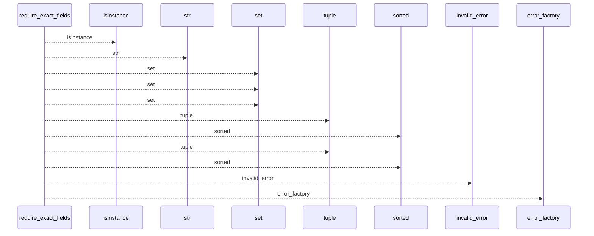
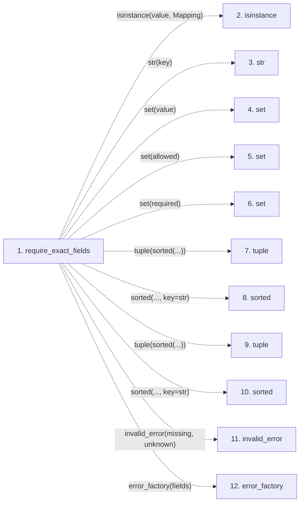

# require_exact_fields

**Entry point:** `require_exact_fields` (`api`)
**Source:** [validation](../modules/validation.md)
**Modules touched:** [validation](../modules/validation.md)

## Call sequence

<!-- Auto-generated from static call edges. Dashed arrows are external or unresolved calls. Reviewed runtime conditions and side effects belong in Behavior. -->

## Data flow

<!-- Auto-generated static analysis. Treat values and boundaries as best-effort hints, not runtime proof. -->

### Step data

| Step | Inputs | Reads | Writes | Returns |
|---|---|---|---|---|
| `require_exact_fields` | `value: object`, `allowed: Iterable[str]`, `required: Iterable[str]`, `mapping_error: Exception`, `missing_error: _ErrorFactory`, `unknown_error: _ErrorFactory`, `invalid_error: Callable[[tuple[str, ...], tuple[str, ...]], Exception] \| None`, `stringify_keys: bool` | `Mapping` | - | - |
| `isinstance` | - | - | - | - |
| `str` | - | - | - | - |
| `set` | - | - | - | - |
| `set` | - | - | - | - |
| `set` | - | - | - | - |
| `tuple` | - | - | - | - |
| `sorted` | - | - | - | - |
| `tuple` | - | - | - | - |
| `sorted` | - | - | - | - |
| `invalid_error` | - | - | - | - |
| `error_factory` | - | - | - | - |

### Call data

| From | To | Line | Call |
|---|---|---:|---|
| require_exact_fields | isinstance | 1205 | `isinstance(value, Mapping)` |
| require_exact_fields | str | 1207 | `str(key)` |
| require_exact_fields | set | 1207 | `set(value)` |
| require_exact_fields | set | 1208 | `set(allowed)` |
| require_exact_fields | set | 1209 | `set(required)` |
| require_exact_fields | tuple | 1210 | `tuple(sorted(...))` |
| require_exact_fields | sorted | 1210 | `sorted(..., key=str)` |
| require_exact_fields | tuple | 1211 | `tuple(sorted(...))` |
| require_exact_fields | sorted | 1211 | `sorted(..., key=str)` |
| require_exact_fields | invalid_error | 1213 | `invalid_error(missing, unknown)` |
| require_exact_fields | error_factory | 1221 | `error_factory(fields)` |

### Boundary effects

*No boundary effects detected.*

### Static analysis gaps

| Kind | Step | Target | Line |
|---|---|---|---:|
| unresolved_call | `require_exact_fields` | `isinstance` | 1205 |
| unresolved_call | `require_exact_fields` | `sorted` | 1210 |
| unresolved_call | `require_exact_fields` | `sorted` | 1211 |
| unresolved_call | `require_exact_fields` | `invalid_error` | 1213 |
| unresolved_call | `require_exact_fields` | `error_factory` | 1221 |

## Behavior

This flow starts at `require_exact_fields` and is classified as `api`. The generated call and data-flow sections are bounded static projections; runtime conditions and side effects require source-level confirmation.
