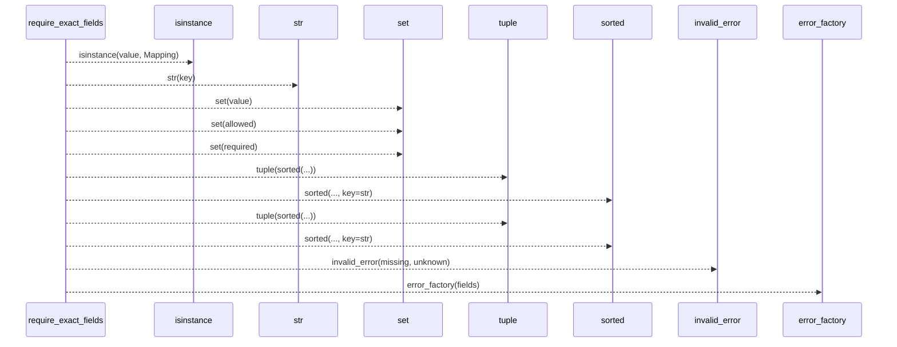
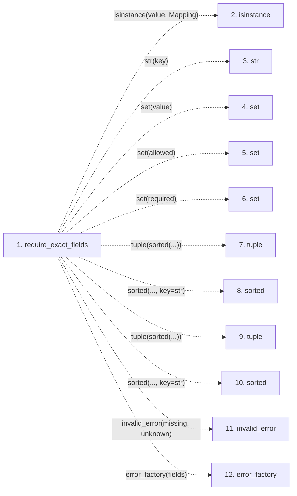

# require_exact_fields

**Entry point:** `require_exact_fields` (`api`)
**Source:** [validation](../modules/validation.md)
**Modules touched:** [validation](../modules/validation.md)

## Call sequence

> Static overview in presentation order, not runtime execution order. Arrows retain captured callers; representative internal continuations and boundary examples precede repeated helper detail.

<!-- Auto-generated from static call edges. Dashed arrows are external or unresolved calls. Reviewed runtime conditions and side effects belong in Behavior. -->

```mermaid
sequenceDiagram
    participant p0 as require_exact_fields
    participant p1 as isinstance
    participant p2 as str
    participant p3 as set
    participant p4 as tuple
    participant p5 as sorted
    participant p6 as invalid_error
    participant p7 as error_factory
    p0-->>p1: isinstance(value, Mapping)
    p0-->>p2: str(key)
    p0-->>p3: set(value)
    p0-->>p3: set(allowed)
    p0-->>p3: set(required)
    p0-->>p4: tuple(sorted(...))
    p0-->>p5: sorted(..., key=str)
    p0-->>p4: tuple(sorted(...))
    p0-->>p5: sorted(..., key=str)
    p0-->>p6: invalid_error(missing, unknown)
    p0-->>p7: error_factory(fields)
```

> Call sequence diagram shows 11 of 11 interactions; 0 omitted to keep the visualization within the 30-interaction and generated-diagram limits, with uncertain identities omitted rather than inferred.

> Captured boundary calls: external 9 of 9 (0 omitted); unresolved 2 of 2 (0 omitted). These counts cover the captured static trace.
> Detailed flow queries retain their own coverage and limits; omitted paths may execute at runtime.

## Data flow

<!-- Auto-generated static analysis. Treat values and boundaries as best-effort hints, not runtime proof. -->

### Analysis coverage

**Effect analysis partially available.** Flow assembly and source effect analysis are separate; empty observations do not prove an empty handler body.

Source steps: 1; effect analysis evaluated: 0, partial: 1, unavailable: 0. Counts include steps omitted from the displayed trace.

Collector observations for 1 source steps with known totals: observed: 10, emitted: 9, omitted: 1. Unavailable totals are excluded.

- Effect collector omitted observations before flow assembly; displayed effects are partial.

| Step | Callable record | Effect analysis | Collector totals | Observed | Emitted | Omitted |
|---|---|---|---|---:|---:|---:|
| `require_exact_fields` | `available` | `partial` | `available` | `10` | `9` | `1` |
| `isinstance` | `not_applicable` | `not_applicable` | `not_applicable` | — | — | — |
| `str` | `not_applicable` | `not_applicable` | `not_applicable` | — | — | — |
| `set` | `not_applicable` | `not_applicable` | `not_applicable` | — | — | — |
| `set` | `not_applicable` | `not_applicable` | `not_applicable` | — | — | — |
| `set` | `not_applicable` | `not_applicable` | `not_applicable` | — | — | — |
| `tuple` | `not_applicable` | `not_applicable` | `not_applicable` | — | — | — |
| `sorted` | `not_applicable` | `not_applicable` | `not_applicable` | — | — | — |
| `tuple` | `not_applicable` | `not_applicable` | `not_applicable` | — | — | — |
| `sorted` | `not_applicable` | `not_applicable` | `not_applicable` | — | — | — |
| `invalid_error` | `not_applicable` | `not_applicable` | `not_applicable` | — | — | — |
| `error_factory` | `not_applicable` | `not_applicable` | `not_applicable` | — | — | — |

```mermaid
flowchart LR
    s1["1. require_exact_fields"]
    s2["2. isinstance"]
    s3["3. str"]
    s4["4. set"]
    s5["5. set"]
    s6["6. set"]
    s7["7. tuple"]
    s8["8. sorted"]
    s9["9. tuple"]
    s10["10. sorted"]
    s11["11. invalid_error"]
    s12["12. error_factory"]
    s1 -. "isinstance(value, Mapping)" .-> s2
    s1 -. "str(key)" .-> s3
    s1 -. "set(value)" .-> s4
    s1 -. "set(allowed)" .-> s5
    s1 -. "set(required)" .-> s6
    s1 -. "tuple(sorted(...))" .-> s7
    s1 -. "sorted(..., key=str)" .-> s8
    s1 -. "tuple(sorted(...))" .-> s9
    s1 -. "sorted(..., key=str)" .-> s10
    s1 -. "invalid_error(missing, unknown)" .-> s11
    s1 -. "error_factory(fields)" .-> s12
    click s1 "../modules/validation.md"
```

### Step data

| Step | Inputs | Reads | Writes | Returns |
|---|---|---|---|---|
| `require_exact_fields` | `value: object`, `allowed: Iterable[str]`, `required: Iterable[str]`, `mapping_error: Exception`, `missing_error: _ErrorFactory`, `unknown_error: _ErrorFactory`, `invalid_error: Callable[[tuple[str, ...], tuple[str, ...]], Exception] \| None`, `stringify_keys: bool` | `Mapping` | - | - |
| `isinstance` | - | - | - | - |
| `str` | - | - | - | - |
| `set` | - | - | - | - |
| `set` | - | - | - | - |
| `set` | - | - | - | - |
| `tuple` | - | - | - | - |
| `sorted` | - | - | - | - |
| `tuple` | - | - | - | - |
| `sorted` | - | - | - | - |
| `invalid_error` | - | - | - | - |
| `error_factory` | - | - | - | - |

### Call data

| From | To | Line | Call |
|---|---|---:|---|
| require_exact_fields | isinstance | 1251 | `isinstance(value, Mapping)` |
| require_exact_fields | str | 1253 | `str(key)` |
| require_exact_fields | set | 1253 | `set(value)` |
| require_exact_fields | set | 1254 | `set(allowed)` |
| require_exact_fields | set | 1255 | `set(required)` |
| require_exact_fields | tuple | 1256 | `tuple(sorted(...))` |
| require_exact_fields | sorted | 1256 | `sorted(..., key=str)` |
| require_exact_fields | tuple | 1257 | `tuple(sorted(...))` |
| require_exact_fields | sorted | 1257 | `sorted(..., key=str)` |
| require_exact_fields | invalid_error | 1259 | `invalid_error(missing, unknown)` |
| require_exact_fields | error_factory | 1267 | `error_factory(fields)` |

### Boundary effects

*No boundary-effect observations were captured in this static trace.*

### Static analysis gaps

| Kind | Step | Target | Line |
|---|---|---|---:|
| external_call | `require_exact_fields` | `isinstance` | 1251 |
| external_call | `require_exact_fields` | `sorted` | 1256 |
| external_call | `require_exact_fields` | `sorted` | 1257 |
| unresolved_call | `require_exact_fields` | `invalid_error` | 1259 |
| unresolved_call | `require_exact_fields` | `error_factory` | 1267 |

## Behavior

This flow starts at `require_exact_fields` and is classified as `api`. The generated call and data-flow sections are bounded static projections; runtime conditions and side effects require source-level confirmation.
