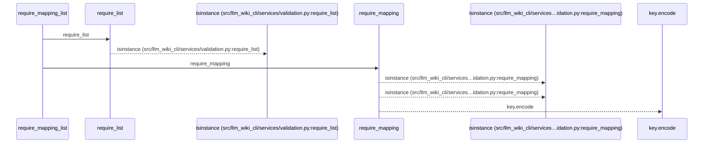
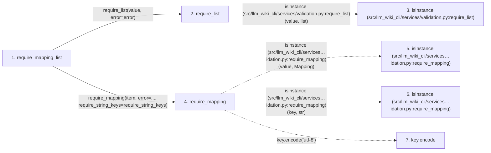

# require_mapping_list

**Entry point:** `require_mapping_list` (`api`)
**Source:** [validation](../modules/validation.md)
**Modules touched:** [validation](../modules/validation.md)

## Call sequence

<!-- Auto-generated from static call edges. Dashed arrows are external or unresolved calls. Reviewed runtime conditions and side effects belong in Behavior. -->

## Data flow

<!-- Auto-generated static analysis. Treat values and boundaries as best-effort hints, not runtime proof. -->

### Step data

| Step | Inputs | Reads | Writes | Returns |
|---|---|---|---|---|
| `require_mapping_list` | `value: object`, `error: Exception`, `item_error: Exception \| None`, `require_string_keys: bool` | - | - | `items` |
| `require_list` | `value: object`, `error: Exception` | - | - | `value` |
| `isinstance (src/llm_wiki_cli/services/validation.py:require_list)` | - | - | - | - |
| `require_mapping` | `value: object`, `error: Exception`, `require_string_keys: bool`, `key_error: Exception \| None`, `require_utf8_keys: bool`, `utf8_key_error: Exception \| None` | `Mapping` | - | `value` |
| `isinstance (src/llm_wiki_cli/services…idation.py:require_mapping)` | - | - | - | - |
| `isinstance (src/llm_wiki_cli/services…idation.py:require_mapping)` | - | - | - | - |
| `key.encode` | - | - | - | - |

### Call data

| From | To | Line | Call |
|---|---|---:|---|
| require_mapping_list | require_list | 1015 | `require_list(value, error=error)` |
| require_list | isinstance (src/llm_wiki_cli/services/validation.py:require_list) | 764 | `isinstance(value, list)` |
| require_mapping_list | require_mapping | 1017 | `require_mapping(item, error=..., require_string_keys=require_string_keys)` |
| require_mapping | isinstance (src/llm_wiki_cli/services…idation.py:require_mapping) | 727 | `isinstance(value, Mapping)` |
| require_mapping | isinstance (src/llm_wiki_cli/services…idation.py:require_mapping) | 731 | `isinstance(key, str)` |
| require_mapping | key.encode | 736 | `key.encode('utf-8')` |

### Boundary effects

*No boundary effects detected.*

### Static analysis gaps

| Kind | Step | Target | Line |
|---|---|---|---:|
| external_call | `require_list` | `isinstance` | 764 |
| external_call | `require_mapping` | `isinstance` | 727 |
| external_call | `require_mapping` | `isinstance` | 731 |
| unresolved_call | `require_mapping` | `key.encode` | 736 |

## Behavior

This flow starts at `require_mapping_list` and is classified as `api`. The generated call and data-flow sections are bounded static projections; runtime conditions and side effects require source-level confirmation.
