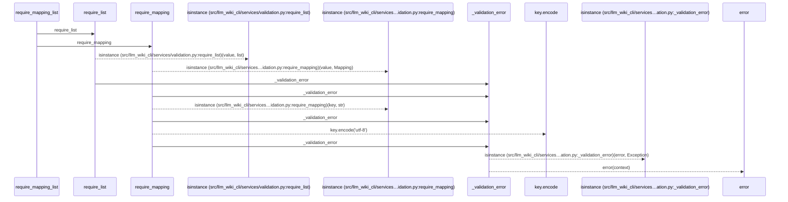
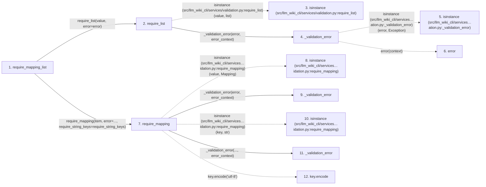

# require_mapping_list

**Entry point:** `require_mapping_list` (`api`)
**Source:** [validation](../modules/validation.md)
**Modules touched:** [validation](../modules/validation.md)

## Call sequence

> Static overview in presentation order, not runtime execution order. Arrows retain captured callers; representative internal continuations and boundary examples precede repeated helper detail.

<!-- Auto-generated from static call edges. Dashed arrows are external or unresolved calls. Reviewed runtime conditions and side effects belong in Behavior. -->

```mermaid
sequenceDiagram
    participant p0 as require_mapping_list
    participant p1 as require_list
    participant p2 as require_mapping
    participant p3 as isinstance (src/llm_wiki_cli/services/validation.py:require_list)
    participant p4 as isinstance (src/llm_wiki_cli/services…idation.py:require_mapping)
    participant p5 as _validation_error
    participant p6 as key.encode
    participant p7 as isinstance (src/llm_wiki_cli/services…ation.py:_validation_error)
    participant p8 as error
    p0->>p1: require_list
    p0->>p2: require_mapping
    p1-->>p3: isinstance (src/llm_wiki_cli/services/validation.py:require_list)(value, list)
    p2-->>p4: isinstance (src/llm_wiki_cli/services…idation.py:require_mapping)(value, Mapping)
    p1->>p5: _validation_error
    p2->>p5: _validation_error
    p2-->>p4: isinstance (src/llm_wiki_cli/services…idation.py:require_mapping)(key, str)
    p2->>p5: _validation_error
    p2-->>p6: key.encode('utf-8')
    p2->>p5: _validation_error
    p5-->>p7: isinstance (src/llm_wiki_cli/services…ation.py:_validation_error)(error, Exception)
    p5-->>p8: error(context)
```

> Call sequence diagram shows 12 of 12 interactions; 0 omitted to keep the visualization within the 30-interaction and generated-diagram limits, with uncertain identities omitted rather than inferred.

> Captured boundary calls: external 4 of 4 (0 omitted); unresolved 2 of 2 (0 omitted). These counts cover the captured static trace.
> Detailed flow queries retain their own coverage and limits; omitted paths may execute at runtime.

## Data flow

<!-- Auto-generated static analysis. Treat values and boundaries as best-effort hints, not runtime proof. -->

### Analysis coverage

**Effect analysis evaluated.** Flow assembly and source effect analysis are separate; empty observations do not prove an empty handler body.

Source steps: 7; effect analysis evaluated: 7, partial: 0, unavailable: 0. Counts include steps omitted from the displayed trace.

Collector observations for 7 source steps with known totals: observed: 30, emitted: 30, omitted: 0. Unavailable totals are excluded.

```mermaid
flowchart LR
    s1["1. require_mapping_list"]
    s2["2. require_list"]
    s3["3. isinstance (src/llm_wiki_cli/services/validation.py:require_list)"]
    s4["4. _validation_error"]
    s5["5. isinstance (src/llm_wiki_cli/services…ation.py:_validation_error)"]
    s6["6. error"]
    s7["7. require_mapping"]
    s8["8. isinstance (src/llm_wiki_cli/services…idation.py:require_mapping)"]
    s9["9. _validation_error"]
    s10["10. isinstance (src/llm_wiki_cli/services…idation.py:require_mapping)"]
    s11["11. _validation_error"]
    s12["12. key.encode"]
    s1 -->|"require_list(value, error=error)"| s2
    s2 -. "isinstance (src/llm_wiki_cli/services/validation.py:require_list)(value, list)" .-> s3
    s2 -->|"_validation_error(error, error_context)"| s4
    s4 -. "isinstance (src/llm_wiki_cli/services…ation.py:_validation_error)(error, Exception)" .-> s5
    s4 -. "error(context)" .-> s6
    s1 -->|"require_mapping(item, error=..., require_string_keys=require_string_keys)"| s7
    s7 -. "isinstance (src/llm_wiki_cli/services…idation.py:require_mapping)(value, Mapping)" .-> s8
    s7 -->|"_validation_error(error, error_context)"| s9
    s7 -. "isinstance (src/llm_wiki_cli/services…idation.py:require_mapping)(key, str)" .-> s10
    s7 -->|"_validation_error(..., error_context)"| s11
    s7 -. "key.encode('utf-8')" .-> s12
    click s1 "../modules/validation.md"
    click s2 "../modules/validation.md"
    click s4 "../modules/validation.md"
    click s7 "../modules/validation.md"
    click s9 "../modules/validation.md"
    click s11 "../modules/validation.md"
```

### Step data

| Step | Inputs | Reads | Writes | Returns |
|---|---|---|---|---|
| `require_mapping_list` | `value: object`, `error: Exception`, `item_error: Exception \| None`, `require_string_keys: bool` | - | - | `items` |
| `require_list` | `value: object`, `error: _ValidationError`, `error_context: str` | - | - | `value` |
| `isinstance (src/llm_wiki_cli/services/validation.py:require_list)` | - | - | - | - |
| `_validation_error` | `error: _ValidationError`, `context: str` | - | - | `...` |
| `isinstance (src/llm_wiki_cli/services…ation.py:_validation_error)` | - | - | - | - |
| `error` | - | - | - | - |
| `require_mapping` | `value: object`, `error: _ValidationError`, `error_context: str`, `require_string_keys: bool`, `key_error: _ValidationError \| None`, `require_utf8_keys: bool`, `utf8_key_error: _ValidationError \| None` | `Mapping` | - | `value` |
| `isinstance (src/llm_wiki_cli/services…idation.py:require_mapping)` | - | - | - | - |
| `_validation_error` | `error: _ValidationError`, `context: str` | - | - | `...` |
| `isinstance (src/llm_wiki_cli/services…idation.py:require_mapping)` | - | - | - | - |
| `_validation_error` | `error: _ValidationError`, `context: str` | - | - | `...` |
| `key.encode` | - | - | - | - |

### Call data

| From | To | Line | Call |
|---|---|---:|---|
| require_mapping_list | require_list | 1073 | `require_list(value, error=error)` |
| require_list | isinstance (src/llm_wiki_cli/services/validation.py:require_list) | 820 | `isinstance(value, list)` |
| require_list | _validation_error | 821 | `_validation_error(error, error_context)` |
| _validation_error | isinstance (src/llm_wiki_cli/services…ation.py:_validation_error) | 95 | `isinstance(error, Exception)` |
| _validation_error | error | 95 | `error(context)` |
| require_mapping_list | require_mapping | 1075 | `require_mapping(item, error=..., require_string_keys=require_string_keys)` |
| require_mapping | isinstance (src/llm_wiki_cli/services…idation.py:require_mapping) | 783 | `isinstance(value, Mapping)` |
| require_mapping | _validation_error | 784 | `_validation_error(error, error_context)` |
| require_mapping | isinstance (src/llm_wiki_cli/services…idation.py:require_mapping) | 787 | `isinstance(key, str)` |
| require_mapping | _validation_error | 788 | `_validation_error(..., error_context)` |
| require_mapping | key.encode | 792 | `key.encode('utf-8')` |

### Boundary effects

*No boundary-effect observations were captured in this static trace.*

### Static analysis gaps

| Kind | Step | Target | Line |
|---|---|---|---:|
| external_call | `require_list` | `isinstance` | 820 |
| external_call | `_validation_error` | `isinstance` | 95 |
| unresolved_call | `_validation_error` | `error` | 95 |
| external_call | `require_mapping` | `isinstance` | 783 |
| external_call | `require_mapping` | `isinstance` | 787 |
| unresolved_call | `require_mapping` | `key.encode` | 792 |
| step_limit | `require_mapping_list` | `first 12 steps` | 0 |

## Behavior

This flow starts at `require_mapping_list` and is classified as `api`. The generated call and data-flow sections are bounded static projections; runtime conditions and side effects require source-level confirmation.
