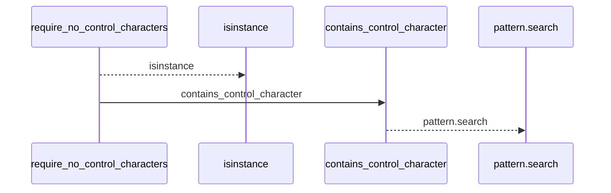
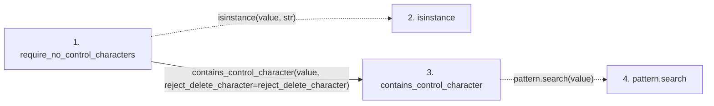

# require_no_control_characters

**Entry point:** `require_no_control_characters` (`api`)
**Source:** [validation](../modules/validation.md)
**Modules touched:** [validation](../modules/validation.md)

## Call sequence

<!-- Auto-generated from static call edges. Dashed arrows are external or unresolved calls. Reviewed runtime conditions and side effects belong in Behavior. -->

## Data flow

<!-- Auto-generated static analysis. Treat values and boundaries as best-effort hints, not runtime proof. -->

### Step data

| Step | Inputs | Reads | Writes | Returns |
|---|---|---|---|---|
| `require_no_control_characters` | `value: object`, `error: Exception`, `reject_delete_character: bool` | - | - | `value` |
| `isinstance` | - | - | - | - |
| `contains_control_character` | `value: str`, `reject_delete_character: bool` | `_ASCII_CONTROL_DELETE`, `_ASCII_CONTROL` | - | `...` |
| `pattern.search` | - | - | - | - |

### Call data

| From | To | Line | Call |
|---|---|---:|---|
| require_no_control_characters | isinstance | 669 | `isinstance(value, str)` |
| require_no_control_characters | contains_control_character | 669 | `contains_control_character(value, reject_delete_character=reject_delete_character)` |
| contains_control_character | pattern.search | 685 | `pattern.search(value)` |

### Boundary effects

*No boundary effects detected.*

### Static analysis gaps

| Kind | Step | Target | Line |
|---|---|---|---:|
| external_call | `require_no_control_characters` | `isinstance` | 669 |
| unresolved_call | `contains_control_character` | `pattern.search` | 685 |

## Behavior

This flow starts at `require_no_control_characters` and is classified as `api`. The generated call and data-flow sections are bounded static projections; runtime conditions and side effects require source-level confirmation.
