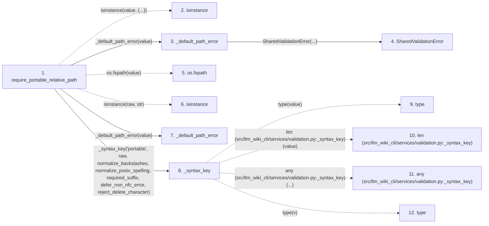

# require_portable_relative_path

**Entry point:** `require_portable_relative_path` (`api`)
**Source:** [validation](../modules/validation.md)
**Modules touched:** [validation](../modules/validation.md)

## Call sequence

```mermaid
sequenceDiagram
    participant p0 as require_portable_relative_path
    participant p1 as isinstance
    participant p2 as _default_path_error
    participant p3 as SharedValidationError
    participant p4 as os.fspath
    participant p5 as _syntax_key
    participant p6 as type
    participant p7 as len (src/llm_wiki_cli/services/validation.py:_syntax_key)
    participant p8 as any (src/llm_wiki_cli/services/validation.py:_syntax_key)
    participant p9 as _known_syntax
    participant p10 as _PATH_SYNTAX.get
    participant p11 as _PATH_SYNTAX.move_to_end (src/llm_wiki_cli/services…alidation.py:_known_syntax)
    participant p12 as _check_path_collision
    participant p13 as portable_path_key
    participant p14 as unicodedata.normalize(…).casefold
    participant p15 as unicodedata.normalize (src/llm_wiki_cli/services…ation.py:portable_path_key)
    participant p16 as collision_seen.setdefault
    participant p17 as collision_error
    participant p18 as raw.encode
    participant p19 as raw.replace
    participant p20 as PurePosixPath
    participant p21 as path.is_absolute
    participant p22 as _WINDOWS_ABSOLUTE_RE.match
    p0-->>p1: isinstance
    p0->>p2: _default_path_error
    p2->>p3: SharedValidationError
    p0-->>p4: os.fspath
    p0-->>p1: isinstance
    p0->>p2: _default_path_error
    p0->>p5: _syntax_key
    p5-->>p6: type
    p5-->>p7: len (src/llm_wiki_cli/services/validation.py:_syntax_key)
    p5-->>p8: any (src/llm_wiki_cli/services/validation.py:_syntax_key)
    p5-->>p6: type
    p5-->>p6: type
    p5-->>p7: len (src/llm_wiki_cli/services/validation.py:_syntax_key)
    p0->>p9: _known_syntax
    p9-->>p10: _PATH_SYNTAX.get
    p9-->>p11: _PATH_SYNTAX.move_to_end (src/llm_wiki_cli/services…alidation.py:_known_syntax)
    p0->>p12: _check_path_collision
    p12->>p13: portable_path_key
    p13-->>p14: unicodedata.normalize(…).casefold
    p13-->>p15: unicodedata.normalize (src/llm_wiki_cli/services…ation.py:portable_path_key)
    p12-->>p16: collision_seen.setdefault
    p12->>p3: SharedValidationError
    p12-->>p17: collision_error
    p0-->>p18: raw.encode
    p0->>p2: _default_path_error
    p0->>p2: _default_path_error
    p0-->>p19: raw.replace
    p0-->>p20: PurePosixPath
    p0-->>p21: path.is_absolute
    p0-->>p22: _WINDOWS_ABSOLUTE_RE.match
```

<!-- Auto-generated from static call edges. Dashed arrows are external or unresolved calls. Reviewed runtime conditions and side effects belong in Behavior. -->

> Call sequence diagram shows 30 of 58 interactions; 28 omitted to keep the visualization within the 30-interaction and generated-diagram limits.

## Data flow

<!-- Auto-generated static analysis. Treat values and boundaries as best-effort hints, not runtime proof. -->

### Step data

| Step | Inputs | Reads | Writes | Returns |
|---|---|---|---|---|
| `require_portable_relative_path` | `value: object`, `normalize_backslashes: bool`, `normalize_posix_spelling: bool`, `required_suffix: str \| None`, `defer_non_nfc_error: bool`, `reject_delete_character: bool`, `text_error: Exception \| None`, `relative_error: Exception \| None` | `os` | - | `cached`, `_remember_syntax(...)` |
| `isinstance` | - | - | - | - |
| `_default_path_error` | `value: object` | - | - | `SharedValidationError(...)` |
| `SharedValidationError` | - | - | - | - |
| `os.fspath` | - | - | - | - |
| `isinstance` | - | - | - | - |
| `_default_path_error` | `value: object` | - | - | `SharedValidationError(...)` |
| `_syntax_key` | `kind`, `value`, `options` | - | - | `None`, `(...)` |
| `type` | - | - | - | - |
| `len (src/llm_wiki_cli/services/validation.py:_syntax_key)` | - | - | - | - |
| `any (src/llm_wiki_cli/services/validation.py:_syntax_key)` | - | - | - | - |
| `type` | - | - | - | - |

### Call data

| From | To | Line | Call |
|---|---|---:|---|
| require_portable_relative_path | isinstance | 216 | `isinstance(value, (...))` |
| require_portable_relative_path | _default_path_error | 217 | `_default_path_error(value)` |
| _default_path_error | SharedValidationError | 113 | `SharedValidationError(...)` |
| require_portable_relative_path | os.fspath | 218 | `os.fspath(value)` |
| require_portable_relative_path | isinstance | 219 | `isinstance(raw, str)` |
| require_portable_relative_path | _default_path_error | 220 | `_default_path_error(value)` |
| require_portable_relative_path | _syntax_key | 221 | `_syntax_key('portable', raw, normalize_backslashes, normalize_posix_spelling, required_suffix, defer_non_nfc_error, reject_delete_character)` |
| _syntax_key | type | 54 | `type(value)` |
| _syntax_key | len (src/llm_wiki_cli/services/validation.py:_syntax_key) | 54 | `len(value)` |
| _syntax_key | any (src/llm_wiki_cli/services/validation.py:_syntax_key) | 55 | `any(...)` |
| _syntax_key | type | 55 | `type(v)` |

### Boundary effects

*No boundary effects detected.*

### Static analysis gaps

| Kind | Step | Target | Line |
|---|---|---|---:|
| external_call | `require_portable_relative_path` | `isinstance` | 216 |
| external_call | `require_portable_relative_path` | `os.fspath` | 218 |
| external_call | `require_portable_relative_path` | `isinstance` | 219 |
| external_call | `_syntax_key` | `type` | 54 |
| external_call | `_syntax_key` | `any` | 55 |
| external_call | `_syntax_key` | `type` | 55 |
| step_limit | `require_portable_relative_path` | `first 12 steps` | 0 |

## Behavior

This flow starts at `require_portable_relative_path` and is classified as `api`. The generated call and data-flow sections are bounded static projections; runtime conditions and side effects require source-level confirmation.
