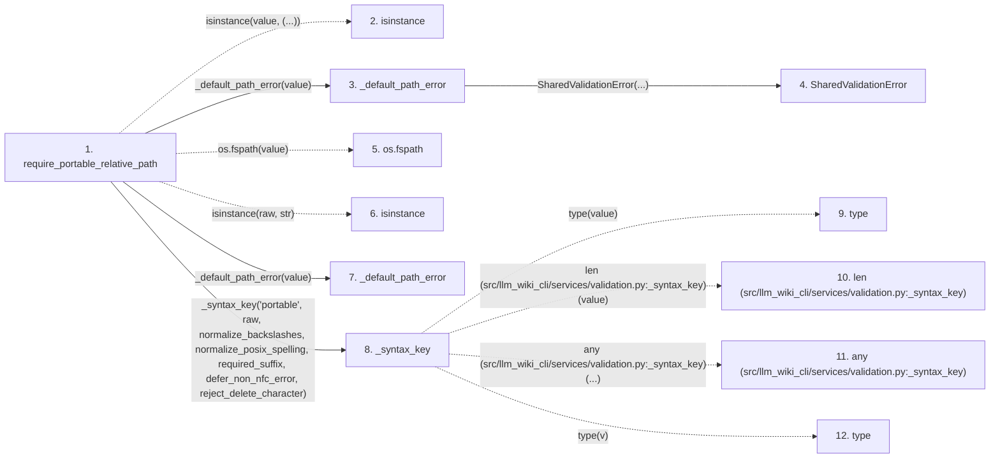

# require_portable_relative_path

**Entry point:** `require_portable_relative_path` (`api`)
**Source:** [validation](../modules/validation.md)
**Modules touched:** [validation](../modules/validation.md)

## Call sequence

> Static overview in presentation order, not runtime execution order. Arrows retain captured callers; representative internal continuations and boundary examples precede repeated helper detail.

<!-- Auto-generated from static call edges. Dashed arrows are external or unresolved calls. Reviewed runtime conditions and side effects belong in Behavior. -->

```mermaid
sequenceDiagram
    participant p0 as require_portable_relative_path
    participant p1 as _default_path_error
    participant p2 as _check_path_collision
    participant p3 as require_portable_path_component
    participant p4 as _syntax_key
    participant p5 as _known_syntax
    participant p6 as _remember_syntax
    participant p7 as SharedValidationError
    participant p8 as portable_path_key
    participant p9 as isinstance
    participant p10 as raw.encode
    participant p11 as os.fspath
    participant p12 as raw.replace
    participant p13 as PurePosixPath
    participant p14 as path.is_absolute
    participant p15 as _WINDOWS_ABSOLUTE_RE.match
    participant p16 as path.as_posix
    participant p17 as normalized.strip
    participant p18 as canonical.casefold().endswith
    participant p19 as canonical.casefold
    participant p20 as required_suffix.casefold
    participant p21 as type
    participant p22 as _PATH_SYNTAX.get
    participant p23 as component.encode
    participant p24 as _PATH_SYNTAX.move_to_end (src/llm_wiki_cli/services…dation.py:_remember_syntax)
    participant p25 as len (src/llm_wiki_cli/services/validation.py:_syntax_key)
    participant p26 as _PATH_SYNTAX.move_to_end (src/llm_wiki_cli/services…alidation.py:_known_syntax)
    participant p27 as collision_seen.setdefault
    participant p28 as len (src/llm_wiki_cli/services…dation.py:_remember_syntax)
    participant p29 as any (src/llm_wiki_cli/services/validation.py:_syntax_key)
    p0->>p1: _default_path_error
    p0->>p2: _check_path_collision
    p0->>p3: require_portable_path_component
    p0->>p4: _syntax_key
    p0->>p5: _known_syntax
    p0->>p6: _remember_syntax
    p1->>p7: SharedValidationError
    p2->>p8: portable_path_key
    p0-->>p9: isinstance(value, (...))
    p0-->>p10: raw.encode('utf-8')
    p0-->>p11: os.fspath(value)
    p0-->>p9: isinstance(raw, str)
    p0-->>p12: raw.replace('\\', '/')
    p0-->>p13: PurePosixPath(normalized)
    p0-->>p14: path.is_absolute
    p0-->>p15: _WINDOWS_ABSOLUTE_RE.match(raw)
    p0-->>p16: path.as_posix
    p0-->>p17: normalized.strip
    p0-->>p18: canonical.casefold().endswith(required_suffix.casefold(...))
    p0-->>p19: canonical.casefold
    p0-->>p20: required_suffix.casefold
    p4-->>p21: type(value)
    p5-->>p22: _PATH_SYNTAX.get(key)
    p3-->>p23: component.encode('utf-8')
    p6-->>p24: _PATH_SYNTAX.move_to_end (src/llm_wiki_cli/services…dation.py:_remember_syntax)(key)
    p4-->>p25: len (src/llm_wiki_cli/services/validation.py:_syntax_key)(value)
    p5-->>p26: _PATH_SYNTAX.move_to_end (src/llm_wiki_cli/services…alidation.py:_known_syntax)(key)
    p2-->>p27: collision_seen.setdefault(key, canonical)
    p6-->>p28: len (src/llm_wiki_cli/services…dation.py:_remember_syntax)(_PATH_SYNTAX)
    p4-->>p29: any (src/llm_wiki_cli/services/validation.py:_syntax_key)(...)
```

> Call sequence diagram shows 30 of 58 interactions; 28 omitted to keep the visualization within the 30-interaction and generated-diagram limits, with uncertain identities omitted rather than inferred.

> Captured boundary calls: external 8 of 17 (9 omitted); unresolved 14 of 20 (6 omitted). These counts cover the captured static trace.

Omitted captured detail, grouped by actual caller occurrence and target module:

| Caller | Parent step | Target module | Kind | Omitted interactions |
| --- | --- | --- | --- | --- |
| `src/llm_wiki_cli/services/validation.py:require_portable_relative_path` | 1 | [src/llm_wiki_cli/services/validation.py](../modules/validation.md) | internal | 7 |
| `src/llm_wiki_cli/services/validation.py:_syntax_key` | 8 | - | external | 3 |
| `src/llm_wiki_cli/services/validation.py:portable_path_key` | 19 | - | unresolved | 1 |
| `src/llm_wiki_cli/services/validation.py:portable_path_key` | 19 | - | external | 1 |
| `src/llm_wiki_cli/services/validation.py:_check_path_collision` | 18 | [src/llm_wiki_cli/services/validation.py](../modules/validation.md) | internal | 1 |
| `src/llm_wiki_cli/services/validation.py:_check_path_collision` | 18 | - | unresolved | 1 |
| `src/llm_wiki_cli/services/validation.py:require_portable_path_component` | 40 | [src/llm_wiki_cli/services/validation.py](../modules/validation.md) | internal | 5 |
| `src/llm_wiki_cli/services/validation.py:require_portable_path_component` | 40 | - | external | 5 |
> Omission summary shows 8 of 10 groups; 2 further groups are not expanded here. Counts above include all omitted interactions.
> Detailed flow queries retain their own coverage and limits; omitted paths may execute at runtime.

## Data flow

<!-- Auto-generated static analysis. Treat values and boundaries as best-effort hints, not runtime proof. -->

### Analysis coverage

**Effect analysis partially available.** Flow assembly and source effect analysis are separate; empty observations do not prove an empty handler body.

Source steps: 22; effect analysis evaluated: 13, partial: 2, unavailable: 7. Counts include steps omitted from the displayed trace.

Collector observations for 15 source steps with known totals: observed: 71, emitted: 60, omitted: 11. Unavailable totals are excluded.

- Callable record unavailable; the selected entry symbol has no represented callable body.
- Effect collector omitted observations before flow assembly; displayed effects are partial.
- Effect collector totals unavailable; observed counts cover captured records only.

| Step | Callable record | Effect analysis | Collector totals | Observed | Emitted | Omitted |
|---|---|---|---|---:|---:|---:|
| `require_portable_relative_path` | `available` | `partial` | `available` | `21` | `11` | `10` |
| `isinstance` | `not_applicable` | `not_applicable` | `not_applicable` | — | — | — |
| `_default_path_error` | `available` | `evaluated` | `available` | `2` | `2` | `0` |
| `SharedValidationError` | `unavailable` | `unavailable` | `unavailable` | — | — | — |
| `os.fspath` | `not_applicable` | `not_applicable` | `not_applicable` | — | — | — |
| `isinstance` | `not_applicable` | `not_applicable` | `not_applicable` | — | — | — |
| `_default_path_error` | `available` | `evaluated` | `available` | `2` | `2` | `0` |
| `_syntax_key` | `available` | `evaluated` | `available` | `5` | `5` | `0` |
| `type` | `not_applicable` | `not_applicable` | `not_applicable` | — | — | — |
| `len (src/llm_wiki_cli/services/validation.py:_syntax_key)` | `not_applicable` | `not_applicable` | `not_applicable` | — | — | — |
| `any (src/llm_wiki_cli/services/validation.py:_syntax_key)` | `not_applicable` | `not_applicable` | `not_applicable` | — | — | — |
| `type` | `not_applicable` | `not_applicable` | `not_applicable` | — | — | — |

```mermaid
flowchart LR
    s1["1. require_portable_relative_path"]
    s2["2. isinstance"]
    s3["3. _default_path_error"]
    s4["4. SharedValidationError"]
    s5["5. os.fspath"]
    s6["6. isinstance"]
    s7["7. _default_path_error"]
    s8["8. _syntax_key"]
    s9["9. type"]
    s10["10. len (src/llm_wiki_cli/services/validation.py:_syntax_key)"]
    s11["11. any (src/llm_wiki_cli/services/validation.py:_syntax_key)"]
    s12["12. type"]
    s1 -. "isinstance(value, (...))" .-> s2
    s1 -->|"_default_path_error(value)"| s3
    s3 -->|"SharedValidationError(...)"| s4
    s1 -. "os.fspath(value)" .-> s5
    s1 -. "isinstance(raw, str)" .-> s6
    s1 -->|"_default_path_error(value)"| s7
    s1 -->|"_syntax_key('portable', raw, normalize_backslashes, normalize_posix_spelling, required_suffix, defer_non_nfc_error, reject_delete_character)"| s8
    s8 -. "type(value)" .-> s9
    s8 -. "len (src/llm_wiki_cli/services/validation.py:_syntax_key)(value)" .-> s10
    s8 -. "any (src/llm_wiki_cli/services/validation.py:_syntax_key)(...)" .-> s11
    s8 -. "type(v)" .-> s12
    click s1 "../modules/validation.md"
    click s3 "../modules/validation.md"
    click s4 "../modules/validation.md"
    click s7 "../modules/validation.md"
    click s8 "../modules/validation.md"
```

### Step data

| Step | Inputs | Reads | Writes | Returns |
|---|---|---|---|---|
| `require_portable_relative_path` | `value: object`, `normalize_backslashes: bool`, `normalize_posix_spelling: bool`, `required_suffix: str \| None`, `defer_non_nfc_error: bool`, `reject_delete_character: bool`, `text_error: Exception \| None`, `relative_error: Exception \| None` | `os` | - | `cached`, `_remember_syntax(...)` |
| `isinstance` | - | - | - | - |
| `_default_path_error` | `value: object` | - | - | `SharedValidationError(...)` |
| `SharedValidationError` | - | - | - | - |
| `os.fspath` | - | - | - | - |
| `isinstance` | - | - | - | - |
| `_default_path_error` | `value: object` | - | - | `SharedValidationError(...)` |
| `_syntax_key` | `kind`, `value`, `options` | - | - | `None`, `(...)` |
| `type` | - | - | - | - |
| `len (src/llm_wiki_cli/services/validation.py:_syntax_key)` | - | - | - | - |
| `any (src/llm_wiki_cli/services/validation.py:_syntax_key)` | - | - | - | - |
| `type` | - | - | - | - |

### Call data

| From | To | Line | Call |
|---|---|---:|---|
| require_portable_relative_path | isinstance | 216 | `isinstance(value, (...))` |
| require_portable_relative_path | _default_path_error | 217 | `_default_path_error(value)` |
| _default_path_error | SharedValidationError | 113 | `SharedValidationError(...)` |
| require_portable_relative_path | os.fspath | 218 | `os.fspath(value)` |
| require_portable_relative_path | isinstance | 219 | `isinstance(raw, str)` |
| require_portable_relative_path | _default_path_error | 220 | `_default_path_error(value)` |
| require_portable_relative_path | _syntax_key | 221 | `_syntax_key('portable', raw, normalize_backslashes, normalize_posix_spelling, required_suffix, defer_non_nfc_error, reject_delete_character)` |
| _syntax_key | type | 54 | `type(value)` |
| _syntax_key | len (src/llm_wiki_cli/services/validation.py:_syntax_key) | 54 | `len(value)` |
| _syntax_key | any (src/llm_wiki_cli/services/validation.py:_syntax_key) | 55 | `any(...)` |
| _syntax_key | type | 55 | `type(v)` |

### Boundary effects

*No boundary-effect observations were captured in this static trace.*

### Static analysis gaps

| Kind | Step | Target | Line |
|---|---|---|---:|
| external_call | `require_portable_relative_path` | `isinstance` | 216 |
| external_call | `require_portable_relative_path` | `os.fspath` | 218 |
| external_call | `require_portable_relative_path` | `isinstance` | 219 |
| external_call | `_syntax_key` | `type` | 54 |
| external_call | `_syntax_key` | `any` | 55 |
| external_call | `_syntax_key` | `type` | 55 |
| step_limit | `require_portable_relative_path` | `first 12 steps` | 0 |

## Behavior

This flow starts at `require_portable_relative_path` and is classified as `api`. The generated call and data-flow sections are bounded static projections; runtime conditions and side effects require source-level confirmation.
