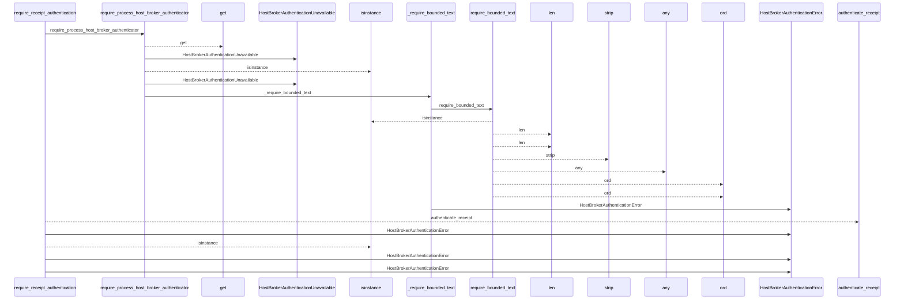
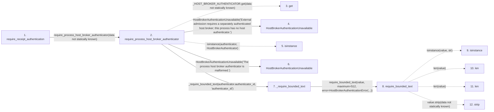

# require_receipt_authentication

**Entry point:** `require_receipt_authentication` (`api`)
**Source:** [host_broker](../modules/host_broker.md)
**Modules touched:** [host_broker](../modules/host_broker.md), [validation](../modules/validation.md)

## Call sequence

<!-- Auto-generated from static call edges. Dashed arrows are external or unresolved calls. Reviewed runtime conditions and side effects belong in Behavior. -->

## Data flow

<!-- Auto-generated static analysis. Treat values and boundaries as best-effort hints, not runtime proof. -->

### Step data

| Step | Inputs | Reads | Writes | Returns |
|---|---|---|---|---|
| `require_receipt_authentication` | `cohort_id: str`, `execution_manifest: Mapping[str, Any]`, `attestation: Mapping[str, Any]`, `receipt: Mapping[str, Any]`, `receipt_hash: str`, `result: Mapping[str, Any]`, `result_hash: str` | `HostBrokerAuthenticationProof` | - | `proof` |
| `require_process_host_broker_authenticator` | - | `HostBrokerAuthenticator` | - | `authenticator` |
| `get` | - | - | - | - |
| `HostBrokerAuthenticationUnavailable` | - | - | - | - |
| `isinstance` | - | - | - | - |
| `HostBrokerAuthenticationUnavailable` | - | - | - | - |
| `_require_bounded_text` | `value: Any`, `label: str` | - | - | `require_bounded_text(...)` |
| `require_bounded_text` | `value: object`, `maximum: int`, `error: Exception`, `minimum: int`, `control_error: Exception \| None`, `require_trimmed: bool`, `reject_control_characters: bool`, `reject_delete_character: bool` | - | - | `value` |
| `isinstance` | - | - | - | - |
| `len` | - | - | - | - |
| `len` | - | - | - | - |
| `strip` | - | - | - | - |

### Call data

| From | To | Line | Call |
|---|---|---:|---|
| require_receipt_authentication | require_process_host_broker_authenticator | 294 | `require_process_host_broker_authenticator(data not statically known)` |
| require_process_host_broker_authenticator | get | 234 | `_HOST_BROKER_AUTHENTICATOR.get(data not statically known)` |
| require_process_host_broker_authenticator | HostBrokerAuthenticationUnavailable | 236 | `HostBrokerAuthenticationUnavailable('External admission requires a separately authenticated host broker; this process has no host authenticator.')` |
| require_process_host_broker_authenticator | isinstance | 240 | `isinstance(authenticator, HostBrokerAuthenticator)` |
| require_process_host_broker_authenticator | HostBrokerAuthenticationUnavailable | 241 | `HostBrokerAuthenticationUnavailable('The process host broker authenticator is malformed.')` |
| require_process_host_broker_authenticator | _require_bounded_text | 244 | `_require_bounded_text(authenticator.authenticator_id, 'authenticator_id')` |
| _require_bounded_text | require_bounded_text | 321 | `require_bounded_text(value, maximum=512, error=HostBrokerAuthenticationError(...))` |
| require_bounded_text | isinstance | 605 | `isinstance(value, str)` |
| require_bounded_text | len | 606 | `len(value)` |
| require_bounded_text | len | 607 | `len(value)` |
| require_bounded_text | strip | 608 | `value.strip(data not statically known)` |

### Boundary effects

*No boundary effects detected.*

### Static analysis gaps

| Kind | Step | Target | Line |
|---|---|---|---:|
| unresolved_call | `require_process_host_broker_authenticator` | `_HOST_BROKER_AUTHENTICATOR.get` | 234 |
| unresolved_call | `require_process_host_broker_authenticator` | `isinstance` | 240 |
| unresolved_call | `require_bounded_text` | `isinstance` | 605 |
| unresolved_call | `require_bounded_text` | `value.strip` | 608 |
| step_limit | `require_receipt_authentication` | `first 12 steps` | 0 |

## Behavior

This flow starts at `require_receipt_authentication` and is classified as `api`. The generated call and data-flow sections are bounded static projections; runtime conditions and side effects require source-level confirmation.
