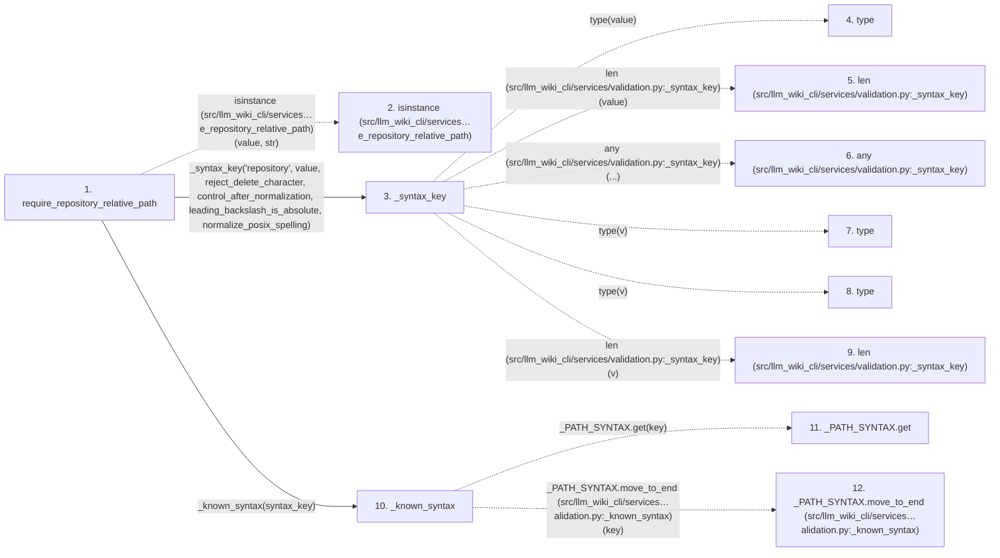

# require_repository_relative_path

**Entry point:** `require_repository_relative_path` (`api`)
**Source:** [validation](../modules/validation.md)
**Modules touched:** [validation](../modules/validation.md)

## Call sequence

```mermaid
sequenceDiagram
    participant p0 as require_repository_relative_path
    participant p1 as isinstance (src/llm_wiki_cli/services…e_repository_relative_path)
    participant p2 as _syntax_key
    participant p3 as type
    participant p4 as len (src/llm_wiki_cli/services/validation.py:_syntax_key)
    participant p5 as any (src/llm_wiki_cli/services/validation.py:_syntax_key)
    participant p6 as _known_syntax
    participant p7 as _PATH_SYNTAX.get
    participant p8 as _PATH_SYNTAX.move_to_end (src/llm_wiki_cli/services…alidation.py:_known_syntax)
    participant p9 as value.strip
    participant p10 as any (src/llm_wiki_cli/services…e_repository_relative_path)
    participant p11 as ord (src/llm_wiki_cli/services…e_repository_relative_path)
    participant p12 as value.startswith
    participant p13 as _WINDOWS_DRIVE_PREFIX_RE.match
    participant p14 as value.split
    participant p15 as PurePosixPath (src/llm_wiki_cli/services…e_repository_relative_path)
    participant p16 as posixpath.normpath
    participant p17 as require_portable_relative_path
    participant p18 as isinstance (src/llm_wiki_cli/services…ire_portable_relative_path)
    participant p19 as _default_path_error
    participant p20 as SharedValidationError
    participant p21 as os.fspath
    p0-->>p1: isinstance (src/llm_wiki_cli/services…e_repository_relative_path)
    p0->>p2: _syntax_key
    p2-->>p3: type
    p2-->>p4: len (src/llm_wiki_cli/services/validation.py:_syntax_key)
    p2-->>p5: any (src/llm_wiki_cli/services/validation.py:_syntax_key)
    p2-->>p3: type
    p2-->>p3: type
    p2-->>p4: len (src/llm_wiki_cli/services/validation.py:_syntax_key)
    p0->>p6: _known_syntax
    p6-->>p7: _PATH_SYNTAX.get
    p6-->>p8: _PATH_SYNTAX.move_to_end (src/llm_wiki_cli/services…alidation.py:_known_syntax)
    p0-->>p9: value.strip
    p0-->>p10: any (src/llm_wiki_cli/services…e_repository_relative_path)
    p0-->>p11: ord (src/llm_wiki_cli/services…e_repository_relative_path)
    p0-->>p11: ord (src/llm_wiki_cli/services…e_repository_relative_path)
    p0-->>p12: value.startswith
    p0-->>p12: value.startswith
    p0-->>p13: _WINDOWS_DRIVE_PREFIX_RE.match
    p0-->>p14: value.split
    p0-->>p15: PurePosixPath (src/llm_wiki_cli/services…e_repository_relative_path)
    p0-->>p10: any (src/llm_wiki_cli/services…e_repository_relative_path)
    p0-->>p16: posixpath.normpath
    p0->>p17: require_portable_relative_path
    p17-->>p18: isinstance (src/llm_wiki_cli/services…ire_portable_relative_path)
    p17->>p19: _default_path_error
    p19->>p20: SharedValidationError
    p17-->>p21: os.fspath
    p17-->>p18: isinstance (src/llm_wiki_cli/services…ire_portable_relative_path)
    p17->>p19: _default_path_error
    p17->>p2: _syntax_key
```

<!-- Auto-generated from static call edges. Dashed arrows are external or unresolved calls. Reviewed runtime conditions and side effects belong in Behavior. -->

> Call sequence diagram shows 30 of 74 interactions; 44 omitted to keep the visualization within the 30-interaction and generated-diagram limits.

## Data flow

<!-- Auto-generated static analysis. Treat values and boundaries as best-effort hints, not runtime proof. -->

### Step data

| Step | Inputs | Reads | Writes | Returns |
|---|---|---|---|---|
| `require_repository_relative_path` | `value: object`, `text_error: Exception`, `posix_error: Exception`, `normalized_error: Exception`, `absolute_error: Exception \| None`, `separator_error: Exception \| None`, `control_error: Exception \| None`, `reject_delete_character: bool` | - | - | `cached`, `_remember_syntax(...)` |
| `isinstance (src/llm_wiki_cli/services…e_repository_relative_path)` | - | - | - | - |
| `_syntax_key` | `kind`, `value`, `options` | - | - | `None`, `(...)` |
| `type` | - | - | - | - |
| `len (src/llm_wiki_cli/services/validation.py:_syntax_key)` | - | - | - | - |
| `any (src/llm_wiki_cli/services/validation.py:_syntax_key)` | - | - | - | - |
| `type` | - | - | - | - |
| `type` | - | - | - | - |
| `len (src/llm_wiki_cli/services/validation.py:_syntax_key)` | - | - | - | - |
| `_known_syntax` | `key` | `_PATH_SYNTAX_LOCK` | - | `None`, `value` |
| `_PATH_SYNTAX.get` | - | - | - | - |
| `_PATH_SYNTAX.move_to_end (src/llm_wiki_cli/services…alidation.py:_known_syntax)` | - | - | - | - |

### Call data

| From | To | Line | Call |
|---|---|---:|---|
| require_repository_relative_path | isinstance (src/llm_wiki_cli/services…e_repository_relative_path) | 299 | `isinstance(value, str)` |
| require_repository_relative_path | _syntax_key | 301 | `_syntax_key('repository', value, reject_delete_character, control_after_normalization, leading_backslash_is_absolute, normalize_posix_spelling)` |
| _syntax_key | type | 54 | `type(value)` |
| _syntax_key | len (src/llm_wiki_cli/services/validation.py:_syntax_key) | 54 | `len(value)` |
| _syntax_key | any (src/llm_wiki_cli/services/validation.py:_syntax_key) | 55 | `any(...)` |
| _syntax_key | type | 55 | `type(v)` |
| _syntax_key | type | 55 | `type(v)` |
| _syntax_key | len (src/llm_wiki_cli/services/validation.py:_syntax_key) | 55 | `len(v)` |
| require_repository_relative_path | _known_syntax | 303 | `_known_syntax(syntax_key)` |
| _known_syntax | _PATH_SYNTAX.get | 64 | `_PATH_SYNTAX.get(key)` |
| _known_syntax | _PATH_SYNTAX.move_to_end (src/llm_wiki_cli/services…alidation.py:_known_syntax) | 66 | `_PATH_SYNTAX.move_to_end(key)` |

### Boundary effects

*No boundary effects detected.*

### Static analysis gaps

| Kind | Step | Target | Line |
|---|---|---|---:|
| external_call | `require_repository_relative_path` | `isinstance` | 299 |
| external_call | `_syntax_key` | `type` | 54 |
| external_call | `_syntax_key` | `any` | 55 |
| external_call | `_syntax_key` | `type` | 55 |
| unresolved_call | `_known_syntax` | `_PATH_SYNTAX.get` | 64 |
| unresolved_call | `_known_syntax` | `_PATH_SYNTAX.move_to_end` | 66 |
| step_limit | `require_repository_relative_path` | `first 12 steps` | 0 |

## Behavior

This flow starts at `require_repository_relative_path` and is classified as `api`. The generated call and data-flow sections are bounded static projections; runtime conditions and side effects require source-level confirmation.
