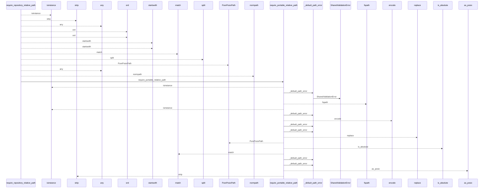
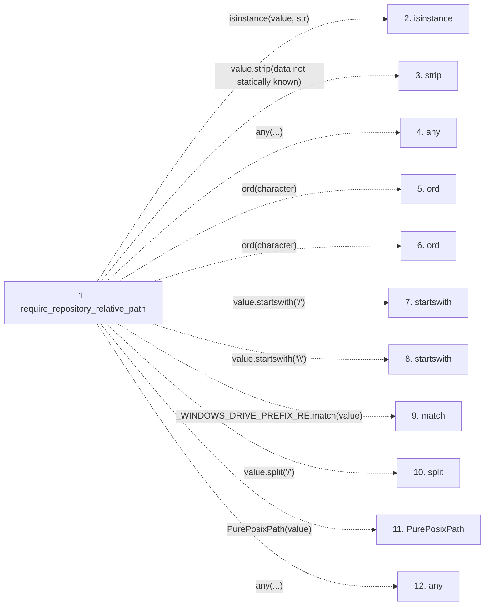

# require_repository_relative_path

**Entry point:** `require_repository_relative_path` (`api`)
**Source:** [validation](../modules/validation.md)
**Modules touched:** [validation](../modules/validation.md)

## Call sequence

<!-- Auto-generated from static call edges. Dashed arrows are external or unresolved calls. Reviewed runtime conditions and side effects belong in Behavior. -->

> Call sequence diagram shows 30 of 55 interactions; 25 omitted to keep the visualization within the 30-interaction and generated-diagram limits.

## Data flow

<!-- Auto-generated static analysis. Treat values and boundaries as best-effort hints, not runtime proof. -->

### Step data

| Step | Inputs | Reads | Writes | Returns |
|---|---|---|---|---|
| `require_repository_relative_path` | `value: object`, `text_error: Exception`, `posix_error: Exception`, `normalized_error: Exception`, `absolute_error: Exception \| None`, `separator_error: Exception \| None`, `control_error: Exception \| None`, `reject_delete_character: bool` | - | - | `require_portable_relative_path(...)` |
| `isinstance` | - | - | - | - |
| `strip` | - | - | - | - |
| `any` | - | - | - | - |
| `ord` | - | - | - | - |
| `ord` | - | - | - | - |
| `startswith` | - | - | - | - |
| `startswith` | - | - | - | - |
| `match` | - | - | - | - |
| `split` | - | - | - | - |
| `PurePosixPath` | - | - | - | - |
| `any` | - | - | - | - |

### Call data

| From | To | Line | Call |
|---|---|---:|---|
| require_repository_relative_path | isinstance | 256 | `isinstance(value, str)` |
| require_repository_relative_path | strip | 258 | `value.strip(data not statically known)` |
| require_repository_relative_path | any | 260 | `any(...)` |
| require_repository_relative_path | ord | 261 | `ord(character)` |
| require_repository_relative_path | ord | 262 | `ord(character)` |
| require_repository_relative_path | startswith | 268 | `value.startswith('/')` |
| require_repository_relative_path | startswith | 269 | `value.startswith('\\')` |
| require_repository_relative_path | match | 270 | `_WINDOWS_DRIVE_PREFIX_RE.match(value)` |
| require_repository_relative_path | split | 275 | `value.split('/')` |
| require_repository_relative_path | PurePosixPath | 277 | `PurePosixPath(value)` |
| require_repository_relative_path | any | 280 | `any(...)` |

### Boundary effects

*No boundary effects detected.*

### Static analysis gaps

| Kind | Step | Target | Line |
|---|---|---|---:|
| unresolved_call | `require_repository_relative_path` | `isinstance` | 256 |
| unresolved_call | `require_repository_relative_path` | `value.strip` | 258 |
| unresolved_call | `require_repository_relative_path` | `any` | 260 |
| unresolved_call | `require_repository_relative_path` | `ord` | 261 |
| unresolved_call | `require_repository_relative_path` | `ord` | 262 |
| unresolved_call | `require_repository_relative_path` | `value.startswith` | 268 |
| unresolved_call | `require_repository_relative_path` | `value.startswith` | 269 |
| unresolved_call | `require_repository_relative_path` | `_WINDOWS_DRIVE_PREFIX_RE.match` | 270 |
| unresolved_call | `require_repository_relative_path` | `value.split` | 275 |
| external_call | `require_repository_relative_path` | `PurePosixPath` | 277 |
| unresolved_call | `require_repository_relative_path` | `any` | 280 |
| step_limit | `require_repository_relative_path` | `first 12 steps` | 0 |

## Behavior

This flow starts at `require_repository_relative_path` and is classified as `api`. The generated call and data-flow sections are bounded static projections; runtime conditions and side effects require source-level confirmation.
