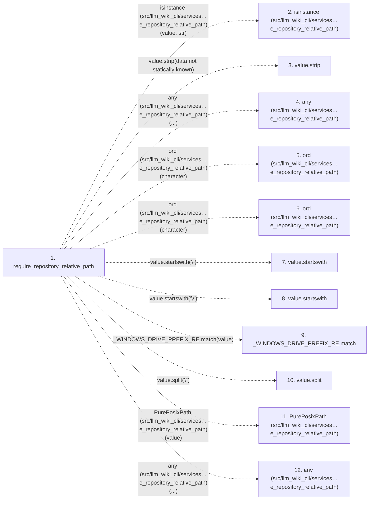

# require_repository_relative_path

**Entry point:** `require_repository_relative_path` (`api`)
**Source:** [validation](../modules/validation.md)
**Modules touched:** [validation](../modules/validation.md)

## Call sequence

```mermaid
sequenceDiagram
    participant p0 as require_repository_relative_path
    participant p1 as isinstance (src/llm_wiki_cli/services…e_repository_relative_path)
    participant p2 as value.strip
    participant p3 as any (src/llm_wiki_cli/services…e_repository_relative_path)
    participant p4 as ord (src/llm_wiki_cli/services…e_repository_relative_path)
    participant p5 as value.startswith
    participant p6 as _WINDOWS_DRIVE_PREFIX_RE.match
    participant p7 as value.split
    participant p8 as PurePosixPath (src/llm_wiki_cli/services…e_repository_relative_path)
    participant p9 as posixpath.normpath
    participant p10 as require_portable_relative_path
    participant p11 as isinstance (src/llm_wiki_cli/services…ire_portable_relative_path)
    participant p12 as _default_path_error
    participant p13 as SharedValidationError
    participant p14 as os.fspath
    participant p15 as raw.encode
    participant p16 as raw.replace
    participant p17 as PurePosixPath (src/llm_wiki_cli/services…ire_portable_relative_path)
    participant p18 as path.is_absolute
    participant p19 as _WINDOWS_ABSOLUTE_RE.match
    participant p20 as path.as_posix
    participant p21 as normalized.strip
    p0-->>p1: isinstance (src/llm_wiki_cli/services…e_repository_relative_path)
    p0-->>p2: value.strip
    p0-->>p3: any (src/llm_wiki_cli/services…e_repository_relative_path)
    p0-->>p4: ord (src/llm_wiki_cli/services…e_repository_relative_path)
    p0-->>p4: ord (src/llm_wiki_cli/services…e_repository_relative_path)
    p0-->>p5: value.startswith
    p0-->>p5: value.startswith
    p0-->>p6: _WINDOWS_DRIVE_PREFIX_RE.match
    p0-->>p7: value.split
    p0-->>p8: PurePosixPath (src/llm_wiki_cli/services…e_repository_relative_path)
    p0-->>p3: any (src/llm_wiki_cli/services…e_repository_relative_path)
    p0-->>p9: posixpath.normpath
    p0->>p10: require_portable_relative_path
    p10-->>p11: isinstance (src/llm_wiki_cli/services…ire_portable_relative_path)
    p10->>p12: _default_path_error
    p12->>p13: SharedValidationError
    p10-->>p14: os.fspath
    p10-->>p11: isinstance (src/llm_wiki_cli/services…ire_portable_relative_path)
    p10->>p12: _default_path_error
    p10-->>p15: raw.encode
    p10->>p12: _default_path_error
    p10->>p12: _default_path_error
    p10-->>p16: raw.replace
    p10-->>p17: PurePosixPath (src/llm_wiki_cli/services…ire_portable_relative_path)
    p10-->>p18: path.is_absolute
    p10-->>p19: _WINDOWS_ABSOLUTE_RE.match
    p10->>p12: _default_path_error
    p10->>p12: _default_path_error
    p10-->>p20: path.as_posix
    p10-->>p21: normalized.strip
```

<!-- Auto-generated from static call edges. Dashed arrows are external or unresolved calls. Reviewed runtime conditions and side effects belong in Behavior. -->

> Call sequence diagram shows 30 of 55 interactions; 25 omitted to keep the visualization within the 30-interaction and generated-diagram limits.

## Data flow

<!-- Auto-generated static analysis. Treat values and boundaries as best-effort hints, not runtime proof. -->

### Step data

| Step | Inputs | Reads | Writes | Returns |
|---|---|---|---|---|
| `require_repository_relative_path` | `value: object`, `text_error: Exception`, `posix_error: Exception`, `normalized_error: Exception`, `absolute_error: Exception \| None`, `separator_error: Exception \| None`, `control_error: Exception \| None`, `reject_delete_character: bool` | - | - | `require_portable_relative_path(...)` |
| `isinstance (src/llm_wiki_cli/services…e_repository_relative_path)` | - | - | - | - |
| `value.strip` | - | - | - | - |
| `any (src/llm_wiki_cli/services…e_repository_relative_path)` | - | - | - | - |
| `ord (src/llm_wiki_cli/services…e_repository_relative_path)` | - | - | - | - |
| `ord (src/llm_wiki_cli/services…e_repository_relative_path)` | - | - | - | - |
| `value.startswith` | - | - | - | - |
| `value.startswith` | - | - | - | - |
| `_WINDOWS_DRIVE_PREFIX_RE.match` | - | - | - | - |
| `value.split` | - | - | - | - |
| `PurePosixPath (src/llm_wiki_cli/services…e_repository_relative_path)` | - | - | - | - |
| `any (src/llm_wiki_cli/services…e_repository_relative_path)` | - | - | - | - |

### Call data

| From | To | Line | Call |
|---|---|---:|---|
| require_repository_relative_path | isinstance (src/llm_wiki_cli/services…e_repository_relative_path) | 256 | `isinstance(value, str)` |
| require_repository_relative_path | value.strip | 258 | `value.strip(data not statically known)` |
| require_repository_relative_path | any (src/llm_wiki_cli/services…e_repository_relative_path) | 260 | `any(...)` |
| require_repository_relative_path | ord (src/llm_wiki_cli/services…e_repository_relative_path) | 261 | `ord(character)` |
| require_repository_relative_path | ord (src/llm_wiki_cli/services…e_repository_relative_path) | 262 | `ord(character)` |
| require_repository_relative_path | value.startswith | 268 | `value.startswith('/')` |
| require_repository_relative_path | value.startswith | 269 | `value.startswith('\\')` |
| require_repository_relative_path | _WINDOWS_DRIVE_PREFIX_RE.match | 270 | `_WINDOWS_DRIVE_PREFIX_RE.match(value)` |
| require_repository_relative_path | value.split | 275 | `value.split('/')` |
| require_repository_relative_path | PurePosixPath (src/llm_wiki_cli/services…e_repository_relative_path) | 277 | `PurePosixPath(value)` |
| require_repository_relative_path | any (src/llm_wiki_cli/services…e_repository_relative_path) | 280 | `any(...)` |

### Boundary effects

*No boundary effects detected.*

### Static analysis gaps

| Kind | Step | Target | Line |
|---|---|---|---:|
| external_call | `require_repository_relative_path` | `isinstance` | 256 |
| unresolved_call | `require_repository_relative_path` | `value.strip` | 258 |
| external_call | `require_repository_relative_path` | `any` | 260 |
| external_call | `require_repository_relative_path` | `ord` | 261 |
| external_call | `require_repository_relative_path` | `ord` | 262 |
| unresolved_call | `require_repository_relative_path` | `value.startswith` | 268 |
| unresolved_call | `require_repository_relative_path` | `value.startswith` | 269 |
| unresolved_call | `require_repository_relative_path` | `_WINDOWS_DRIVE_PREFIX_RE.match` | 270 |
| unresolved_call | `require_repository_relative_path` | `value.split` | 275 |
| external_call | `require_repository_relative_path` | `PurePosixPath` | 277 |
| external_call | `require_repository_relative_path` | `any` | 280 |
| step_limit | `require_repository_relative_path` | `first 12 steps` | 0 |

## Behavior

This flow starts at `require_repository_relative_path` and is classified as `api`. The generated call and data-flow sections are bounded static projections; runtime conditions and side effects require source-level confirmation.
