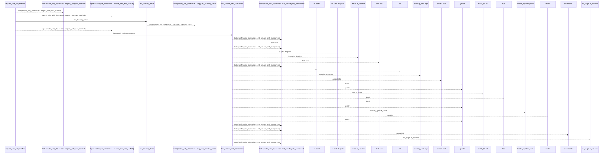
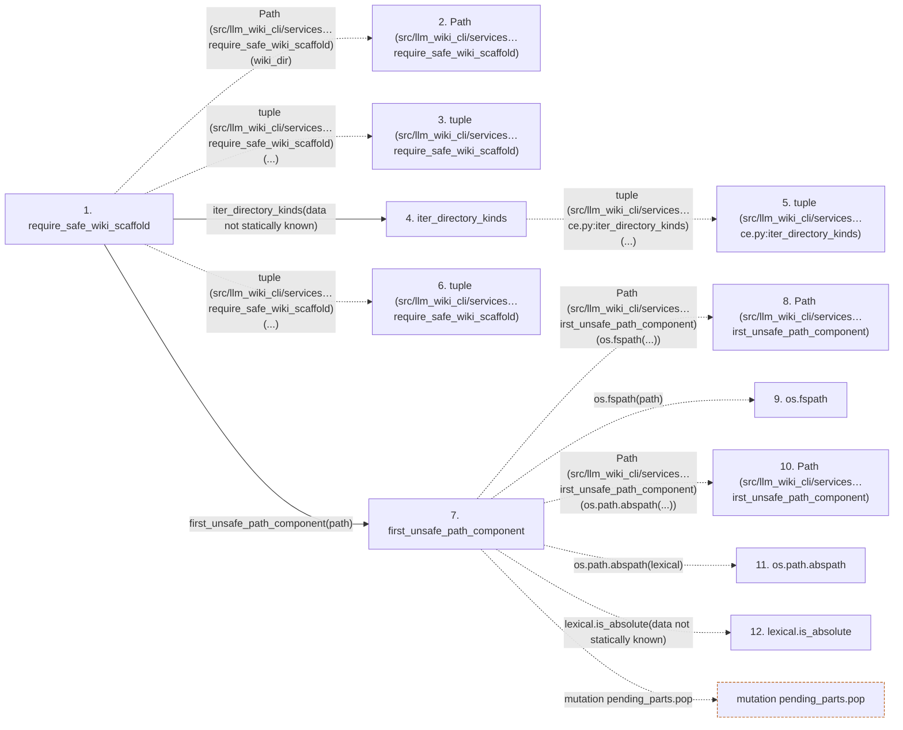

# require_safe_wiki_scaffold

**Entry point:** `require_safe_wiki_scaffold` (`api`)
**Source:** [wiki_lifecycle](../modules/wiki_lifecycle.md)
**Modules touched:** [io](../modules/io.md), [wiki_lifecycle](../modules/wiki_lifecycle.md), [wiki_surface](../modules/wiki_surface.md)

## Call sequence

<!-- Auto-generated from static call edges. Dashed arrows are external or unresolved calls. Reviewed runtime conditions and side effects belong in Behavior. -->

> Call sequence diagram shows 30 of 38 interactions; 8 omitted to keep the visualization within the 30-interaction and generated-diagram limits.

## Data flow

<!-- Auto-generated static analysis. Treat values and boundaries as best-effort hints, not runtime proof. -->

### Step data

| Step | Inputs | Reads | Writes | Returns |
|---|---|---|---|---|
| `require_safe_wiki_scaffold` | `wiki_dir: Union[str, Path]` | - | - | - |
| `Path (src/llm_wiki_cli/services…require_safe_wiki_scaffold)` | - | - | - | - |
| `tuple (src/llm_wiki_cli/services…require_safe_wiki_scaffold)` | - | - | - | - |
| `iter_directory_kinds` | - | `_PAGE_KINDS` | - | `tuple(...)` |
| `tuple (src/llm_wiki_cli/services…ce.py:iter_directory_kinds)` | - | - | - | - |
| `tuple (src/llm_wiki_cli/services…require_safe_wiki_scaffold)` | - | - | - | - |
| `first_unsafe_path_component` | `path: str \| Path`, `trusted_symlink_uids: Set[int] \| None`, `trusted_symlink_owner: Callable[[Path], bool] \| None` | `stat`, `os` | - | `lexical`, `None`, `current`, `current`, `current`, `current`, `current`, `None` |
| `Path (src/llm_wiki_cli/services…irst_unsafe_path_component)` | - | - | - | - |
| `os.fspath` | - | - | - | - |
| `Path (src/llm_wiki_cli/services…irst_unsafe_path_component)` | - | - | - | - |
| `os.path.abspath` | - | - | - | - |
| `lexical.is_absolute` | - | - | - | - |

### Call data

| From | To | Line | Call |
|---|---|---:|---|
| require_safe_wiki_scaffold | Path (src/llm_wiki_cli/services…require_safe_wiki_scaffold) | 43 | `Path(wiki_dir)` |
| require_safe_wiki_scaffold | tuple (src/llm_wiki_cli/services…require_safe_wiki_scaffold) | 44 | `tuple(...)` |
| require_safe_wiki_scaffold | iter_directory_kinds | 46 | `iter_directory_kinds(data not statically known)` |
| iter_directory_kinds | tuple (src/llm_wiki_cli/services…ce.py:iter_directory_kinds) | 224 | `tuple(...)` |
| require_safe_wiki_scaffold | tuple (src/llm_wiki_cli/services…require_safe_wiki_scaffold) | 49 | `tuple(...)` |
| require_safe_wiki_scaffold | first_unsafe_path_component | 54 | `first_unsafe_path_component(path)` |
| first_unsafe_path_component | Path (src/llm_wiki_cli/services…irst_unsafe_path_component) | 50 | `Path(os.fspath(...))` |
| first_unsafe_path_component | os.fspath | 50 | `os.fspath(path)` |
| first_unsafe_path_component | Path (src/llm_wiki_cli/services…irst_unsafe_path_component) | 58 | `Path(os.path.abspath(...))` |
| first_unsafe_path_component | os.path.abspath | 58 | `os.path.abspath(lexical)` |
| first_unsafe_path_component | lexical.is_absolute | 59 | `lexical.is_absolute(data not statically known)` |

### Boundary effects

| Kind | Target | Step | Line |
|---|---|---|---:|
| mutation | `pending_parts.pop` | `first_unsafe_path_component` | 70 |

### Static analysis gaps

| Kind | Step | Target | Line |
|---|---|---|---:|
| external_call | `first_unsafe_path_component` | `os.fspath` | 50 |
| external_call | `first_unsafe_path_component` | `os.path.abspath` | 58 |
| unresolved_call | `first_unsafe_path_component` | `lexical.is_absolute` | 59 |
| step_limit | `require_safe_wiki_scaffold` | `first 12 steps` | 0 |

## Behavior

This flow starts at `require_safe_wiki_scaffold` and is classified as `api`. The generated call and data-flow sections are bounded static projections; runtime conditions and side effects require source-level confirmation.
