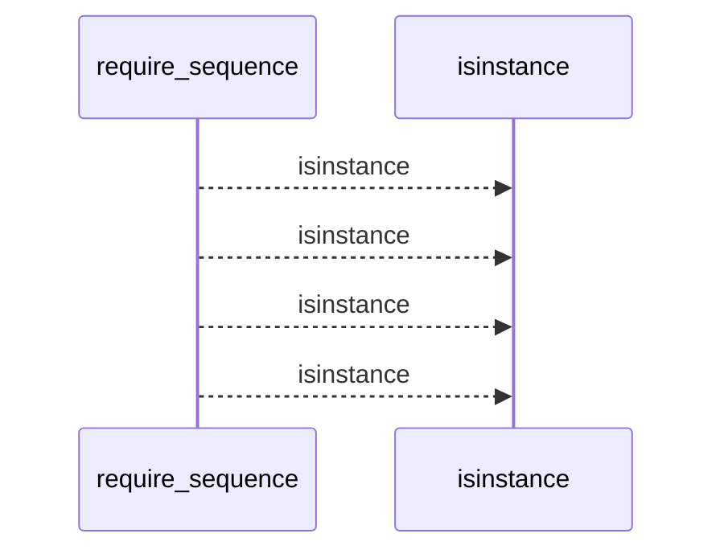
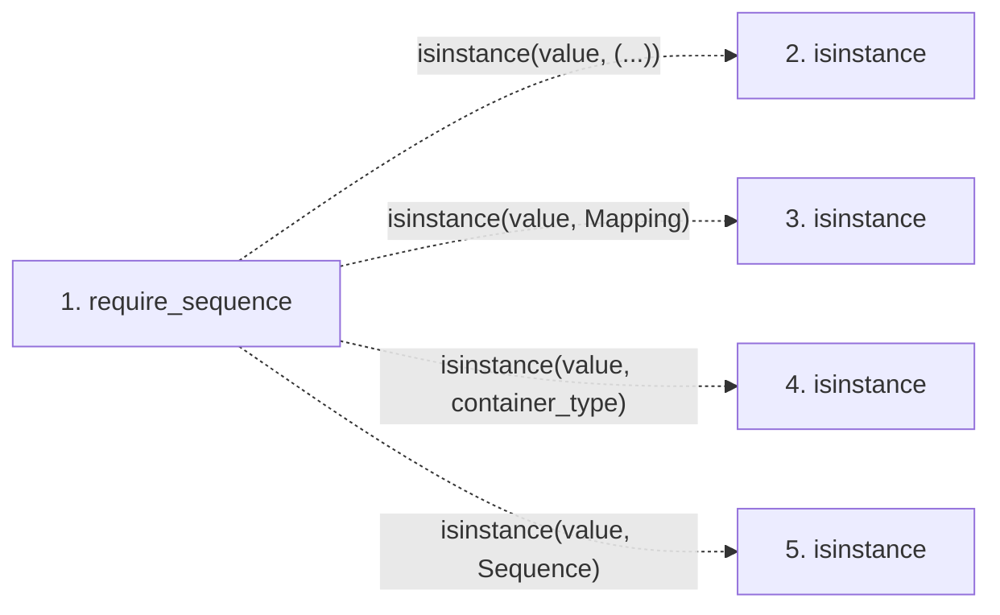

# require_sequence

**Entry point:** `require_sequence` (`api`)
**Source:** [validation](../modules/validation.md)
**Modules touched:** [validation](../modules/validation.md)

## Call sequence

<!-- Auto-generated from static call edges. Dashed arrows are external or unresolved calls. Reviewed runtime conditions and side effects belong in Behavior. -->

## Data flow

<!-- Auto-generated static analysis. Treat values and boundaries as best-effort hints, not runtime proof. -->

### Step data

| Step | Inputs | Reads | Writes | Returns |
|---|---|---|---|---|
| `require_sequence` | `value: object`, `error: Exception`, `container_type: type[object] \| tuple[type[object], ...]`, `reject_mapping: bool` | `Mapping`, `Sequence` | - | `value` |
| `isinstance` | - | - | - | - |
| `isinstance` | - | - | - | - |
| `isinstance` | - | - | - | - |
| `isinstance` | - | - | - | - |

### Call data

| From | To | Line | Call |
|---|---|---:|---|
| require_sequence | isinstance | 752 | `isinstance(value, (...))` |
| require_sequence | isinstance | 753 | `isinstance(value, Mapping)` |
| require_sequence | isinstance | 754 | `isinstance(value, container_type)` |
| require_sequence | isinstance | 757 | `isinstance(value, Sequence)` |

### Boundary effects

*No boundary effects detected.*

### Static analysis gaps

| Kind | Step | Target | Line |
|---|---|---|---:|
| unresolved_call | `require_sequence` | `isinstance` | 752 |
| unresolved_call | `require_sequence` | `isinstance` | 753 |
| unresolved_call | `require_sequence` | `isinstance` | 754 |
| unresolved_call | `require_sequence` | `isinstance` | 757 |

## Behavior

This flow starts at `require_sequence` and is classified as `api`. The generated call and data-flow sections are bounded static projections; runtime conditions and side effects require source-level confirmation.
