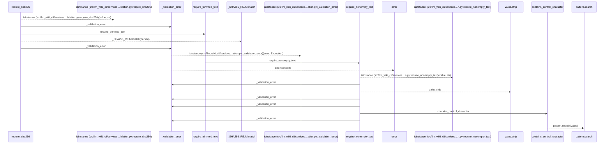
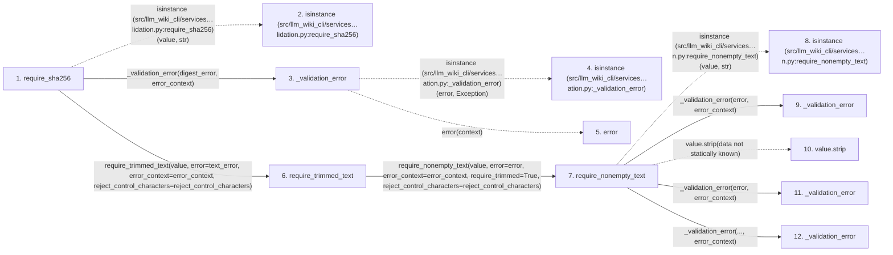

# require_sha256

**Entry point:** `require_sha256` (`api`)
**Source:** [validation](../modules/validation.md)
**Modules touched:** [validation](../modules/validation.md)

## Call sequence

> Static overview in presentation order, not runtime execution order. Arrows retain captured callers; representative internal continuations and boundary examples precede repeated helper detail.

<!-- Auto-generated from static call edges. Dashed arrows are external or unresolved calls. Reviewed runtime conditions and side effects belong in Behavior. -->

```mermaid
sequenceDiagram
    participant p0 as require_sha256
    participant p1 as isinstance (src/llm_wiki_cli/services…lidation.py:require_sha256)
    participant p2 as _validation_error
    participant p3 as require_trimmed_text
    participant p4 as _SHA256_RE.fullmatch
    participant p5 as isinstance (src/llm_wiki_cli/services…ation.py:_validation_error)
    participant p6 as require_nonempty_text
    participant p7 as error
    participant p8 as isinstance (src/llm_wiki_cli/services…n.py:require_nonempty_text)
    participant p9 as value.strip
    participant p10 as contains_control_character
    participant p11 as pattern.search
    p0-->>p1: isinstance (src/llm_wiki_cli/services…lidation.py:require_sha256)(value, str)
    p0->>p2: _validation_error
    p0->>p3: require_trimmed_text
    p0-->>p4: _SHA256_RE.fullmatch(parsed)
    p0->>p2: _validation_error
    p2-->>p5: isinstance (src/llm_wiki_cli/services…ation.py:_validation_error)(error, Exception)
    p3->>p6: require_nonempty_text
    p2-->>p7: error(context)
    p6-->>p8: isinstance (src/llm_wiki_cli/services…n.py:require_nonempty_text)(value, str)
    p6->>p2: _validation_error
    p6-->>p9: value.strip
    p6->>p2: _validation_error
    p6->>p2: _validation_error
    p6->>p10: contains_control_character
    p6->>p2: _validation_error
    p10-->>p11: pattern.search(value)
```

> Call sequence diagram shows 16 of 16 interactions; 0 omitted to keep the visualization within the 30-interaction and generated-diagram limits, with uncertain identities omitted rather than inferred.

> Captured boundary calls: external 3 of 3 (0 omitted); unresolved 4 of 4 (0 omitted). These counts cover the captured static trace.
> Detailed flow queries retain their own coverage and limits; omitted paths may execute at runtime.

## Data flow

<!-- Auto-generated static analysis. Treat values and boundaries as best-effort hints, not runtime proof. -->

### Analysis coverage

**Effect analysis evaluated.** Flow assembly and source effect analysis are separate; empty observations do not prove an empty handler body.

Source steps: 10; effect analysis evaluated: 10, partial: 0, unavailable: 0. Counts include steps omitted from the displayed trace.

Collector observations for 10 source steps with known totals: observed: 45, emitted: 45, omitted: 0. Unavailable totals are excluded.

```mermaid
flowchart LR
    s1["1. require_sha256"]
    s2["2. isinstance (src/llm_wiki_cli/services…lidation.py:require_sha256)"]
    s3["3. _validation_error"]
    s4["4. isinstance (src/llm_wiki_cli/services…ation.py:_validation_error)"]
    s5["5. error"]
    s6["6. require_trimmed_text"]
    s7["7. require_nonempty_text"]
    s8["8. isinstance (src/llm_wiki_cli/services…n.py:require_nonempty_text)"]
    s9["9. _validation_error"]
    s10["10. value.strip"]
    s11["11. _validation_error"]
    s12["12. _validation_error"]
    s1 -. "isinstance (src/llm_wiki_cli/services…lidation.py:require_sha256)(value, str)" .-> s2
    s1 -->|"_validation_error(digest_error, error_context)"| s3
    s3 -. "isinstance (src/llm_wiki_cli/services…ation.py:_validation_error)(error, Exception)" .-> s4
    s3 -. "error(context)" .-> s5
    s1 -->|"require_trimmed_text(value, error=text_error, error_context=error_context, reject_control_characters=reject_control_characters)"| s6
    s6 -->|"require_nonempty_text(value, error=error, error_context=error_context, require_trimmed=True, reject_control_characters=reject_control_characters)"| s7
    s7 -. "isinstance (src/llm_wiki_cli/services…n.py:require_nonempty_text)(value, str)" .-> s8
    s7 -->|"_validation_error(error, error_context)"| s9
    s7 -. "value.strip(data not statically known)" .-> s10
    s7 -->|"_validation_error(error, error_context)"| s11
    s7 -->|"_validation_error(..., error_context)"| s12
    click s1 "../modules/validation.md"
    click s3 "../modules/validation.md"
    click s6 "../modules/validation.md"
    click s7 "../modules/validation.md"
    click s9 "../modules/validation.md"
    click s11 "../modules/validation.md"
    click s12 "../modules/validation.md"
```

### Step data

| Step | Inputs | Reads | Writes | Returns |
|---|---|---|---|---|
| `require_sha256` | `value: object`, `digest_error: _ValidationError`, `text_error: _ValidationError \| None`, `error_context: str`, `reject_control_characters: bool`, `allow_empty: bool` | - | - | `parsed`, `parsed` |
| `isinstance (src/llm_wiki_cli/services…lidation.py:require_sha256)` | - | - | - | - |
| `_validation_error` | `error: _ValidationError`, `context: str` | - | - | `...` |
| `isinstance (src/llm_wiki_cli/services…ation.py:_validation_error)` | - | - | - | - |
| `error` | - | - | - | - |
| `require_trimmed_text` | `value: object`, `error: _ValidationError`, `error_context: str`, `reject_control_characters: bool` | - | - | `require_nonempty_text(...)` |
| `require_nonempty_text` | `value: object`, `error: _ValidationError`, `trim_error: _ValidationError \| None`, `error_context: str`, `normalize: bool`, `require_trimmed: bool`, `reject_control_characters: bool`, `reject_delete_character: bool` | - | - | `parsed` |
| `isinstance (src/llm_wiki_cli/services…n.py:require_nonempty_text)` | - | - | - | - |
| `_validation_error` | `error: _ValidationError`, `context: str` | - | - | `...` |
| `value.strip` | - | - | - | - |
| `_validation_error` | `error: _ValidationError`, `context: str` | - | - | `...` |
| `_validation_error` | `error: _ValidationError`, `context: str` | - | - | `...` |

### Call data

| From | To | Line | Call |
|---|---|---:|---|
| require_sha256 | isinstance (src/llm_wiki_cli/services…lidation.py:require_sha256) | 1159 | `isinstance(value, str)` |
| require_sha256 | _validation_error | 1160 | `_validation_error(digest_error, error_context)` |
| _validation_error | isinstance (src/llm_wiki_cli/services…ation.py:_validation_error) | 95 | `isinstance(error, Exception)` |
| _validation_error | error | 95 | `error(context)` |
| require_sha256 | require_trimmed_text | 1163 | `require_trimmed_text(value, error=text_error, error_context=error_context, reject_control_characters=reject_control_characters)` |
| require_trimmed_text | require_nonempty_text | 711 | `require_nonempty_text(value, error=error, error_context=error_context, require_trimmed=True, reject_control_characters=reject_control_characters)` |
| require_nonempty_text | isinstance (src/llm_wiki_cli/services…n.py:require_nonempty_text) | 637 | `isinstance(value, str)` |
| require_nonempty_text | _validation_error | 638 | `_validation_error(error, error_context)` |
| require_nonempty_text | value.strip | 639 | `value.strip(data not statically known)` |
| require_nonempty_text | _validation_error | 642 | `_validation_error(error, error_context)` |
| require_nonempty_text | _validation_error | 644 | `_validation_error(..., error_context)` |

### Boundary effects

*No boundary-effect observations were captured in this static trace.*

### Static analysis gaps

| Kind | Step | Target | Line |
|---|---|---|---:|
| external_call | `require_sha256` | `isinstance` | 1159 |
| external_call | `_validation_error` | `isinstance` | 95 |
| unresolved_call | `_validation_error` | `error` | 95 |
| external_call | `require_nonempty_text` | `isinstance` | 637 |
| unresolved_call | `require_nonempty_text` | `value.strip` | 639 |
| step_limit | `require_sha256` | `first 12 steps` | 0 |

## Behavior

This flow starts at `require_sha256` and is classified as `api`. The generated call and data-flow sections are bounded static projections; runtime conditions and side effects require source-level confirmation.
