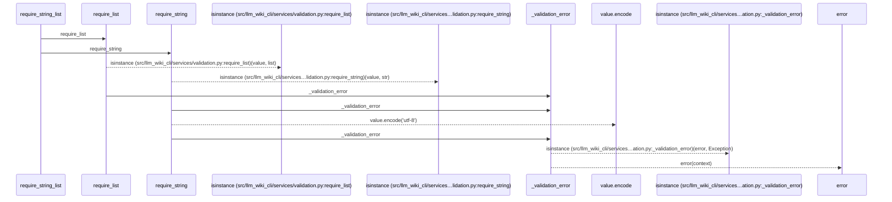
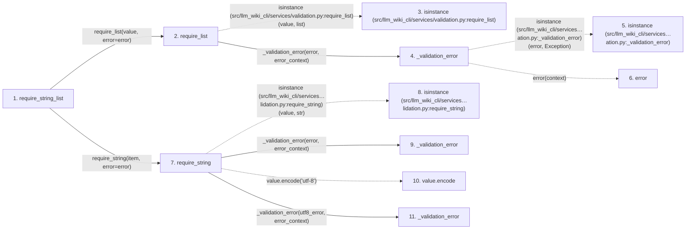

# require_string_list

**Entry point:** `require_string_list` (`api`)
**Source:** [validation](../modules/validation.md)
**Modules touched:** [validation](../modules/validation.md)

## Call sequence

> Static overview in presentation order, not runtime execution order. Arrows retain captured callers; representative internal continuations and boundary examples precede repeated helper detail.

<!-- Auto-generated from static call edges. Dashed arrows are external or unresolved calls. Reviewed runtime conditions and side effects belong in Behavior. -->

```mermaid
sequenceDiagram
    participant p0 as require_string_list
    participant p1 as require_list
    participant p2 as require_string
    participant p3 as isinstance (src/llm_wiki_cli/services/validation.py:require_list)
    participant p4 as isinstance (src/llm_wiki_cli/services…lidation.py:require_string)
    participant p5 as _validation_error
    participant p6 as value.encode
    participant p7 as isinstance (src/llm_wiki_cli/services…ation.py:_validation_error)
    participant p8 as error
    p0->>p1: require_list
    p0->>p2: require_string
    p1-->>p3: isinstance (src/llm_wiki_cli/services/validation.py:require_list)(value, list)
    p2-->>p4: isinstance (src/llm_wiki_cli/services…lidation.py:require_string)(value, str)
    p1->>p5: _validation_error
    p2->>p5: _validation_error
    p2-->>p6: value.encode('utf-8')
    p2->>p5: _validation_error
    p5-->>p7: isinstance (src/llm_wiki_cli/services…ation.py:_validation_error)(error, Exception)
    p5-->>p8: error(context)
```

> Call sequence diagram shows 10 of 10 interactions; 0 omitted to keep the visualization within the 30-interaction and generated-diagram limits, with uncertain identities omitted rather than inferred.

> Captured boundary calls: external 3 of 3 (0 omitted); unresolved 2 of 2 (0 omitted). These counts cover the captured static trace.
> Detailed flow queries retain their own coverage and limits; omitted paths may execute at runtime.

## Data flow

<!-- Auto-generated static analysis. Treat values and boundaries as best-effort hints, not runtime proof. -->

### Analysis coverage

**Effect analysis evaluated.** Flow assembly and source effect analysis are separate; empty observations do not prove an empty handler body.

Source steps: 6; effect analysis evaluated: 6, partial: 0, unavailable: 0. Counts include steps omitted from the displayed trace.

Collector observations for 6 source steps with known totals: observed: 21, emitted: 21, omitted: 0. Unavailable totals are excluded.

```mermaid
flowchart LR
    s1["1. require_string_list"]
    s2["2. require_list"]
    s3["3. isinstance (src/llm_wiki_cli/services/validation.py:require_list)"]
    s4["4. _validation_error"]
    s5["5. isinstance (src/llm_wiki_cli/services…ation.py:_validation_error)"]
    s6["6. error"]
    s7["7. require_string"]
    s8["8. isinstance (src/llm_wiki_cli/services…lidation.py:require_string)"]
    s9["9. _validation_error"]
    s10["10. value.encode"]
    s11["11. _validation_error"]
    s1 -->|"require_list(value, error=error)"| s2
    s2 -. "isinstance (src/llm_wiki_cli/services/validation.py:require_list)(value, list)" .-> s3
    s2 -->|"_validation_error(error, error_context)"| s4
    s4 -. "isinstance (src/llm_wiki_cli/services…ation.py:_validation_error)(error, Exception)" .-> s5
    s4 -. "error(context)" .-> s6
    s1 -->|"require_string(item, error=error)"| s7
    s7 -. "isinstance (src/llm_wiki_cli/services…lidation.py:require_string)(value, str)" .-> s8
    s7 -->|"_validation_error(error, error_context)"| s9
    s7 -. "value.encode('utf-8')" .-> s10
    s7 -->|"_validation_error(utf8_error, error_context)"| s11
    click s1 "../modules/validation.md"
    click s2 "../modules/validation.md"
    click s4 "../modules/validation.md"
    click s7 "../modules/validation.md"
    click s9 "../modules/validation.md"
    click s11 "../modules/validation.md"
```

### Step data

| Step | Inputs | Reads | Writes | Returns |
|---|---|---|---|---|
| `require_string_list` | `value: object`, `error: Exception` | - | - | `items` |
| `require_list` | `value: object`, `error: _ValidationError`, `error_context: str` | - | - | `value` |
| `isinstance (src/llm_wiki_cli/services/validation.py:require_list)` | - | - | - | - |
| `_validation_error` | `error: _ValidationError`, `context: str` | - | - | `...` |
| `isinstance (src/llm_wiki_cli/services…ation.py:_validation_error)` | - | - | - | - |
| `error` | - | - | - | - |
| `require_string` | `value: object`, `error: _ValidationError`, `utf8_error: _ValidationError \| None`, `error_context: str` | - | - | `value` |
| `isinstance (src/llm_wiki_cli/services…lidation.py:require_string)` | - | - | - | - |
| `_validation_error` | `error: _ValidationError`, `context: str` | - | - | `...` |
| `value.encode` | - | - | - | - |
| `_validation_error` | `error: _ValidationError`, `context: str` | - | - | `...` |

### Call data

| From | To | Line | Call |
|---|---|---:|---|
| require_string_list | require_list | 1011 | `require_list(value, error=error)` |
| require_list | isinstance (src/llm_wiki_cli/services/validation.py:require_list) | 820 | `isinstance(value, list)` |
| require_list | _validation_error | 821 | `_validation_error(error, error_context)` |
| _validation_error | isinstance (src/llm_wiki_cli/services…ation.py:_validation_error) | 95 | `isinstance(error, Exception)` |
| _validation_error | error | 95 | `error(context)` |
| require_string_list | require_string | 1013 | `require_string(item, error=error)` |
| require_string | isinstance (src/llm_wiki_cli/services…lidation.py:require_string) | 761 | `isinstance(value, str)` |
| require_string | _validation_error | 762 | `_validation_error(error, error_context)` |
| require_string | value.encode | 765 | `value.encode('utf-8')` |
| require_string | _validation_error | 767 | `_validation_error(utf8_error, error_context)` |

### Boundary effects

*No boundary-effect observations were captured in this static trace.*

### Static analysis gaps

| Kind | Step | Target | Line |
|---|---|---|---:|
| external_call | `require_list` | `isinstance` | 820 |
| external_call | `_validation_error` | `isinstance` | 95 |
| unresolved_call | `_validation_error` | `error` | 95 |
| external_call | `require_string` | `isinstance` | 761 |
| unresolved_call | `require_string` | `value.encode` | 765 |

## Behavior

This flow starts at `require_string_list` and is classified as `api`. The generated call and data-flow sections are bounded static projections; runtime conditions and side effects require source-level confirmation.
