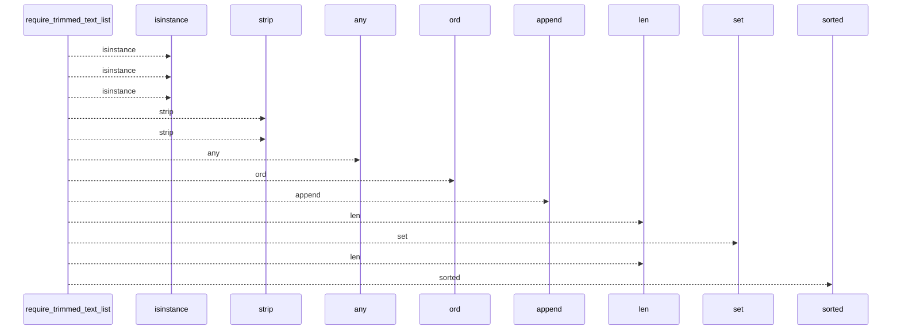
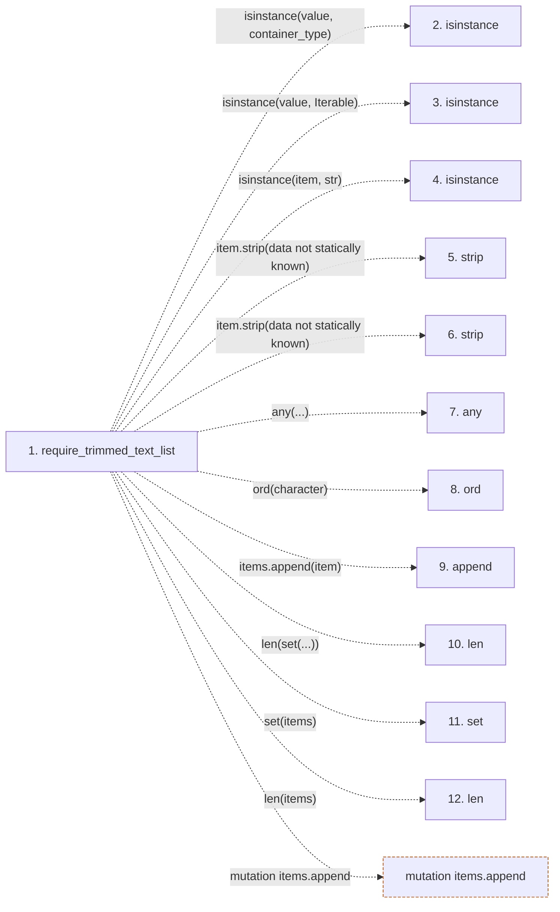

# require_trimmed_text_list

**Entry point:** `require_trimmed_text_list` (`api`)
**Source:** [validation](../modules/validation.md)
**Modules touched:** [validation](../modules/validation.md)

## Call sequence

<!-- Auto-generated from static call edges. Dashed arrows are external or unresolved calls. Reviewed runtime conditions and side effects belong in Behavior. -->

## Data flow

<!-- Auto-generated static analysis. Treat values and boundaries as best-effort hints, not runtime proof. -->

### Step data

| Step | Inputs | Reads | Writes | Returns |
|---|---|---|---|---|
| `require_trimmed_text_list` | `value: object`, `error: Exception`, `item_error: Exception \| None`, `duplicate_error: Exception \| None`, `sort: bool`, `require_trimmed_items: bool`, `reject_control_characters: bool`, `reject_duplicates: bool` | `Iterable` | - | `...` |
| `isinstance` | - | - | - | - |
| `isinstance` | - | - | - | - |
| `isinstance` | - | - | - | - |
| `strip` | - | - | - | - |
| `strip` | - | - | - | - |
| `any` | - | - | - | - |
| `ord` | - | - | - | - |
| `append` | - | - | - | - |
| `len` | - | - | - | - |
| `set` | - | - | - | - |
| `len` | - | - | - | - |

### Call data

| From | To | Line | Call |
|---|---|---:|---|
| require_trimmed_text_list | isinstance | 680 | `isinstance(value, container_type)` |
| require_trimmed_text_list | isinstance | 680 | `isinstance(value, Iterable)` |
| require_trimmed_text_list | isinstance | 684 | `isinstance(item, str)` |
| require_trimmed_text_list | strip | 684 | `item.strip(data not statically known)` |
| require_trimmed_text_list | strip | 686 | `item.strip(data not statically known)` |
| require_trimmed_text_list | any | 688 | `any(...)` |
| require_trimmed_text_list | ord | 689 | `ord(character)` |
| require_trimmed_text_list | append | 692 | `items.append(item)` |
| require_trimmed_text_list | len | 693 | `len(set(...))` |
| require_trimmed_text_list | set | 693 | `set(items)` |
| require_trimmed_text_list | len | 693 | `len(items)` |

### Boundary effects

| Kind | Target | Step | Line |
|---|---|---|---:|
| mutation | `items.append` | `require_trimmed_text_list` | 692 |

### Static analysis gaps

| Kind | Step | Target | Line |
|---|---|---|---:|
| unresolved_call | `require_trimmed_text_list` | `isinstance` | 680 |
| unresolved_call | `require_trimmed_text_list` | `isinstance` | 684 |
| unresolved_call | `require_trimmed_text_list` | `item.strip` | 684 |
| unresolved_call | `require_trimmed_text_list` | `item.strip` | 686 |
| unresolved_call | `require_trimmed_text_list` | `any` | 688 |
| unresolved_call | `require_trimmed_text_list` | `ord` | 689 |
| step_limit | `require_trimmed_text_list` | `first 12 steps` | 0 |

## Behavior

This flow starts at `require_trimmed_text_list` and is classified as `api`. The generated call and data-flow sections are bounded static projections; runtime conditions and side effects require source-level confirmation.
