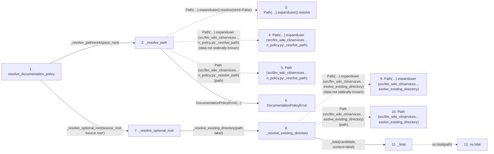

# resolve_documentation_policy

**Entry point:** `resolve_documentation_policy` (`api`)
**Source:** [documentation_policy](../modules/documentation_policy.md)
**Modules touched:** [config](../modules/config.md), [documentation_policy](../modules/documentation_policy.md), [filesystem_guard](../modules/filesystem_guard.md), [source_selection](../modules/source_selection.md), and 1 more

**Complete modules touched:**

- [config](../modules/config.md)
- [documentation_policy](../modules/documentation_policy.md)
- [filesystem_guard](../modules/filesystem_guard.md)
- [source_selection](../modules/source_selection.md)
- [validation](../modules/validation.md)

## Call sequence

```mermaid
sequenceDiagram
    participant p0 as resolve_documentation_policy
    participant p1 as _resolve_path
    participant p2 as Path(…).expanduser().resolve
    participant p3 as Path(…).expanduser (src/llm_wiki_cli/services…n_policy.py:_resolve_path)
    participant p4 as Path (src/llm_wiki_cli/services…n_policy.py:_resolve_path)
    participant p5 as DocumentationPolicyError
    participant p6 as _resolve_optional_root
    participant p7 as _resolve_existing_directory
    participant p8 as Path(…).expanduser (src/llm_wiki_cli/services…esolve_existing_directory)
    participant p9 as Path (src/llm_wiki_cli/services…esolve_existing_directory)
    participant p10 as _lstat
    participant p11 as os.lstat
    participant p12 as _assert_safe_directory
    participant p13 as stat.S_ISLNK (src/llm_wiki_cli/services…py:_assert_safe_directory)
    participant p14 as _is_windows_reparse_point
    participant p15 as int (src/llm_wiki_cli/services…_is_windows_reparse_point)
    participant p16 as getattr (src/llm_wiki_cli/services…_is_windows_reparse_point)
    participant p17 as bool (src/llm_wiki_cli/services…_is_windows_reparse_point)
    participant p18 as stat.S_ISDIR (src/llm_wiki_cli/services…py:_assert_safe_directory)
    participant p19 as _assert_same_file_identity
    participant p20 as windows_object_identity
    participant p21 as windows_object_identity_from_values
    p0->>p1: _resolve_path
    p1-->>p2: Path(…).expanduser().resolve
    p1-->>p3: Path(…).expanduser (src/llm_wiki_cli/services…n_policy.py:_resolve_path)
    p1-->>p4: Path (src/llm_wiki_cli/services…n_policy.py:_resolve_path)
    p1->>p5: DocumentationPolicyError
    p0->>p6: _resolve_optional_root
    p6->>p7: _resolve_existing_directory
    p7-->>p8: Path(…).expanduser (src/llm_wiki_cli/services…esolve_existing_directory)
    p7-->>p9: Path (src/llm_wiki_cli/services…esolve_existing_directory)
    p7->>p10: _lstat
    p10-->>p11: os.lstat
    p10->>p5: DocumentationPolicyError
    p7->>p12: _assert_safe_directory
    p12-->>p13: stat.S_ISLNK (src/llm_wiki_cli/services…py:_assert_safe_directory)
    p12->>p5: DocumentationPolicyError
    p12->>p14: _is_windows_reparse_point
    p14-->>p15: int (src/llm_wiki_cli/services…_is_windows_reparse_point)
    p14-->>p16: getattr (src/llm_wiki_cli/services…_is_windows_reparse_point)
    p14-->>p15: int (src/llm_wiki_cli/services…_is_windows_reparse_point)
    p14-->>p16: getattr (src/llm_wiki_cli/services…_is_windows_reparse_point)
    p14-->>p17: bool (src/llm_wiki_cli/services…_is_windows_reparse_point)
    p12->>p5: DocumentationPolicyError
    p12-->>p18: stat.S_ISDIR (src/llm_wiki_cli/services…py:_assert_safe_directory)
    p12->>p5: DocumentationPolicyError
    p7->>p1: _resolve_path
    p7->>p10: _lstat
    p7->>p12: _assert_safe_directory
    p7->>p19: _assert_same_file_identity
    p19->>p20: windows_object_identity
    p20->>p21: windows_object_identity_from_values
```

<!-- Auto-generated from static call edges. Dashed arrows are external or unresolved calls. Reviewed runtime conditions and side effects belong in Behavior. -->

> Call sequence diagram shows 30 of 233 interactions; 203 omitted to keep the visualization within the 30-interaction and generated-diagram limits.

> Trace truncated at the depth limit; deeper calls are omitted.

## Data flow

<!-- Auto-generated static analysis. Treat values and boundaries as best-effort hints, not runtime proof. -->

### Step data

| Step | Inputs | Reads | Writes | Returns |
|---|---|---|---|---|
| `resolve_documentation_policy` | `workspace_root: str \| Path`, `source_root: str \| Path \| None`, `source_selection: str \| Path \| None`, `input_wiki_root: str \| Path \| None`, `helper_cache_root: str \| Path \| None`, `capture_root: str \| Path \| None`, `trust_source_plugins: bool`, `live_service_url: str \| None` | `SourceSelectionError` | - | `DocumentationMutationPolicy(...)` |
| `_resolve_path` | `path: str \| Path` | - | - | `...` |
| `Path(…).expanduser().resolve` | - | - | - | - |
| `Path(…).expanduser (src/llm_wiki_cli/services…n_policy.py:_resolve_path)` | - | - | - | - |
| `Path (src/llm_wiki_cli/services…n_policy.py:_resolve_path)` | - | - | - | - |
| `DocumentationPolicyError` | - | - | - | - |
| `_resolve_optional_root` | `path: str \| Path \| None`, `label: str` | - | - | `None`, `_resolve_existing_directory(...)` |
| `_resolve_existing_directory` | `path: str \| Path`, `label: str` | - | - | `resolved` |
| `Path(…).expanduser (src/llm_wiki_cli/services…esolve_existing_directory)` | - | - | - | - |
| `Path (src/llm_wiki_cli/services…esolve_existing_directory)` | - | - | - | - |
| `_lstat` | `path: Path`, `context: str` | - | - | `os.lstat(...)` |
| `os.lstat` | - | - | - | - |

### Call data

| From | To | Line | Call |
|---|---|---:|---|
| resolve_documentation_policy | _resolve_path | 217 | `_resolve_path(workspace_root)` |
| _resolve_path | Path(…).expanduser().resolve | 983 | `Path(path).expanduser().resolve(strict=False)` |
| _resolve_path | Path(…).expanduser (src/llm_wiki_cli/services…n_policy.py:_resolve_path) | 983 | `Path(path).expanduser(data not statically known)` |
| _resolve_path | Path (src/llm_wiki_cli/services…n_policy.py:_resolve_path) | 983 | `Path(path)` |
| _resolve_path | DocumentationPolicyError | 985 | `DocumentationPolicyError(...)` |
| resolve_documentation_policy | _resolve_optional_root | 218 | `_resolve_optional_root(source_root, 'source root')` |
| _resolve_optional_root | _resolve_existing_directory | 974 | `_resolve_existing_directory(path, label)` |
| _resolve_existing_directory | Path(…).expanduser (src/llm_wiki_cli/services…esolve_existing_directory) | 948 | `Path(path).expanduser(data not statically known)` |
| _resolve_existing_directory | Path (src/llm_wiki_cli/services…esolve_existing_directory) | 948 | `Path(path)` |
| _resolve_existing_directory | _lstat | 949 | `_lstat(candidate, context=label)` |
| _lstat | os.lstat | 782 | `os.lstat(path)` |

### Boundary effects

*No boundary effects detected.*

### Static analysis gaps

| Kind | Step | Target | Line |
|---|---|---|---:|
| unresolved_call | `_resolve_path` | `Path(path).expanduser().resolve` | 983 |
| unresolved_call | `_resolve_path` | `Path(path).expanduser` | 983 |
| unresolved_call | `_resolve_existing_directory` | `Path(path).expanduser` | 948 |
| external_call | `_lstat` | `os.lstat` | 782 |
| step_limit | `resolve_documentation_policy` | `first 12 steps` | 0 |
| truncated_flow | `resolve_documentation_policy` | `depth limit` | 0 |

## Behavior

This flow starts at `resolve_documentation_policy` and is classified as `api`. The generated call and data-flow sections are bounded static projections; runtime conditions and side effects require source-level confirmation.
